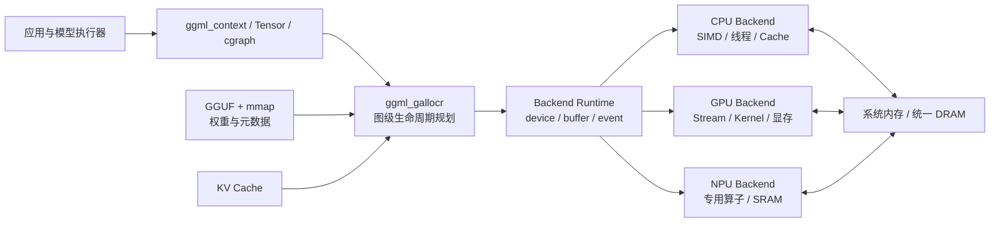
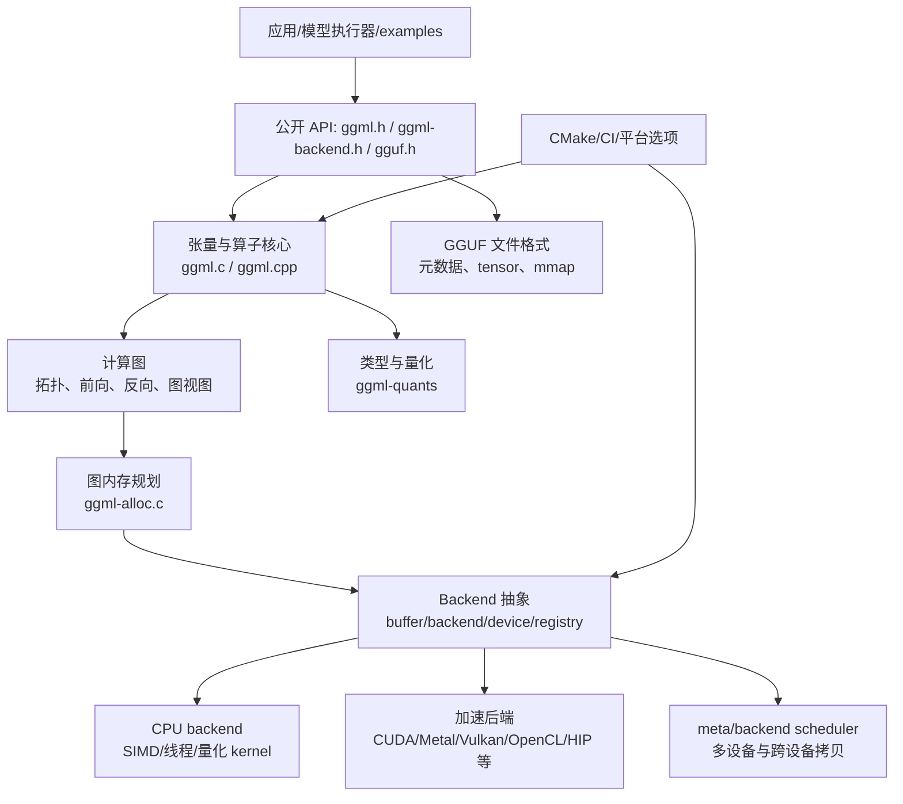
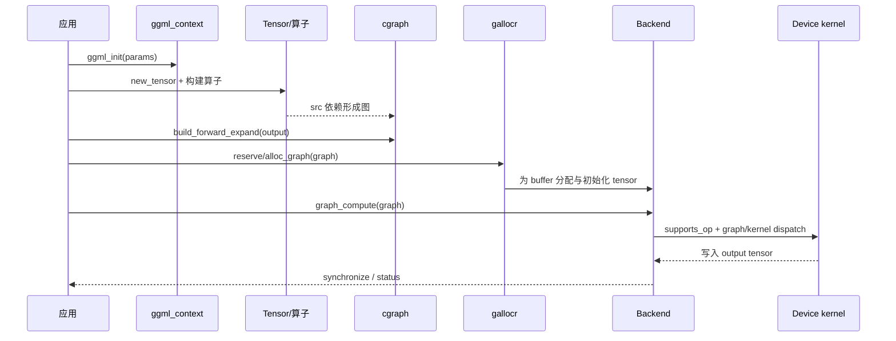

# ggml 代码仓系统方案设计

> **文档状态**：基于代码的架构基线分析
>
> **分析对象**：当前仓库（ggml 0.24.0，具体提交由构建时 `ggml_commit()` 暴露）
>
> **语言**：中文
>
> **分析原则**：代码事实优先；设计推断均标注证据；未从代码确认的内容列入“待确认事项”。

## 1. 执行摘要

ggml 是一个面向机器学习的轻量级、可移植、高性能张量计算库。它不以完整训练框架或统一运行时为目标，而是提供一组可嵌入的基础能力：多维张量和算子、显式计算图、自动微分/优化基础、图级内存规划、量化数据类型、统一后端抽象，以及 CPU、GPU、NPU 和浏览器等平台的实现。

其核心设计可以概括为：

1. **用张量对象表达数据和计算依赖**，用计算图延迟执行；
2. **将图构建、内存规划和实际执行分离**，使运行时分配和调度成本可控；
3. **以 C ABI 和最小依赖作为生态边界**，以 C/C++ 实现作为可移植内核；
4. **以 backend/device/buffer 接口隔离硬件差异**，允许不同后端独立实现算子、内存和同步；
5. **把量化格式、数据布局、SIMD kernel 与后端能力作为一等性能因素**；
6. **通过静态链接、动态后端和 CMake 选项适配从嵌入式到高性能 GPU 的部署形态**。

推荐的总体架构是“**张量计算核心 + 图内存规划 + 统一后端运行时 + 专用 kernel/设备插件**”的分层架构，而不是微服务或传统业务分层架构。

## 2. 系统总览（System Overview）、范围与分析基线

### 2.1 架构模式（Architecture Pattern）

ggml 采用**分层的可嵌入计算库架构（Layered Embedded Compute Library）**：以张量/计算图为核心，以图级内存规划为运行时中间层，以 backend/device/buffer 为硬件适配层，并通过静态或动态插件完成设备扩展。它不是微服务系统，也不是传统带数据库的业务应用。

选择该模式的原因是：核心需要低依赖和跨平台，计算图需要在执行前完成全局规划，而硬件 kernel 又必须独立演进。将应用 API、数学语义、内存策略和设备实现分层，能在保持 C ABI 稳定的同时替换或增加后端。

**主要替代方案**：

- 将所有设备代码写入核心：实现初期简单，但会扩大条件编译和依赖传播；
- 采用每个硬件独立的高层运行时：设备隔离更强，但会失去统一图、tensor 和内存语义；
- 使用微服务拆分：不适用于进程内低延迟张量计算，会引入网络和序列化成本。

### 2.2 系统概览（System Overview）

系统输入可以是应用直接创建的 tensor，也可以是 GGUF 中加载的量化权重；应用构建计算图后，由 allocator 为图节点分配 buffer，再由一个或多个 backend 执行。输出仍以 tensor 形式提供给应用。核心数据通路如下：

```text
应用/模型执行器 -> tensor/算子 -> computation graph -> graph allocator
       -> backend/device/buffer -> CPU/GPU/NPU kernel -> output tensor
```

### 2.3 API 与接口规格（API Specifications）

公共接口分为四组：

| 接口组 | 入口 | 责任 |
|---|---|---|
| Tensor/Graph API | `include/ggml.h` | context、tensor、op、shape、stride、graph、梯度 |
| Allocation API | `include/ggml-alloc.h` | tensor allocator、graph allocator、buffer 规划 |
| Backend API | `include/ggml-backend.h` | device、backend、buffer、copy、event、graph compute |
| Model I/O API | `include/gguf.h` | GGUF 元数据和 tensor 存储 |

接口约束是：调用方先创建/加载 tensor，再构建图并分配，最后调用 `ggml_backend_graph_compute` 或等价图执行入口；backend 通过 `supports_op`/`supports_buft` 协商能力，不支持时由执行器决定回退或报错。具体接口契约详见第 5、6、7 节。

### 2.4 技术栈与选择依据（Technology Stack）

**Rationale（选择理由）**：

- **语言**：C 为核心数据/算子实现，C++ 承载 backend 注册、部分辅助和平台集成；原因是 ABI 友好、低运行时依赖和跨编译器可用性；
- **构建**：CMake，支持静态/共享库、交叉编译、ISA 选项、sanitizer 和可选 backend；
- **数据/模型格式**：原生 tensor 类型加 GGUF；原因是量化、mmap、可扩展元数据和单文件部署；
- **执行模型**：显式计算图 + graph allocator + device backend；原因是可预测内存和硬件解耦；
- **测试**：CTest 驱动的 C/C++ 单测、backend 对比测试和 examples 集成验证。

### 2.5 部署架构（Deployment Architecture）

ggml 以进程内库部署，不要求独立服务。典型部署为：应用进程加载 `ggml`/`ggml-base` 与选择的 CPU 或硬件 backend；模型以 GGUF 文件直接读取，可利用 mmap；若启用动态 backend，则从配置目录加载设备插件。CPU-only 是最小部署形态，GPU/NPU 形态额外携带对应 SDK 产物和运行时库。

#### 2.5.1 面向异构 SoC 的部署示意

下面的示意图将 ggml 的软件抽象映射到一个包含 CPU、GPU、NPU、统一内存和高速存储的异构 SoC。它是帮助理解数据流和资源归属的概念图，不表示某一具体芯片的物理实现，也不意味着所有 ggml 后端都能同时使用同一块物理内存。

```text
+-------------------------------------------------------------------------------------------+
|                              异构 SoC / 推理设备                                          |
|                                                                                           |
|  +------------------------------------+          +-------------------------------------+  |
|  |             CPU 集群               |          |             GPU 集群                |  |
|  |  +------------------------------+  |          |  +-------------------------------+  |  |
|  |  |      L1 / L2 Cache（核心）   |  |          |  |      Compute Units（SIMT）     |  |  |
|  |  +------------------------------+  |          |  +-------------------------------+  |  |
|  |  |         共享 L3 Cache        |  |          |  |      Local Threadgroup RAM    |  |  |
|  |  +------------------------------+  |          |  +-------------------------------+  |  |
|  +------------------+-----------------+          +------------------+------------------+  |
|                     |                                               |                     |
|                     |        AXI / NoC（片上互连）                   |                     |
|                     +-----------------------+-----------------------+                     |
|                                             |                                             |
|  +------------------------------------+     |    +-------------------------------------+  |
|  |             NPU 引擎               |     |    |          高速存储（NVMe）            |  |
|  |  +------------------------------+  |     |    |  +-------------------------------+  |  |
|  |  |     权重解压缩单元           |  |     |    |  | 逐层模型权重                  |  |  |
|  |  +------------------------------+  |     |    |  |（可 mmap 的线性文件格式）      |  |  |
|  |  |     脉动阵列（INT4 MAC）      |  |     |    |  +-------------------------------+  |  |
|  |  +------------------------------+  |     |    |                 |                     |  |
|  |  |       本地 Scratchpad SRAM   |  |     |    |                 | 直接 I/O 绕过      |  |
|  |  +------------------------------+  |     |    |                 |                     |  |
|  +------------------+-----------------+     |    +------------------+------------------+  |
|                     |                       |                       |                     |
|                     +-----------------------v-----------------------+                     |
|                                             |                                             |
|                               +-------------v-------------+                               |
|                               |       系统内存控制器      |                               |
|                               +-------------+-------------+                               |
+---------------------------------------------|---------------------------------------------+
                                              | 内存总线（128-bit / 256-bit）
                               +--------------v--------------+
                               |       统一 LPDDR5X DRAM    |
                               |  - 操作系统与应用常驻区    |
                               |  - 统一分页 KV Cache       |
                               |  - 热模型权重（RAM）       |
                               +-----------------------------+
```

在这个部署模型中，各部分与 ggml 的关系如下：

- **CPU 集群**：通常承载应用逻辑、Tokenizer、图构建、调度、采样以及 CPU backend；L1/L2/L3 Cache 影响小张量算子、控制流和 Decode 阶段的访问效率。
- **GPU 集群**：通过 CUDA、Metal、Vulkan、OpenCL 或其他 backend 执行矩阵乘法、Attention、FFN 等并行度高的算子；Local Threadgroup RAM 类似 kernel 的片上工作区。
- **NPU 引擎**：适合执行特定精度和布局的矩阵计算，例如 INT4/INT8 MAC；是否使用 NPU 取决于 backend 的 `supports_op`、数据格式和设备 SDK 能力。
- **高速存储**：GGUF 等模型文件可以通过 mmap 暴露为文件映射区域。实际部署中仍需考虑页缓存、预取、文件对齐和缺页开销；“可 mmap”不等于每一层都无需复制即可直接被所有设备访问。
- **统一 DRAM**：可承载操作系统、应用对象、热权重和分页 KV Cache。对于具有独立显存的 GPU，权重和 KV Cache 可能需要额外复制；对于共享内存架构，则可能由 CPU/GPU/NPU 共享物理内存但使用不同的缓存和同步语义。
- **片上互连与内存控制器**：决定 CPU、GPU、NPU 之间共享数据的带宽和延迟。跨设备 tensor copy、权重搬运和 KV Cache 访问都可能受到该链路限制。

#### 2.5.2 软件抽象到硬件资源的映射



这张映射图强调两个边界：`ggml_gallocr` 负责“何时需要多少内存”，backend 负责“这段内存由哪个设备以什么方式访问”；应用不应直接依赖某个硬件的内部 kernel 或缓存实现。

### 2.1 范围

本方案覆盖：

- `include/` 中的公开 C API 和 C++ 辅助接口；
- `src/` 中的张量、计算图、分配器、backend、量化和文件格式实现；
- CPU、CUDA、Metal、Vulkan、OpenCL、SYCL、HIP、MUSA、WebGPU、NPU 等后端接入模式；
- CMake 构建选项、示例、测试、CI 与扩展工作流；
- GGUF 模型文件作为模型权重和元数据的边界。

### 2.2 非目标

- 不把 ggml 描述为完整的 LLM 推理应用；应用层的 tokenizer、模型架构编排、服务协议和会话管理不属于本仓库核心职责；
- 不把所有后端的内部 kernel 实现逐个展开；本文定义共性接口和代表性实现位置；
- 不假设所有后端具有相同的算子覆盖、异步能力或内存语义。

### 2.3 证据范围

主要证据文件：

| 领域 | 代表文件 |
|---|---|
| 公共张量/算子/图 API | `include/ggml.h` |
| 分配器 | `include/ggml-alloc.h`, `src/ggml-alloc.c` |
| 后端公共 API | `include/ggml-backend.h` |
| 后端内部 vtable | `src/ggml-backend-impl.h` |
| 后端注册/动态加载 | `src/ggml-backend-reg.cpp` |
| 核心实现 | `src/ggml.c`, `src/ggml.cpp`, `src/ggml-backend.cpp` |
| 量化与 CPU kernel | `src/ggml-quants.*`, `src/ggml-cpu/` |
| 模型文件格式 | `src/gguf.cpp`, `docs/gguf.md` |
| 构建与平台选项 | `CMakeLists.txt`, `src/CMakeLists.txt` |
| 验证与使用示例 | `tests/`, `examples/`, `.github/workflows/` |

## 3. 设计理念与设计原则

### 3.1 最小依赖、可嵌入

**原则**：核心库尽量不依赖大型第三方运行时，把平台和硬件依赖放在可选 backend 中。

**证据**：`README.md` 将目标定义为“simple, portable, efficient tensor library with minimal setup”，并强调纯 C/C++、无依赖；`src/CMakeLists.txt` 先构建 `ggml-base`，再按选项附加后端。

**收益**：适合桌面、服务器、移动端、嵌入式和 WebAssembly；应用可只链接 CPU 或选择特定加速器。

**约束**：功能不会自动获得高级运行时提供的图优化、内存管理或设备编排；这些能力必须在 ggml 内显式设计。

### 3.2 显式计算图与延迟执行

**原则**：算子构造阶段只创建张量和依赖，计算在图明确建立并提交后发生。

**证据**：`include/ggml.h:19-89` 的总览示例用 `ggml_mul`/`ggml_add` 构建表达式，再用 `ggml_new_graph`、`ggml_build_forward_expand` 和 `ggml_graph_compute_with_ctx` 执行；`ggml_tensor` 保存 `op` 与 `src[]`。

**收益**：可以在执行前进行拓扑分析、内存复用、后端分配、算子支持判断和图级优化；同一图拓扑可重复执行。

**约束**：动态图式的即时调试更复杂；算子必须正确声明形状、步长、数据类型和源张量关系。

### 3.3 上下文和内存生命周期显式化

**原则**：张量元数据、图对象和工作区由 `ggml_context` 管理；数据缓冲区可以由 context 或 backend allocator 管理。

**证据**：`ggml_init_params` 提供 `mem_size`、外部 `mem_buffer` 和 `no_alloc`；`ggml_object_type` 区分 tensor、graph 和 work buffer；`ggml-alloc.h` 提供 `ggml_tallocr` 与 `ggml_gallocr`。

**收益**：避免对象级碎片化分配，便于 arena/pool 使用、内存映射权重和运行前容量估计。

**约束**：调用方必须理解 context、tensor data、backend buffer 的所有权边界，错误生命周期可能导致悬空指针或过量占用。

### 3.4 零或近零运行时分配

**原则**：运行前通过图扫描和生命周期分析预留计算缓冲区，执行阶段复用内存。

**证据**：README 明确列出“Zero memory allocations during runtime”；`ggml_gallocr_reserve` 支持用最坏情况图预分配，`ggml_gallocr_alloc_graph` 在图拓扑变化时才考虑重新分配；`src/ggml-alloc.c` 按节点、视图、子节点生命周期回收空间。

**收益**：减少分配器锁、碎片和不可预测暂停，适合高频推理循环。

**约束**：图拓扑、backend 额外空间和并发执行依赖必须纳入规划；后端若乱序执行，需要通过 `graph_optimize` 的 allocation dependency 延长生命周期。

### 3.5 后端可插拔而非核心分叉

**原则**：核心使用统一的 buffer type、buffer、backend、device、registry 接口，硬件代码通过实现接口接入。

**证据**：`include/ggml-backend.h` 定义 buffer 分配/拷贝、backend 图执行、device 属性/能力和 registry；`src/ggml-backend-impl.h` 用接口表表达 `supports_op`、`graph_compute`、`event_*` 等能力。

**收益**：同一计算图可由 CPU、GPU、NPU 或 meta backend 执行；应用不必绑定具体厂商 API。

**约束**：各后端算子覆盖与数据布局可能不同，必须实现能力判断、回退和跨设备拷贝。

### 3.6 数据布局和量化优先

**原则**：张量不仅描述形状，还描述步长、数据类型、量化块布局和设备数据；kernel 以实际布局为输入，而非假设连续 FP32。

**证据**：`ggml_tensor` 的 `ne[]`、`nb[]`、`type`、`data`、`extra` 字段；`include/ggml.h` 的 `GGML_TYPE_Q*`、`MXFP4`、`NVFP4` 等类型；`src/ggml-quants.*` 与 `src/ggml-cpu/` 提供量化转换和优化 kernel。

**收益**：显著降低模型权重内存与带宽，允许为不同 ISA/加速器选择专用矩阵乘法路径。

**约束**：类型枚举、块大小、对齐和 kernel 组合复杂；新格式需要同步元数据、序列化、参考实现和各后端支持。

### 3.7 C ABI 与兼容性意识

**原则**：公开接口以 C 风格结构和函数为主，C++ 仅用于实现和辅助封装；枚举和后端 API 对扩展保持兼容。

**证据**：公共头文件使用 `extern "C"` 与 `GGML_API`；`enum ggml_type` 明确“always add types at the end ... backward compatibility”；backend 使用 `GGML_BACKEND_API_VERSION`。

**收益**：便于 Python、Rust、Go、Objective-C、插件和跨编译器集成。

**约束**：公开结构布局和 ABI 字段调整成本高；扩展应优先追加字段/枚举或通过版本化接口实现。

### 3.8 性能可测量、平台可配置

**原则**：通过 CMake 选项、编译器特性、SIMD/ISA、sanitizer、测试和示例显式选择性能与可诊断性。

**证据**：顶层 `CMakeLists.txt` 提供 `GGML_NATIVE`、SSE/AVX/NEON/RVV、LTO、OpenMP、sanitizer、各后端开关；CI 至少覆盖 CPU 构建；`tests/test-backend-ops.cpp` 等验证算子行为。

**收益**：同一代码仓适配多架构，并可在性能、可移植性和调试能力之间作部署选择。

**约束**：组合数量大，必须持续维护构建矩阵和跨后端一致性测试。

## 4. 总体分层架构

### 4.1 组件设计（Component Design）

系统组件及边界如下：

| 组件 | 主要职责 | 对外接口 | 关键依赖 |
|---|---|---|---|
| Tensor/Core | 类型、shape、stride、算子语义和 context | `ggml_new_tensor_*`, 算子构造函数 | 无硬件依赖 |
| Graph | 依赖收集、节点顺序、前向/反向图 | `ggml_build_forward_*`, graph API | Tensor/Core |
| Graph Allocator | 生命周期、view、对齐、buffer 复用 | `ggml_gallocr_*` | Graph、buffer type |
| Backend Runtime | device/backend/buffer/registry、copy、sync | `ggml_backend_*` | 平台 backend |
| CPU/Device Kernels | 算子执行、SIMD、量化和专用加速 | backend 内部 vtable | Backend Runtime、平台 SDK |
| GGUF I/O | 元数据、权重、mmap 和格式兼容 | `gguf_*` | Tensor/Core、文件系统 |
| Build/Test | 平台配置、目标生成、回归验证 | CMake、CTest | 编译器/SDK |

组件依赖方向必须保持从应用到公开 API、从公开 API 到核心抽象、从抽象到后端实现；CPU/GPU kernel 不应反向改变 tensor 的公共语义。详见第 4.2 节的数据模型和第 7 节的扩展契约。




### 4.1 层次职责

| 层 | 主要职责 | 不应承担的职责 |
|---|---|---|
| 应用/执行器 | 选择模型、构建图、填充输入、提交执行、读取输出 | 直接依赖某个后端的内部 vtable |
| 公开 API | 稳定的张量、图、分配、backend 和 GGUF 契约 | 暴露每个硬件 kernel 的细节 |
| 张量/算子核心 | 形状推导、stride、算子表达、上下文对象、自动微分基础 | 负责设备特定代码生成 |
| 图层 | 依赖收集、节点顺序、输入/输出标志、图执行入口 | 管理厂商 API 资源 |
| 分配层 | 张量生命周期、视图复用、buffer 规划、容量估计 | 决定算子数学语义 |
| Backend 抽象 | 设备枚举、内存、数据拷贝、同步、图执行、能力判断 | 规定具体硬件 kernel 算法 |
| Backend 实现 | 将 ggml op 映射到 CPU/GPU/NPU kernel 和内存模型 | 改变公共 tensor 语义 |
| GGUF | 模型权重、元数据和可 mmap 的序列化边界 | 承担运行时调度 |
| 构建/CI | 选择平台、编译特性、测试组合和发布物 | 替代运行时能力协商 |

## 5. 核心数据模型（Data Model）

### 5.1 Tensor

`struct ggml_tensor` 是核心统一数据模型，包含：

- `type`：数据类型或量化类型；
- `ne[4]`：最多四维元素数；
- `nb[4]`：每维字节步长，支持非连续、转置、permute 和 view；
- `op` 与 `op_params`：产生该 tensor 的算子及参数；
- `src[GGML_MAX_SRC]`：输入依赖；
- `view_src/view_offs`：零拷贝视图关系；
- `buffer/data/extra`：后端存储、数据地址和后端扩展信息；
- `flags`：input/output/param/loss/compute 生命周期与计算语义标志。

这使 tensor 同时承担“数据描述”“计算节点”和“内存对象”三种角色，是 ggml 简洁性的来源，也是扩展时需要谨慎维护的耦合中心。

### 5.2 Context 与对象池

`ggml_init_params` 决定 context 的 arena 行为：可以让 ggml 内部持有内存、使用调用方提供的内存，或用 `no_alloc` 只构建元数据。对象类型用于区分 tensor、graph 和 work buffer。推荐模型加载和推理执行分开使用 context，以避免权重生命周期与临时计算对象互相污染。

### 5.3 Computation Graph

图由 tensor 的 `src[]` 关系构成；`ggml_build_forward_expand` 从输出递归收集依赖并形成节点序列。图 API 支持复制、清理、视图、节点访问、DOT 导出和梯度相关操作。图是执行、内存规划和后端分派的共同中间表示。

### 5.4 Backend 对象族

| 对象 | 语义 |
|---|---|
| `buffer_type` | 某类设备内存的分配策略、对齐、最大大小、tensor 分配大小 |
| `buffer` | 实际的一段内存及 tensor 读写、清理、复制行为 |
| `backend` | 一个执行流/上下文，负责图计算、同步、事件和异步数据访问 |
| `device` | 设备能力、内存属性、首选 buffer type、算子支持和 backend 初始化 |
| `registry` | backend 插件登记、设备枚举和可选过程地址查询 |
| `event` | 跨 backend/stream 的同步原语 |

### 5.5 GGUF

GGUF 是模型存储边界，不是计算运行时。`docs/gguf.md` 规定单文件、可扩展、mmap 友好、完整元数据和 key-value 元数据结构；`src/gguf.cpp` 负责读写。该边界让权重格式可以独立演进，同时允许 runtime 根据类型和元数据建立 tensor。

## 6. 关键运行时流程

### 6.1 建图与执行



#### 6.1.1 建图与执行的整体概念

ggml 的“建图与执行”采用**声明式建图、显式分配、后端执行**的三阶段模型。应用代码在建图阶段描述“需要计算什么”，而不是立即执行每个算子；只有图完整建立并完成内存规划后，才将图提交给具体 backend 执行。

这一区分是 ggml 运行时设计的核心：

- **建图阶段**关注计算语义和依赖关系；
- **分配阶段**关注张量生命周期、内存复用和设备放置；
- **执行阶段**关注算子支持、kernel 分派、数据传输和同步。

因此，同一个计算图可以在不同的 backend 上执行，或者在输入数据变化时重复执行，而不必重新创建所有 tensor 对象和重新分配全部运行时内存。

#### 6.1.2 第一步：初始化 `ggml_context`

应用首先调用 `ggml_init(params)` 创建 `ggml_context`。context 可以理解为 ggml 的对象管理和元数据分配区域，主要承载：

- tensor 元数据，例如类型、形状、步长、算子和输入依赖；
- 计算图对象及其节点数组；
- 必要的工作区或临时对象描述。

`ggml_init_params` 中的 `mem_size`、`mem_buffer` 和 `no_alloc` 决定 context 的内存策略。一个常见做法是：模型权重使用长期存在的 context，推理过程使用单独的执行 context，从而避免权重和临时计算对象的生命周期相互影响。

需要注意，创建 tensor 通常只是创建 tensor 描述，不等于已经在 CPU 或 GPU 上为其数据分配了完整存储。数据 buffer 的实际分配可以延后到 graph allocator 和 backend 阶段。

#### 6.1.3 第二步：创建 tensor 并构建算子

应用通过 `ggml_new_tensor_*` 创建输入、权重和中间 tensor，再调用 `ggml_mul_mat`、`ggml_add`、`ggml_norm`、`ggml_rope` 等算子构造函数建立计算关系。

例如，执行 `c = ggml_add(ctx, a, b)` 时，ggml 通常不会立即读取 `a` 和 `b` 的数据并计算结果，而是创建一个新的 tensor `c`，并在 `c` 中记录：

- `c->op`：产生 `c` 的操作类型；
- `c->src[0]`、`c->src[1]`：输入 tensor `a`、`b`；
- `c->ne[]`、`c->nb[]`：输出形状和步长；
- `c->op_params`：算子特定参数；
- `c->flags`：输入、输出或必须计算等标志。

这个过程相当于构建一棵表达“数据从哪里来、要经过哪些操作”的有向无环图。tensor 同时作为数据描述和图节点，是 ggml 简洁 API 的基础。

#### 6.1.4 第三步：通过 `src[]` 形成依赖图

每个计算 tensor 的 `src[]` 保存其输入依赖。应用通常以最终输出 tensor 为入口调用 `ggml_build_forward_expand(graph, output)`，ggml 从输出反向访问所有父节点，并将尚未加入图的依赖按可执行顺序加入 `ggml_cgraph`。

此时只完成了**计算拓扑的收集**，还没有执行矩阵乘法、Attention 或采样。图中的节点一般包括：

1. 叶子节点：输入数据、模型权重或常量；
2. 中间节点：Embedding、MatMul、Norm、RoPE、Attention、FFN 等算子；
3. 输出节点：logits、隐藏状态或最终结果。

图构建使运行时可以在执行前看到全局依赖，从而计算每个 tensor 的生命周期、判断哪些节点可以复用内存，并决定哪些节点适合放到某个设备上。

#### 6.1.5 第四步：预留和分配图内存

图完成后，应用将其交给 `ggml_gallocr_reserve`、`ggml_gallocr_alloc_graph` 或相关 backend 分配函数。graph allocator 会遍历叶子和节点，并综合考虑：

- tensor 是否已经拥有 backend buffer；
- tensor 是否为 view，是否共享其他 tensor 的存储；
- tensor 的输入、输出和计算标志；
- 节点最后一次使用时间；
- backend 的对齐要求和额外临时空间；
- 异步或乱序执行带来的延长生命周期依赖。

在不影响后续计算的前提下，生命周期不重叠的中间 tensor 可以复用同一段内存。这就是 ggml 能够减少运行时 `malloc/free` 并控制内存峰值的关键。

`reserve` 通常用于根据最坏情况图提前计算和申请容量；`alloc_graph` 则将具体 graph 中的 tensor 初始化到相应 buffer。对于输入和输出，分配器会根据标志保留稳定地址，避免执行过程中被错误覆盖。

#### 6.1.6 第五步：提交 backend 执行

内存准备完成后，应用调用 `ggml_backend_graph_compute(backend, graph)`。backend 首先根据设备能力检查图中各个 op：

- `supports_op`：设备是否支持该算子、数据类型、形状和参数；
- `supports_buft`：输入和输出所在 buffer 类型是否可直接使用；
- `offload_op`：即使权重位置不理想，是否值得将算子卸载到该设备；
- 是否需要跨设备复制、host staging 或数据布局转换。

通过这些能力判断，统一 backend 接口可以将同一张图映射到 CPU、GPU、NPU 或 meta backend。若设备不支持某个 op，执行器可以选择 CPU fallback、重新分区图，或返回明确的失败状态；具体行为由上层调度策略决定。

#### 6.1.7 第六步：kernel 分派、写回和同步

backend 将图节点转换为具体设备执行：CPU backend 调用多线程/SIMD kernel，GPU backend 可能将 op 转为 CUDA、Metal 或 Vulkan kernel，其他设备则调用相应 SDK。kernel 从输入 buffer 读取数据，将结果写入已经规划好的输出 tensor buffer。

如果 backend 支持异步执行，`graph_compute` 可能只表示操作已进入 stream，而不代表所有结果已经对 CPU 可见。应用需要根据 backend 能力调用 `ggml_backend_synchronize`，或使用 event 的 record/wait 机制建立跨 stream 的依赖。最终通过 `ggml_status` 判断执行是成功、失败还是被中止。

因此，时序图中最后的 `synchronize / status` 有两层含义：

1. 等待异步设备完成，确保输出可以安全读取；
2. 将设备执行错误、资源不足或 abort 回调结果传回应用。

#### 6.1.8 一次推理循环中的复用

在典型推理场景中，模型权重 tensor 和计算图拓扑可以长期复用。每次生成新 Token 时，应用只需要：

1. 更新输入 tensor、位置编码和 KV Cache 相关数据；
2. 重新分配或复用必要的动态 buffer；
3. 调用同一 backend 执行图；
4. 读取 logits，执行 sampling；
5. 将下一个 Token 写回下一轮输入。

这说明“构建图”和“执行图”不是一一对应的单次操作：图可以被多次执行，而输入值、KV Cache 内容和部分 shape 可以随推理请求变化。若拓扑或尺寸超出预留范围，才需要重新 reserve/allocate；这也是 `ggml_gallocr` 支持预留和自动重新分配的原因。

### 6.2 内存规划

1. 以图叶子和节点为输入，识别 tensor 是否已有 buffer、是否为 view、是否是 input/output；
2. 根据 tensor 的 backend buffer type 计算对齐后的分配大小；
3. 根据子节点计数、view 数量和 backend 额外空间决定释放时机；
4. 将可复用生命周期映射到一个或多个 buffer；
5. 对输出和输入保留稳定地址；
6. 若图拓扑或尺寸变化超过已保留容量，重新 reserve/allocate。

后端可以通过 `graph_optimize` 的 `add_alloc_dep` 声明乱序/并发执行的延长生命周期依赖，从而保持内存规划正确。

### 6.3 后端选择与能力协商

设备通过 `supports_op`、`supports_buft`、`offload_op` 暴露能力。执行器应先判断：

- op 的数据类型、shape、stride 和参数是否被设备支持；
- 输入权重/激活所在 buffer 是否可直接使用；
- 是否需要跨 backend copy 或 host staging；
- 是否使用同步、异步、event 或 graph plan；
- 不支持时是否安全回退 CPU。

### 6.4 跨设备数据流

统一 API 支持同步和异步 tensor set/get、2D copy、`ggml_backend_tensor_copy_async`、event record/wait。设备间传输应尽量保持量化/布局不变，避免不必要的反量化和连续化；确需转换时，应在明确的 op 或 buffer 初始化阶段完成。

## 7. 后端扩展设计

### 7.1 新后端接入契约

新 backend 至少应提供：

1. registry：名称、设备枚举、初始化入口；
2. device：类型、内存、能力、首选 buffer type、`supports_op`；
3. buffer type：分配、对齐、tensor alloc size、host 属性；
4. buffer：base、tensor 初始化、set/get/memset、copy、clear；
5. backend：名称、图计算、同步；若支持异步则提供 async 访问和事件；
6. CMake 选项和目标依赖；
7. 与 CPU/reference 结果一致的 backend operation tests；
8. 设备不可用、算子不支持和资源不足时的明确状态。

### 7.2 各后端共性/差异

- **CPU**：系统内存，通常可直接访问；重点在多线程、SIMD、量化 kernel 和 ISA 选择；
- **CUDA/Metal/Vulkan/HIP 等 GPU**：设备内存与异步 stream，重点在 kernel 覆盖、host/device copy、event 和内存池；
- **BLAS/AMX/NPU 类 accelerator**：可视为与 CPU 协同的加速设备，通常需要对 buffer 可访问性和 offload 策略做精细判断；
- **WebGPU/WebAssembly**：受平台能力、文件加载和内存限制影响，构建选项与数据传输成本是主要驱动；
- **meta backend**：包装多个 backend，服务于张量并行、分片或设备组合，需要处理通信和生命周期协调。

### 7.3 动态加载

当 `GGML_BACKEND_DL` 开启且构建共享库时，`src/ggml-backend-reg.cpp` 可从目录加载 backend，并以 `ggml_backend_init`/可选 score 函数注册。动态加载减少主程序对所有厂商 SDK 的链接依赖，但引入 ABI 版本、搜索路径、部署和卸载顺序管理成本。

## 8. 非功能需求（NFR）映射

本节覆盖性能（performance）、可扩展性（scalability）、安全性（security）、可靠性（reliability）、可用性（availability）和可维护性（maintainability）等 NFR；其中性能与内存效率是 ggml 的首要架构驱动。

| NFR | 设计决策 | 代码证据/验证方式 |
|---|---|---|
| 性能 | 图级内存复用、SIMD/ISA、量化 kernel、backend 专用执行 | `src/ggml-alloc.c`, `src/ggml-cpu/`, backend benchmarks/tests |
| 延迟可预测 | 避免执行期频繁分配，预留 worst-case graph | `ggml_gallocr_reserve`；重复图执行压测 |
| 吞吐 | 多线程 CPU、异步 backend、graph plan/event | `include/ggml-backend.h`；端到端 benchmark |
| 内存效率 | arena、view、量化、mmap、buffer usage | `ggml_init_params`, `view_*`, GGUF mmap 设计 |
| 可移植性 | C/C++、C ABI、CMake 平台分支、可选 backend | `CMakeLists.txt`, `include/*.h`；跨平台 CI |
| 可扩展性 | op 枚举追加、backend vtable、registry、动态加载 | `GGML_BACKEND_API_VERSION`, `src/ggml-backend-reg.cpp` |
| 正确性 | CPU/reference 路径、backend ops 对比、量化测试、sanitizer | `tests/test-backend-ops.cpp`, `test-quantize-*`, CMake sanitizer |
| 并发安全 | backend 同步、event、abort callback、明确 backend stream 语义 | `ggml_backend_synchronize`, `event_*`；TSAN |
| 可靠性 | status、aborted、资源释放、能力探测和回退 | `enum ggml_status`, buffer/backend free；故障注入 |
| 可维护性 | 公共 API/内部实现分离、目录按后端组织、CI | `include/` vs `src/`, `.github/workflows/` |
| 互操作性 | GGUF 单文件、KV metadata、mmap、稳定 C API | `docs/gguf.md`, `src/gguf.cpp` |
| 安全性 | 输入 shape/size 校验、文件边界检查、避免隐式远程行为 | fuzz/异常文件测试；ASAN/UBSAN |

## 9. 构建、发布与开发工作流

### 9.1 构建层次与技术选型理由

顶层 CMake 的平台选项、C/C++ 组合、可选 backend 和 CTest 结构共同实现技术选型的可配置性；选择 C/C++、CMake、GGUF 和显式图的理由已在第 2.4 节说明，具体权衡见第 10 节。


- 顶层 CMake 定义版本、共享/静态库、native 优化、警告、sanitizer 和后端开关；
- `src/CMakeLists.txt` 构建 `ggml-base`（核心、量化、GGUF、backend 公共实现），再构建公开 `ggml` 目标和可选后端；
- `tests/` 与 `examples/` 在 standalone 构建时加入；
- 头文件从 `include/` 安装，内部 vtable 头文件不应被普通应用直接依赖。

### 9.2 推荐开发流程

1. 先在 `include/ggml.h` 明确 op/type/API 契约；
2. 实现 CPU/reference 语义和 shape/stride/边界检查；
3. 增加量化/布局相关测试；
4. 为目标 backend 增加 `supports_op` 和 kernel；
5. 用 backend operation tests 对比 CPU 结果；
6. 评估 graph allocator 对新 op 的额外空间和生命周期影响；
7. 更新 CMake、文档和 CI 矩阵；
8. 用 sanitizer、性能测试和真实示例验证；
9. 保持 ABI/API 兼容，枚举只追加不重排。

### 9.3 测试金字塔

- **单元层**：数据类型、量化、shape 推导、stride、边界和序列化；
- **算子层**：CPU/reference 与各 backend 的数值一致性；
- **图层**：建图、view、输入输出标记、内存复用、拓扑变化；
- **集成层**：examples 中的模型加载、GGUF、mmap、跨设备 copy；
- **非功能层**：吞吐/延迟、内存峰值、ASAN/UBSAN/TSAN、跨架构构建。

## 10. 关键架构决策记录（ADR）与权衡分析（Trade-off Analysis）

### ADR-001：采用显式计算图而非即时执行

- **决策**：算子构建只生成 tensor/依赖，执行由 graph API 触发。
- **原因**：支持内存规划、后端分派、重复执行和自动微分。
- **放弃方案**：每个 API 调用立即执行；更易理解但会丢失全局生命周期和设备调度信息。
- **代价**：调试和动态 shape 管理更复杂。

### ADR-002：以统一 backend/device/buffer 抽象承载多硬件

- **决策**：核心不直接绑定 CUDA、Metal 或某个厂商 runtime。
- **原因**：可移植、可动态加载、应用代码稳定。
- **放弃方案**：在核心中按平台大量 `#ifdef`；短期实现快，长期会导致依赖扩散和维护矩阵爆炸。
- **代价**：需要维护接口版本、能力协商和跨设备复制语义。

### ADR-003：图级 arena/lifetime allocation

- **决策**：通过 `ggml_gallocr` 进行预留和生命周期复用。
- **原因**：降低 runtime allocation、提高延迟稳定性和内存利用率。
- **放弃方案**：每个 tensor 独立 malloc/free；实现简单但碎片、锁竞争和峰值内存不可控。
- **代价**：需要正确处理 view、输出、后端额外空间和并发依赖。

### ADR-004：量化类型作为 tensor 原生类型

- **决策**：量化格式进入 `ggml_type`，由 CPU/后端 kernel 直接消费或转换。
- **原因**：权重内存和带宽是机器学习推理的主要约束；避免所有调用方自行管理压缩格式。
- **放弃方案**：只支持 F32/F16，将压缩放到应用层；简单但无法统一 kernel 和 buffer 语义。
- **代价**：类型枚举、块布局、转换和后端覆盖复杂度持续增长。

### ADR-005：GGUF 作为独立模型文件边界

- **决策**：使用带 KV 元数据、单文件、可 mmap、可扩展的 GGUF。
- **原因**：模型加载需要完整信息，且格式需跨版本扩展。
- **放弃方案**：依赖外部配置或旧的无类型元数据格式；加载脆弱且不利于生态互操作。
- **代价**：需要长期维护格式规范、兼容性和安全解析。

## 11. 当前边界、风险与改进建议

### 11.1 主要风险

1. **Tensor 职责集中**：形状、算子、依赖、内存和 backend extra 共存，新增能力容易扩大核心耦合；
2. **后端能力不均衡**：同一 op 在不同 backend 的精度、stride、量化和异步语义可能不同；
3. **图静态假设与动态场景冲突**：batch/shape 变化可能触发重新规划，影响延迟稳定性；
4. **组合构建矩阵庞大**：架构、编译器、ISA、厂商 SDK 和后端选项的组合需要持续 CI 覆盖；
5. **文档与实现同步成本**：`include/ggml.h` 中部分历史说明仍有 TODO，复杂机制需要更多契约文档；
6. **文件输入安全**：GGUF 解析必须持续强化长度、偏移、类型和超大分配检查，并配合模糊测试。

### 11.2 建议的演进方向

- 建立“op contract”规范：统一记录 shape、stride、dtype、精度、in-place、临时空间、backend 支持和测试矩阵；
- 为 backend API 增加更明确的能力查询和错误分类，区分“不支持”“资源不足”“运行失败”；
- 对图执行增加稳定的计划/缓存键：拓扑、shape、dtype、设备和 buffer 类型共同决定可复用计划；
- 将 reference kernel、CPU 优化 kernel、设备 kernel 的一致性测试自动化；
- 增加内存峰值、分配重用率、跨设备拷贝量和 kernel fallback 的可观测性；
- 对 GGUF 和 backend 动态加载加入 fuzz、ABI 版本兼容和恶意输入回归测试；
- 对新增 backend 提供最小模板和生命周期示例，降低社区接入成本。

## 12. 验证方案与验收标准

### 12.1 文档验收

- [x] 覆盖核心公开头文件、分配器、backend、量化、GGUF、构建、测试和示例；
- [x] 每条核心设计原则均有代码证据、收益和约束；
- [x] 给出组件边界、运行时流程、后端扩展契约和 NFR 映射；
- [x] 记录关键替代方案和架构代价；
- [x] 明确风险、待确认事项和演进路线。

### 12.2 代码验证建议

```bash
cmake -S . -B build-arch-doc -DGGML_NATIVE=OFF -DGGML_CCACHE=OFF
cmake --build build-arch-doc --config Release -j2
ctest --test-dir build-arch-doc --output-on-failure
```

在具备特定 SDK 时，再分别启用 CUDA、Metal、Vulkan 等后端执行相应 backend tests。对内存/文件边界修改，应额外使用 ASAN、UBSAN 和 fuzz 测试。

## 13. 附录：目录—职责索引

| 路径 | 职责 |
|---|---|
| `include/ggml.h` | tensor、type、op、graph、context、自动微分和工具公共 API |
| `include/ggml-alloc.h` | tensor allocator、graph allocator 和 context tensor allocation |
| `include/ggml-backend.h` | buffer/backend/device/registry/event 公共 API |
| `include/ggml-*.h` | 各可选后端和辅助模块的公开入口 |
| `src/ggml.c` | 核心 C 实现、context、tensor、图和算子基础逻辑 |
| `src/ggml.cpp` | C++ 辅助/核心扩展实现 |
| `src/ggml-alloc.c` | graph lifetime allocation 与 buffer 规划 |
| `src/ggml-backend*.cpp` | backend 公共实现、meta、动态加载和注册 |
| `src/ggml-backend-impl.h` | backend 内部接口表和插件实现契约 |
| `src/ggml-quants.*` | 量化类型、转换和参考实现 |
| `src/ggml-cpu/` | CPU backend、线程、SIMD 和量化 kernel |
| `src/ggml-cuda/`, `src/ggml-metal/` 等 | 专用设备后端实现 |
| `src/gguf.cpp` | GGUF 读写与元数据处理 |
| `docs/gguf.md` | GGUF 设计和格式规范 |
| `tests/` | 算子、backend、量化、优化和边界测试 |
| `examples/` | 模型、分配、backend、Python 和性能使用范例 |
| `cmake/`, `CMakeLists.txt` | 平台检测、编译选项、目标和安装 |
| `.github/workflows/` | CI、构建和发布自动化 |

## 14. 待确认事项

1. 各后端当前完整支持的 op/type/stride 矩阵需要从具体版本的 backend 源码和 CI 产物进一步生成；
2. 不同平台下图执行是否完全异步、哪些 copy 使用 pinned memory，需要以设备实现和运行时探测结果为准；
3. meta backend 的张量并行通信策略和生产部署边界，需要结合上层执行器确认；
4. GGUF 解析的安全保证应通过实际 fuzz 覆盖率而非文档推断；
5. 性能目标（延迟、吞吐、内存峰值）必须由具体模型、shape、硬件和量化类型定义，不能从通用库 API 单独推导。
