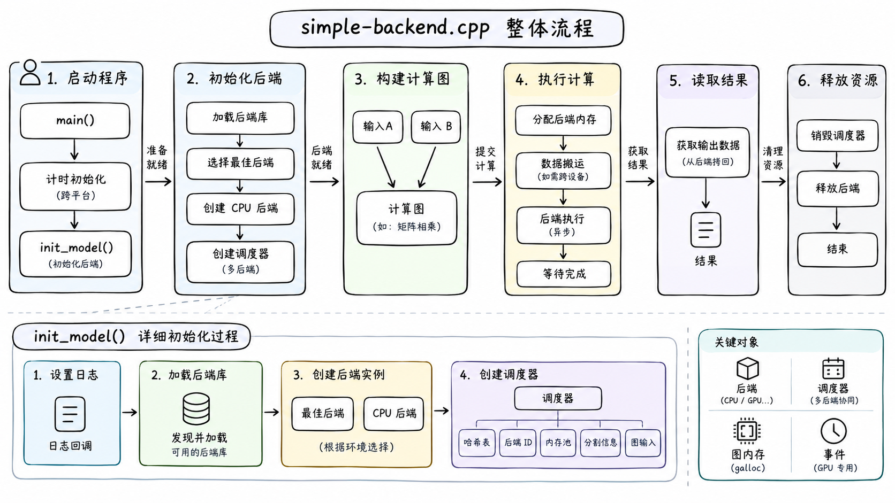
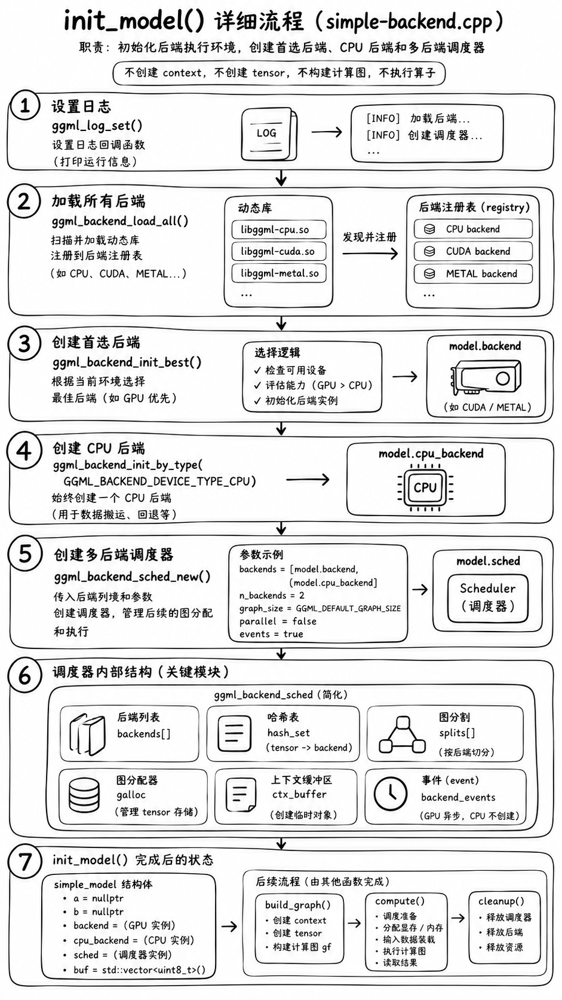

# simple-backend.cpp 断点调试：init_model 与后端调度初始化源码解析

## 0 概述



> 上图作为本文档的总览入口：先从 `main()` 的整体流程理解程序阶段，再进入 `init_model()` 的后端初始化、backend 实例创建和多后端 scheduler 构造细节。图中后续的构图、执行、结果读取和资源释放阶段，分别对应 `simple-backend-cpu-build_graph.md` 与 `simple-backend-cpu-compute.md`。

### 0.1 调试目标

本文基于 `examples/simple/simple-backend.cpp` 的断点调试过程，围绕 `init_model()` 这一函数，追踪 GGML 后端系统的初始化链路，理解以下机制：



> 该图作为 `init_model()` 章节的详细流程入口，展示日志配置、后端动态库加载、首选 backend 创建、CPU backend 创建、多后端 scheduler 创建，以及 scheduler 内部关键结构的初始化关系。

- GGML 计时设施初始化 `ggml_time_init()`；
- 后端动态库的发现、加载与注册；
- backend registry 与 device 的构造过程；
- CPU backend 实例的创建 `ggml_backend_cpu_init()`；
- 多后端调度器 `ggml_backend_sched_new()` 的创建；
- 调度器内部各功能块（hash table、backend ids、context buffer、splits、graph inputs）的划分理由；
- graph allocator `ggml_gallocr` 的结构体与依赖关系；
- backend event 的用途以及为什么 CPU 场景下不会创建 event。

### 0.2 调试环境

```text
示例程序：examples/simple/simple-backend.cpp
GGML 实现：src/ggml.c、src/ggml-backend.cpp、src/ggml-backend-reg.cpp、src/ggml-alloc.c、src/ggml-cpu/ggml-cpu.c、src/ggml-cpu/ggml-cpu.cpp
平台：macOS（Darwin 23.6.0）
调试工具：lldb / gdb
```

### 0.3 文档说明

本文不是纯源码静态阅读，而是基于断点运行时状态（断点位置、局部变量、调用栈、日志输出）逐段分析。所有结论均对应仓库中实际存在的源码位置；对于需要运行时确认的部分，在文末“待补充验证点”中列出。

### 0.4 `init_model()` 在整体流程中的位置

```text
main()
    │
    ├── ggml_time_init()              计时设施初始化（macOS 下为空操作）
    │
    ├── simple_model model;
    ├── init_model(model)             ← 本文重点
    │       ├── ggml_log_set()
    │       ├── ggml_backend_load_all()
    │       ├── ggml_backend_init_best()
    │       ├── ggml_backend_init_by_type(CPU)
    │       └── ggml_backend_sched_new()
    │
    ├── build_graph(model)            创建 context、Tensor、计算图
    │
    ├── compute(model, gf)            分配后端 buffer 并执行计算图
    │
    └── 读取输出张量结果
```

`init_model()` 的核心职责可以概括为：

> 初始化 GGML 后端执行环境，创建首选后端、CPU 后端以及多后端调度器，为后续的计算图分配与执行做准备。

它不创建 `ggml_context`，不创建 `ggml_tensor`，不构建计算图，也不执行任何算子。

---

## 1 `ggml_time_init()`：跨平台计时接口

### 1.1 调用位置

```cpp
int main(void) {
    ggml_time_init();

    simple_model model;
    init_model(model);
    ...
}
```

`ggml_time_init()` 是整个程序最早的 GGML 调用。

### 1.2 非 Windows 平台为空操作

`src/ggml.c` 中：

```c
#if defined(_MSC_VER) || defined(__MINGW32__)
/* Windows 分支：使用 QueryPerformanceCounter */
#else
void ggml_time_init(void) {}
int64_t ggml_time_ms(void) {
    struct timespec ts;
    clock_gettime(CLOCK_MONOTONIC, &ts);
    return (int64_t) ts.tv_sec * 1000 + (int64_t) ts.tv_nsec / 1000000;
}

int64_t ggml_time_us(void) {
    struct timespec ts;
    clock_gettime(CLOCK_MONOTONIC, &ts);
    return (int64_t) ts.tv_sec * 1000000 + (int64_t) ts.tv_nsec / 1000;
}
#endif
```

因此在当前 macOS 环境下：

```text
进入 ggml_time_init()
    ↓
函数体为空
    ↓
立即返回
```

### 1.3 Windows 平台的实现

Windows 分支使用高精度性能计数器：

```c
static int64_t timer_freq, timer_start;

static BOOL CALLBACK ggml_time_init_once(PINIT_ONCE once, PVOID param, PVOID *ctx) {
    LARGE_INTEGER t;
    QueryPerformanceFrequency(&t);
    timer_freq = t.QuadPart;

    QueryPerformanceCounter(&t);
    timer_start = t.QuadPart;
    return TRUE;
}

void ggml_time_init(void) {
    static INIT_ONCE once = INIT_ONCE_STATIC_INIT;
    InitOnceExecuteOnce(&once, ggml_time_init_once, NULL, NULL);
}
```

Windows 下完成两件事：

1. 获取性能计数器频率 `timer_freq`；
2. 记录程序起始计数值 `timer_start`。

### 1.4 关键区分

| 函数 | 作用 |
|---|---|
| `ggml_time_init()` | 初始化或准备计时接口 |
| `ggml_init()` | 创建 `ggml_context`，管理 GGML 对象和内存池 |
| `ggml_backend_init_*()` | 创建具体后端实例 |
| `ggml_new_tensor()` | 在 context 中创建 Tensor 元数据 |
| `ggml_graph_compute()` | 执行计算图 |

`ggml_time_init()` 不分配 GGML 内存，不创建 Tensor，不构建计算图，不影响推理结果。它放在 `main()` 第一行，是为了保持跨平台调用接口一致。

---

## 2 `init_model()` 整体结构

### 2.1 源码

```cpp
// This is a simple model with two tensors a and b
struct simple_model {
    struct ggml_tensor * a {};
    struct ggml_tensor * b {};

    // the backend to perform the computation (CPU, CUDA, METAL)
    ggml_backend_t backend {};
    ggml_backend_t cpu_backend {};
    ggml_backend_sched_t sched {};

    // storage for the graph and tensors
    std::vector<uint8_t> buf;
};

// initialize the backends and scheduler
void init_model(simple_model & model) {
    ggml_log_set(ggml_log_callback_default, nullptr);

    ggml_backend_load_all();

    model.backend = ggml_backend_init_best();
    model.cpu_backend = ggml_backend_init_by_type(GGML_BACKEND_DEVICE_TYPE_CPU, nullptr);

    ggml_backend_t backends[2] = { model.backend, model.cpu_backend };
    model.sched = ggml_backend_sched_new(backends, nullptr, 2, GGML_DEFAULT_GRAPH_SIZE, false, true);
}
```

### 2.2 断点入口时的变量状态

在函数入口断点观察：

```lldb
p model.a
p model.b
p model.backend
p model.cpu_backend
p model.sched
p model.buf.size()
```

预期：

```text
model.a           = nullptr
model.b           = nullptr
model.backend     = nullptr
model.cpu_backend = nullptr
model.sched       = nullptr
model.buf.size()  = 0
```

函数返回时的状态变化：

```text
model.backend     != nullptr        （第 60 行之后）
model.cpu_backend != nullptr        （第 61 行之后）
model.sched       != nullptr        （第 64 行之后）

model.a           == nullptr        仍然未创建
model.b           == nullptr        仍然未创建
model.buf.size()  == 0              仍然未分配
```

Tensor 创建发生在后续的 `build_graph()`。

### 2.3 `model` 以引用传递

```cpp
void init_model(simple_model & model)
```

`&` 表示引用，函数内对 `model` 成员的修改直接反映到 `main()` 中的同一对象上。

### 2.4 分层职责

```text
init_model()
    ├── 日志配置         ggml_log_set()
    ├── 后端发现与加载   ggml_backend_load_all()
    ├── 后端实例创建     ggml_backend_init_best()
    │                    ggml_backend_init_by_type()
    └── 调度器创建       ggml_backend_sched_new()
```

注意区分四层语义：

```text
加载（load）     ：发现并注册 backend 动态库
初始化（init）   ：创建具体 backend 实例
调度（schedule） ：决定节点使用哪个 backend
计算（compute）  ：实际执行算子
```

`init_model()` 只涉及前三层中的前两层半——调度器被创建出来，但真正的调度决策发生在 `ggml_backend_sched_alloc_graph()`。

---

## 3 日志回调 `ggml_log_set()`

### 3.1 源码

```cpp
static void ggml_log_callback_default(ggml_log_level level, const char * text, void * user_data) {
    (void) level;
    (void) user_data;
    fputs(text, stderr);
    fflush(stderr);
}

ggml_log_set(ggml_log_callback_default, nullptr);
```

### 3.2 作用

将 GGML 日志输出回调设置为写入 `stderr` 并立即刷新。

```text
GGML 产生日志
    ↓
ggml_log_callback_default()
    ↓
fputs(text, stderr)
    ↓
fflush(stderr)
```

`nullptr` 是用户数据指针，当前示例没有使用额外日志上下文。

后续可见的日志包括：

- 后端加载信息；
- 设备注册信息；
- 后端选择和 buffer 分配信息；
- 警告与错误。

---

## 4 后端动态加载 `ggml_backend_load_all()`

### 4.1 调用链

```cpp
void ggml_backend_load_all() {
    ggml_backend_load_all_from_path(nullptr);
}

void ggml_backend_load_all_from_path(const char * dir_path) {
#ifdef NDEBUG
    bool silent = true;
#else
    bool silent = false;
#endif

    ggml_backend_load_best("blas", silent, dir_path);
    ggml_backend_load_best("zendnn", silent, dir_path);
    ggml_backend_load_best("cann", silent, dir_path);
    ggml_backend_load_best("cuda", silent, dir_path);
    ggml_backend_load_best("hip", silent, dir_path);
    ggml_backend_load_best("metal", silent, dir_path);
    ggml_backend_load_best("rpc", silent, dir_path);
    ggml_backend_load_best("sycl", silent, dir_path);
    ggml_backend_load_best("vulkan", silent, dir_path);
    ggml_backend_load_best("virtgpu", silent, dir_path);
    ggml_backend_load_best("opencl", silent, dir_path);
    ggml_backend_load_best("hexagon", silent, dir_path);
    ggml_backend_load_best("musa", silent, dir_path);
    ggml_backend_load_best("openvino", silent, dir_path);
    ggml_backend_load_best("cpu", silent, dir_path);

    // check the environment variable GGML_BACKEND_PATH to load an out-of-tree backend
    const char * backend_path = std::getenv("GGML_BACKEND_PATH");
    if (backend_path) {
        ggml_backend_load(backend_path);
    }
}
```

### 4.2 `ggml_backend_load_best(name, silent, user_search_path)`

源码：

```cpp
static ggml_backend_reg_t ggml_backend_load_best(const char * name, bool silent, const char * user_search_path) {
    // enumerate all the files that match [lib]ggml-name-*.[so|dll] in the search paths
    const fs::path name_path = fs::u8path(name);
    const fs::path file_prefix = backend_filename_prefix().native() + name_path.native() + fs::u8path("-").native();
    const fs::path file_extension = backend_filename_extension();
    ...
}
```

“best”的含义需要明确：

> 它只在**某一个指定后端类别的候选动态库之间**选择评分最高的库，而不是在 CPU、Metal、CUDA 等不同类型后端之间统一选择。

调用：

```cpp
ggml_backend_load_best("cpu", silent, dir_path);
```

表示只扫描匹配：

```text
libggml-cpu-*.so
```

的文件，并调用候选库导出的 `ggml_backend_score()`，选择 `best_score` 最大者。

选择流程：

```text
枚举候选动态库
    ↓
dl_load_library()
    ↓
查找符号 ggml_backend_score
    ↓
调用 score_fn()
    ↓
比较 s > best_score
    ↓
记录 best_path
```

若没有任何候选带评分，则退化为直接加载基础名称的库：

```cpp
if (best_score == 0) {
    // try to load the base backend
    for (const auto & search_path : search_paths) {
        fs::path filename = backend_filename_prefix().native() + name_path.native() + backend_filename_extension().native();
        fs::path path = search_path / filename;
        if (std::error_code ec; fs::exists(path, ec)) {
            return get_reg().load_backend(path, silent);
        }
        ...
    }
    return nullptr;
}
```

即尝试加载：

```text
libggml-cpu.so
```

### 4.3 默认搜索路径

当 `user_search_path == nullptr` 时：

```cpp
std::vector<fs::path> search_paths;
if (user_search_path == nullptr) {
#ifdef GGML_BACKEND_DIR
    search_paths.push_back(fs::u8path(GGML_BACKEND_DIR));
#endif
    // default search paths: executable directory, current directory
    search_paths.push_back(get_executable_path());
    std::error_code cwd_ec;
    const fs::path cwd = fs::current_path(cwd_ec);
    ...
    search_paths.push_back(cwd);
} else {
    search_paths.push_back(fs::u8path(user_search_path));
}
```

因此默认搜索顺序为：

```text
1. 编译期 GGML_BACKEND_DIR（若定义）
2. 当前可执行文件所在目录 get_executable_path()
3. 当前进程工作目录 fs::current_path()
```

在 CLion 调试时，第 3 项取决于 Run/Debug Configuration 的 Working directory，与可执行文件目录不一定相同。

### 4.4 `silent` 参数

```cpp
#ifdef NDEBUG
    bool silent = true;
#else
    bool silent = false;
#endif
```

```text
Debug 构建   ：silent = false，输出更多加载失败信息
Release 构建 ：silent = true，抑制部分失败日志
```

它只控制某些失败路径的日志输出，不控制是否加载后端。

### 4.5 `GGML_BACKEND_PATH` 环境变量

```cpp
// check the environment variable GGML_BACKEND_PATH to load an out-of-tree backend
const char * backend_path = std::getenv("GGML_BACKEND_PATH");
if (backend_path) {
    ggml_backend_load(backend_path);
}
```

含义：

```text
环境变量存在：
    backend_path 指向具体动态库文件路径
    调用 ggml_backend_load(backend_path)

环境变量不存在：
    backend_path == nullptr
    跳过
```

注意这里调用的是 `ggml_backend_load()`，而不是 `ggml_backend_load_all_from_path()`：

| 接口 | 参数含义 |
|---|---|
| `ggml_backend_load_all_from_path(path)` | 后端目录 |
| `ggml_backend_load(path)` | 一个具体后端动态库文件 |
| `GGML_BACKEND_PATH` | 在当前代码中是**具体动态库文件路径** |

示例用法：

```bash
export GGML_BACKEND_PATH=/opt/ggml/lib/libggml-custom.so
```

这是用于加载 **out-of-tree backend**（不在当前 GGML 源码树内构建的外部后端）。

### 4.6 静态注册与动态加载的关系

即使动态加载函数返回 `nullptr`，CPU backend 也可能仍然可用。原因是 backend registry 构造时会先注册编译期后端：

```cpp
struct ggml_backend_registry {
    ...
    ggml_backend_registry() {
#ifdef GGML_USE_CUDA
        register_backend(ggml_backend_cuda_reg());
#endif
#ifdef GGML_USE_METAL
        register_backend(ggml_backend_metal_reg());
#endif
        ...
#ifdef GGML_USE_CPU
        register_backend(ggml_backend_cpu_reg());
#endif
    }
};
```

因此：

```text
静态注册：
    backend 已编译进当前程序，registry 构造时直接注册

动态加载：
    从磁盘动态库中加载 backend 并注册到同一个 registry
```

当前工程 CMake 默认：

```cmake
option(GGML_BACKEND_DL "ggml: build backends as dynamic libraries (requires BUILD_SHARED_LIBS)" OFF)
set(GGML_BACKEND_DIR "" CACHE PATH "ggml: directory to load dynamic backends from (requires GGML_BACKEND_DL")
```

因此 CPU 后端很可能通过 `GGML_USE_CPU` 静态注册，此时跟踪 `ggml_backend_load_best("cpu", ...)` 看不到候选动态库属于正常现象。

### 4.7 动态加载的应用场景

```text
1. 同一个程序适配不同硬件（CPU / Metal / CUDA / Vulkan）
2. 避免在没有对应运行库的机器上产生硬依赖
3. 在同一 backend 类别的多个 CPU 优化变体之间选择
4. 加载第三方或 out-of-tree backend
5. 在 API 版本兼容的前提下独立替换后端动态库
```

动态加载只解决“有哪些后端可用”，不解决“某个节点由谁执行”。

---

## 5 设备注册与日志来源

### 5.1 CPU backend 注册入口

CPU backend 的注册入口不是 `ggml_backend_cpu_init()`，而是：

```cpp
#ifdef GGML_USE_CPU
    register_backend(ggml_backend_cpu_reg());
#endif
```

这段代码位于 `src/ggml-backend-reg.cpp` 的
`ggml_backend_registry` 构造函数中：

```cpp
struct ggml_backend_registry {
    std::vector<ggml_backend_reg_entry> backends;
    std::vector<ggml_backend_dev_t> devices;

    ggml_backend_registry() {
#ifdef GGML_USE_CUDA
        register_backend(ggml_backend_cuda_reg());
#endif
#ifdef GGML_USE_METAL
        register_backend(ggml_backend_metal_reg());
#endif
        ...
#ifdef GGML_USE_CPU
        register_backend(ggml_backend_cpu_reg());
#endif
    }
};
```

`get_reg()` 使用函数内静态对象保证 registry 在第一次访问时构造一次：

```cpp
static ggml_backend_registry & get_reg() {
    static ggml_backend_registry reg;
    return reg;
}
```

因此，首次触发以下任一类 registry 访问时，会进入 registry 构造函数，并按照编译期宏注册静态 backend：

```text
ggml_backend_load_all()
ggml_backend_init_best()
ggml_backend_dev_count()
ggml_backend_cpu_reg()
```

在本示例中，典型入口是：

```text
init_model()
    ↓
ggml_backend_load_all()
    ↓
ggml_backend_load_all_from_path(nullptr)
    ↓
第一次访问 get_reg()
    ↓
构造 ggml_backend_registry
    ↓
#ifdef GGML_USE_CPU
    ↓
ggml_backend_cpu_reg()
    ↓
register_backend(reg)
```

因此，CPU backend 的注册发生在动态库扫描之前或扫描过程中都可能被观察到；更准确地说，静态 backend 是 registry 第一次构造时注册的，`ggml_backend_load_all()` 后续再尝试加载额外的动态 backend。

### 5.2 `ggml_backend_cpu_reg()` 返回什么

CPU backend 的注册函数位于 `src/ggml-cpu/ggml-cpu.cpp`：

```cpp
ggml_backend_reg_t ggml_backend_cpu_reg(void) {
    static struct ggml_backend_reg ggml_backend_cpu_reg = {
        /* .api_version = */ GGML_BACKEND_API_VERSION,
        /* .iface       = */ ggml_backend_cpu_reg_i,
        /* .context     = */ NULL,
    };

    return &ggml_backend_cpu_reg;
}
```

当前源码中的 `ggml_backend_cpu_reg()` 还会先调用：

```cpp
ggml_cpu_init();
```

该调用确保 CPU 全局查找表和 CPU 特性检测等初始化路径完成；随后函数返回静态保存的注册对象。它仍然不会创建 CPU backend 执行实例。

其中 `ggml_backend_cpu_reg_i` 提供注册级接口：

```cpp
static const struct ggml_backend_reg_i ggml_backend_cpu_reg_i = {
    /* .get_name           = */ ggml_backend_cpu_reg_get_name,
    /* .get_device_count   = */ ggml_backend_cpu_reg_get_device_count,
    /* .get_device         = */ ggml_backend_cpu_reg_get_device,
    /* .get_proc_address   = */ ggml_backend_cpu_get_proc_address,
};
```

CPU 注册对象不会在这里创建 CPU backend 执行实例；它提供的是：

```text
注册名
设备数量
如何获取设备
如何查询特性和接口
```

真正的 CPU backend 执行实例要到后续调用：

```cpp
ggml_backend_cpu_init();
```

才会创建。

### 5.3 `register_backend: registered backend CPU (1 devices)` 的来源

日志代码位于 `src/ggml-backend-reg.cpp`：

```cpp
void register_backend(ggml_backend_reg_t reg, dl_handle_ptr handle = nullptr) {
    if (!reg) {
        return;
    }

    for (auto & entry : backends) {
        if (entry.reg == reg) {
            return;
        }
    }

#ifndef NDEBUG
    GGML_LOG_DEBUG("%s: registered backend %s (%zu devices)\\n",
        __func__,
        ggml_backend_reg_name(reg),
        ggml_backend_reg_dev_count(reg));
#endif

    backends.push_back({ reg, std::move(handle) });

    for (size_t i = 0; i < ggml_backend_reg_dev_count(reg); i++) {
        register_device(ggml_backend_reg_dev_get(reg, i));
    }
}
```

当传入的是 CPU 注册对象时：

```cpp
reg = ggml_backend_cpu_reg()
```

日志中的三部分分别来自：

```text
register_backend
    → __func__，当前函数名

CPU
    → ggml_backend_reg_name(reg)
    → ggml_backend_cpu_reg_get_name(reg)
    → 固定返回 "CPU"

1 devices
    → ggml_backend_reg_dev_count(reg)
    → ggml_backend_cpu_reg_get_device_count(reg)
    → 固定返回 1
```

CPU 注册级 name/count 函数：

```cpp
static const char * ggml_backend_cpu_reg_get_name(ggml_backend_reg_t reg) {
    return "CPU";
}

static size_t ggml_backend_cpu_reg_get_device_count(ggml_backend_reg_t reg) {
    return 1;
}
```

所以日志：

```text
register_backend: registered backend CPU (1 devices)
```

准确含义是：

> 名为 `CPU` 的 backend registration 已加入全局 registry，并且该注册对象声明自己提供 1 个 device。

它不表示：

```text
已经创建了 1 个 CPU backend 执行实例
已经执行了 CPU 算子
已经分配了 Tensor data
```

### 5.4 `register_backend` 后如何注册 CPU device

`register_backend()` 打印 backend 日志后执行：

```cpp
backends.push_back({ reg, std::move(handle) });

for (size_t i = 0; i < ggml_backend_reg_dev_count(reg); i++) {
    register_device(ggml_backend_reg_dev_get(reg, i));
}
```

对于 CPU：

```text
ggml_backend_cpu_reg_dev_count() == 1
    ↓
i = 0
    ↓
ggml_backend_cpu_reg_get_device(reg, 0)
    ↓
返回 CPU device
    ↓
register_device(device)
```

CPU device 的获取函数：

```cpp
static ggml_backend_dev_t ggml_backend_cpu_reg_get_device(
        ggml_backend_reg_t reg, size_t index) {
    GGML_ASSERT(index == 0);

    static ggml_backend_cpu_device_context ctx;
    static ggml_backend_device ggml_backend_cpu_device = {
        /* .iface   = */ ggml_backend_cpu_device_i,
        /* .reg     = */ reg,
        /* .context = */ &ctx,
    };

    return &ggml_backend_cpu_device;
}
```

第一次调用时：

```text
构造 static CPU device context
    ↓
读取 CPU 品牌字符串
    ↓
构造 static ggml_backend_device
    ↓
返回 CPU device 指针
```

随后 `register_device()` 将这个 device 加入：

```cpp
std::vector<ggml_backend_dev_t> devices;
```

这就形成了两级注册关系：

```text
backend registry
    └── CPU backend registration（CPU，1 devices）
          └── CPU device（CPU，Intel(R) Core(TM) ...）
```

### 5.5 `register_device` 日志代码

```cpp
void register_device(ggml_backend_dev_t device) {
    for (auto & dev : devices) {
        if (dev == device) {
            return;
        }
    }

#ifndef NDEBUG
    GGML_LOG_DEBUG("%s: registered device %s (%s)\n",
        __func__,
        ggml_backend_dev_name(device),
        ggml_backend_dev_description(device));
#endif
    devices.push_back(device);
}
```

对应日志：

```text
register_device: registered device CPU (Intel(R) Core(TM) i7-4770HQ CPU @ 2.20GHz)
```

### 5.2 两段信息的来源不同

```text
CPU
    → device name，固定逻辑名称

Intel(R) Core(TM) i7-4770HQ CPU @ 2.20GHz
    → device description，从操作系统读取的 CPU 品牌字符串
```

CPU device 的 name 函数：

```cpp
static const char * ggml_backend_cpu_device_get_name(ggml_backend_dev_t dev) {
    return "CPU";

    GGML_UNUSED(dev);
}
```

它不读取系统信息，固定返回 `"CPU"`。

### 5.3 description 的来源

CPU device context 定义：

```cpp
struct ggml_backend_cpu_device_context {
    std::string description = "CPU";

    ggml_backend_cpu_device_context() {
#ifdef __APPLE__
        size_t len = 0;
        if (!sysctlbyname("machdep.cpu.brand_string", NULL, &len, NULL, 0)) {
            description.resize(len);
            sysctlbyname("machdep.cpu.brand_string", &description[0], &len, NULL, 0);
        }
#elif defined(__linux__)
        FILE * f = fopen("/proc/cpuinfo", "r");
        ...
#elif defined(_WIN32)
        /* 读取注册表 HARDWARE\DESCRIPTION\System\CentralProcessor\0 的 ProcessorNameString */
#endif
    }
};
```

macOS 下两次调用 `sysctlbyname`：

```text
第一次：oldp = NULL，查询字符串长度，写入 len
    ↓
description.resize(len)
    ↓
第二次：读取实际品牌字符串到 description
```

不同平台的信息来源：

| 平台 | 来源 |
|---|---|
| macOS | `sysctlbyname("machdep.cpu.brand_string", ...)` |
| Linux | `/proc/cpuinfo` 中的 `model name` |
| Windows | 注册表 `HARDWARE\DESCRIPTION\System\CentralProcessor\0` 的 `ProcessorNameString` |
| 查询失败 | 保留默认值 `"CPU"` |

### 5.4 获取 description 的接口

```cpp
static const char * ggml_backend_cpu_device_get_description(ggml_backend_dev_t dev) {
    struct ggml_backend_cpu_device_context * ctx = (struct ggml_backend_cpu_device_context *)dev->context;

    return ctx->description.c_str();
}
```

对象关系：

```text
ggml_backend_device
    └── context
          └── ggml_backend_cpu_device_context
                └── description
```

### 5.5 device context 的构造时机

```cpp
static ggml_backend_dev_t ggml_backend_cpu_reg_get_device(ggml_backend_reg_t reg, size_t index) {
    GGML_ASSERT(index == 0);

    static ggml_backend_cpu_device_context ctx;
    static ggml_backend_device ggml_backend_cpu_device = {
        /* .iface   = */ ggml_backend_cpu_device_i,
        /* .reg     = */ reg,
        /* .context = */ &ctx,
    };

    return &ggml_backend_cpu_device;
}
```

`ctx` 和 `ggml_backend_cpu_device` 都是 `static` 对象，第一次调用时构造一次（此时执行 `sysctlbyname`），之后复用。

### 5.6 重要区分

这条日志出现在 **backend registry 注册 CPU device 阶段**，早于 `ggml_backend_cpu_init()`。

```text
registered device CPU
    → CPU device 已注册到全局 backend registry

ggml_backend_cpu_init()
    → CPU backend 执行实例被创建
```

另外，设备描述信息只表示 CPU 品牌，不等同于 SSE / AVX / AVX2 等指令集特性检测。指令集能力由独立的 CPU feature detection 逻辑（`ggml_cpu_has_*`）负责。

---

## 6 首选后端初始化 `ggml_backend_init_best()`

### 6.1 源码

```cpp
ggml_backend_t ggml_backend_init_best(void) {
    ggml_backend_dev_t dev = ggml_backend_dev_by_type(GGML_BACKEND_DEVICE_TYPE_GPU);
    dev = dev ? dev : ggml_backend_dev_by_type(GGML_BACKEND_DEVICE_TYPE_IGPU);
    dev = dev ? dev : ggml_backend_dev_by_type(GGML_BACKEND_DEVICE_TYPE_CPU);
    if (!dev) {
        return nullptr;
    }
    return ggml_backend_dev_init(dev, nullptr);
}
```

### 6.2 设备选择优先级

```text
GPU
  ↓ 如果没有
集成 GPU（IGPU）
  ↓ 如果没有
CPU
```

它查询的是 registry 中已经注册的设备：

```cpp
ggml_backend_dev_t ggml_backend_dev_by_type(enum ggml_backend_dev_type type) {
    for (size_t i = 0; i < ggml_backend_dev_count(); i++) {
        ggml_backend_dev_t dev = ggml_backend_dev_get(i);
        if (ggml_backend_dev_type(dev) == type) {
            return dev;
        }
    }
    return nullptr;
}
```

因此必须在 `ggml_backend_load_all()` 之后调用，否则动态加载的设备尚不存在。

### 6.3 与 `ggml_backend_load_best()` 的区别

```text
ggml_backend_load_best()
    → 在某一后端类别的动态库候选中选评分最高者，改变 registry 内容

ggml_backend_init_best()
    → 在 registry 中已注册的设备里按优先级选一个并创建实例
```

这是两个完全不同的“best”。

---

## 7 CPU backend 实例创建 `ggml_backend_cpu_init()`

### 7.1 调用链

```text
ggml_backend_init_best()
    ↓
ggml_backend_dev_by_type(CPU)
    ↓
ggml_backend_dev_init(dev, nullptr)
    ↓
CPU device 的 init_backend 回调
    ↓
ggml_backend_cpu_init()
```

以及显式路径：

```cpp
ggml_backend_init_by_type(GGML_BACKEND_DEVICE_TYPE_CPU, nullptr);
```

对应：

```cpp
ggml_backend_t ggml_backend_init_by_type(enum ggml_backend_dev_type type, const char * params) {
    ggml_backend_dev_t dev = ggml_backend_dev_by_type(type);
    if (!dev) {
        return nullptr;
    }
    return ggml_backend_dev_init(dev, params);
}
```

### 7.2 完整源码

```cpp
ggml_backend_t ggml_backend_cpu_init(void) {
    // initialize CPU backend now to avoid slowing the first graph computation
    ggml_cpu_init();

    struct ggml_backend_cpu_context * ctx = new ggml_backend_cpu_context;
    if (ctx == NULL) {
        return NULL;
    }

    ctx->n_threads           = GGML_DEFAULT_N_THREADS;
    ctx->threadpool          = NULL;
    ctx->work_data           = NULL;
    ctx->work_size           = 0;
    ctx->abort_callback      = NULL;
    ctx->abort_callback_data = NULL;
    ctx->use_ref             = false;

    ggml_backend_t cpu_backend = new ggml_backend {
        /* .guid    = */ ggml_backend_cpu_guid(),
        /* .iface   = */ ggml_backend_cpu_i,
        /* .device  = */ ggml_backend_reg_dev_get(ggml_backend_cpu_reg(), 0),
        /* .context = */ ctx,
    };

    if (cpu_backend == NULL) {
        delete ctx;
        return NULL;
    }

    return cpu_backend;
}
```

### 7.3 `ggml_cpu_init()`：CPU 全局执行环境初始化

```cpp
void ggml_cpu_init(void) {
    // needed to initialize ggml_time
    {
        struct ggml_init_params params = { 0, NULL, false };
        struct ggml_context * ctx = ggml_init(params);
        ggml_free(ctx);
    }

    ggml_critical_section_start();

    static bool is_first_call = true;

    if (is_first_call) {
        // initialize GELU, Quick GELU, SILU and EXP F32 tables
        {
            const uint64_t t_start = ggml_time_us(); UNUSED(t_start);

            for (int i = 0; i < (1 << 16); ++i) {
                union {
                    uint16_t u16;
                    ggml_fp16_t fp16;
                } u = {i};
                float f = GGML_COMPUTE_FP16_TO_FP32(u.fp16);
                ggml_table_f32_f16[i] = f;
                ggml_table_gelu_f16[i] = GGML_CPU_FP32_TO_FP16(ggml_gelu_f32(f));
                ggml_table_gelu_quick_f16[i] = GGML_CPU_FP32_TO_FP16(ggml_gelu_quick_f32(f));
            }
            ...
        }

#if defined(__ARM_ARCH)
        ggml_init_arm_arch_features();
#endif
#if defined(__riscv)
        ggml_init_riscv_arch_features();
#endif
        {
            const char * env = getenv("GGML_CPU_DISABLE_FUSION");
            ggml_cpu_disable_fusion = (env != NULL && atoi(env) == 1);
        }

        is_first_call = false;
    }

    ggml_critical_section_end();
}
```

它完成：

```text
1. 触发一次 ggml_init() / ggml_free()，初始化时间等基础路径
2. 预计算 FP16 / GELU / Quick GELU / SILU / EXP 查找表
3. 初始化 E8M0、UE4M3 等低精度转换表
4. 初始化 ARM / RISC-V 架构特性
5. 读取 GGML_CPU_DISABLE_FUSION 环境变量
```

注意入口处创建的 `ctx` 是临时 context：

```text
创建临时 context
    ↓
立即 ggml_free(ctx)
```

它不是模型计算使用的 context，也不保存模型 Tensor。

`is_first_call` 保证全局表和架构特性只初始化一次；`ggml_critical_section_start()/end()` 保护首次并发进入。

### 7.4 CPU backend 私有上下文

```cpp
struct ggml_backend_cpu_context * ctx = new ggml_backend_cpu_context;
```

这是 CPU backend 的运行时状态，不是 `ggml_context`。

```text
ggml_context
    → 管理 ggml_tensor / ggml_cgraph 元数据和对象内存池

ggml_backend_cpu_context
    → 管理 CPU backend 的线程数、线程池、work buffer、中止回调
```

初始字段：

```cpp
ctx->n_threads           = GGML_DEFAULT_N_THREADS;
ctx->threadpool          = NULL;
ctx->work_data           = NULL;
ctx->work_size           = 0;
ctx->abort_callback      = NULL;
ctx->abort_callback_data = NULL;
ctx->use_ref             = false;
```

含义：

```text
使用默认线程数
暂未指定外部线程池
暂未申请 graph work buffer
未设置中止回调
```

后续可以通过以下接口修改：

```cpp
void ggml_backend_cpu_set_n_threads(ggml_backend_t backend_cpu, int n_threads);
void ggml_backend_cpu_set_threadpool(ggml_backend_t backend_cpu, ggml_threadpool_t threadpool);
void ggml_backend_cpu_set_abort_callback(ggml_backend_t backend_cpu, ggml_abort_callback abort_callback, void * abort_callback_data);
void ggml_backend_cpu_set_use_ref(ggml_backend_t backend_cpu, bool use_ref);
```

### 7.5 通用 backend 对象的组装

```cpp
ggml_backend_t cpu_backend = new ggml_backend {
    /* .guid    = */ ggml_backend_cpu_guid(),
    /* .iface   = */ ggml_backend_cpu_i,
    /* .device  = */ ggml_backend_reg_dev_get(ggml_backend_cpu_reg(), 0),
    /* .context = */ ctx,
};
```

四个字段：

```text
.guid
    标识 backend 类型，用于 ggml_backend_is_cpu() 判断

.iface
    CPU backend 的函数表，包括 graph_compute / free / set_tensor 等

.device
    该 backend 实例关联的 CPU device

.context
    指向 ggml_backend_cpu_context
```

guid 判断：

```cpp
bool ggml_backend_is_cpu(ggml_backend_t backend) {
    return backend != NULL && ggml_guid_matches(backend->guid, ggml_backend_cpu_guid());
}
```

iface 函数表：

```cpp
static const struct ggml_backend_i ggml_backend_cpu_i = {
    /* .get_name                = */ ggml_backend_cpu_get_name,
    /* .free                    = */ ggml_backend_cpu_free,
    /* .set_tensor_async        = */ NULL,
    /* .get_tensor_async        = */ NULL,
    /* .set_tensor_2d_async     = */ NULL,
    /* .get_tensor_2d_async     = */ NULL,
    /* .cpy_tensor_async        = */ NULL,
    /* .synchronize             = */ NULL,
    /* .graph_plan_create       = */ ggml_backend_cpu_graph_plan_create,
    /* .graph_plan_free         = */ ggml_backend_cpu_graph_plan_free,
    /* .graph_plan_update       = */ NULL,
    /* .graph_plan_compute      = */ ggml_backend_cpu_graph_plan_compute,
    /* .graph_compute           = */ ggml_backend_cpu_graph_compute,
    /* .event_record            = */ NULL,
    /* .event_wait              = */ NULL,
    /* .graph_optimize          = */ NULL,
};
```

上层统一调用：

```cpp
ggml_backend_graph_compute(backend, graph);
```

由 GGML 通过：

```cpp
backend->iface.graph_compute
```

分派到：

```cpp
ggml_backend_cpu_graph_compute
```

这就是 GGML 用同一套调度代码支持 CPU / Metal / CUDA 的关键机制。

### 7.6 执行顺序关系

```text
registry 构造（静态注册 CPU backend + device）
    ↓
ggml_backend_load_all()（动态加载其他后端）
    ↓
ggml_backend_init_best() / ggml_backend_init_by_type(CPU)
    ↓
ggml_backend_cpu_init()
    ├── ggml_cpu_init()（全局一次性初始化）
    ├── new ggml_backend_cpu_context
    └── new ggml_backend
    ↓
ggml_backend_sched_new()
    ↓
ggml_backend_sched_alloc_graph()
    ↓
ggml_backend_sched_graph_compute()
```

### 7.7 可能被调用两次

如果 `model.backend` 最终也是 CPU：

```cpp
model.backend = ggml_backend_init_best();          // 第一次 ggml_backend_cpu_init()
model.cpu_backend = ggml_backend_init_by_type(...); // 第二次 ggml_backend_cpu_init()
```

此时：

```text
ggml_cpu_init() 的全局表和架构初始化：
    只做一次（is_first_call）

ggml_backend_cpu_init() 创建的 backend / context：
    每次都创建新实例
```

因此 `model.backend` 和 `model.cpu_backend` 即使都是 CPU，也不应默认认为是同一个指针。

### 7.8 该函数不做什么

`ggml_backend_cpu_init()` 不创建 `ggml_context`，不创建 `ggml_tensor`，不分配 Tensor data，不构建计算图，不执行算子，也不为当前计算图分配后端 buffer。

---

## 8 多后端调度器 `ggml_backend_sched_new()`

### 8.1 调用与参数

```cpp
ggml_backend_t backends[2] = { model.backend, model.cpu_backend };
model.sched = ggml_backend_sched_new(backends, nullptr, 2, GGML_DEFAULT_GRAPH_SIZE, false, true);
```

声明：

```cpp
GGML_API ggml_backend_sched_t ggml_backend_sched_new(
    ggml_backend_t * backends,
    ggml_backend_buffer_type_t * bufts,
    int n_backends,
    size_t graph_size,
    bool parallel,
    bool op_offload);
```

参数含义：

| 参数 | 当前传值 | 作用 |
|---|---:|---|
| `backends` | `backends` | 后端实例数组 |
| `bufts` | `nullptr` | 每个后端的 buffer 类型；空表示使用默认 |
| `n_backends` | `2` | 后端数量 |
| `graph_size` | `GGML_DEFAULT_GRAPH_SIZE` | 调度器预留的计算图容量 |
| `parallel` | `false` | 是否启用流水线多副本执行 |
| `op_offload` | `true` | 是否允许算子卸载到非 CPU 后端 |

### 8.2 入口断言与 CPU 约束

```cpp
GGML_ASSERT(n_backends > 0);
GGML_ASSERT(n_backends <= GGML_SCHED_MAX_BACKENDS);
GGML_ASSERT(ggml_backend_dev_type(ggml_backend_get_device(backends[n_backends - 1])) == GGML_BACKEND_DEVICE_TYPE_CPU);
```

最后一个后端必须是 CPU：

```text
backends[0 ... n-2]：
    其他优先后端，例如 CUDA、Metal、Vulkan

backends[n-1]：
    CPU fallback backend
```

这就是 `init_model()` 特意构造 `{ model.backend, model.cpu_backend }` 的原因。

### 8.3 `parallel` 的作用

```cpp
sched->n_copies = parallel ? GGML_SCHED_MAX_COPIES : 1;
```

当前 `parallel = false`：

```text
sched->n_copies = 1
```

`parallel` 不是“CPU 是否多线程”。CPU 线程数由 `ggml_backend_cpu_context::n_threads` 管理。这里的 `parallel` 指 scheduler 层面的多副本 / pipeline parallel execution。

### 8.4 `op_offload` 的作用

```cpp
sched->op_offload = op_offload;
```

当前 `true` 表示允许调度器根据后端能力把算子分配到更合适的后端。

它不等于：

```text
强制所有算子使用 GPU
把整个模型无条件搬到 GPU
```

最终仍取决于 `supports_op()`、Tensor 已有 buffer 位置、节点依赖关系和 backend 优先级。在 CPU-only 场景下，即使为 `true` 也无其他设备可卸载。

### 8.5 `bufts` 为 `nullptr` 的处理

```cpp
for (int b = 0; b < n_backends; b++) {
    sched->backends[b] = backends[b];
    sched->bufts[b] = bufts ? bufts[b] : ggml_backend_get_default_buffer_type(backends[b]);
    GGML_ASSERT(ggml_backend_supports_buft(backends[b], sched->bufts[b]));
    ...
}
```

自动获取每个 backend 的默认 buffer 类型：

```text
CPU backend   → CPU host buffer type
Metal backend → Metal buffer type
CUDA backend  → CUDA device buffer type
```

并检查后端是否支持该 buffer 类型。

### 8.6 scheduler 结构体

```cpp
struct ggml_backend_sched {
    bool is_reset; // true if the scheduler has been reset since the last graph split
    bool is_alloc;

    int n_backends;

    ggml_backend_t backends[GGML_SCHED_MAX_BACKENDS];
    ggml_backend_buffer_type_t bufts[GGML_SCHED_MAX_BACKENDS];
    ggml_gallocr_t galloc;

    // hash map of the nodes in the graph
    struct ggml_hash_set  hash_set;
    int                 * hv_tensor_backend_ids; // [hash_set.size]
    struct ggml_tensor ** hv_tensor_copies;      // [hash_set.size][n_backends][n_copies]

    int * node_backend_ids; // [graph_size]
    int * leaf_backend_ids; // [graph_size]

    int * prev_node_backend_ids; // [graph_size]
    int * prev_leaf_backend_ids; // [graph_size]

    // copy of the graph with modified inputs
    struct ggml_cgraph graph;

    // graph splits
    struct ggml_backend_sched_split * splits;
    int n_splits;
    int splits_capacity;

    // pipeline parallelism support
    int n_copies;
    int cur_copy;
    int next_copy;
    ggml_backend_event_t events[GGML_SCHED_MAX_BACKENDS][GGML_SCHED_MAX_COPIES];
    struct ggml_tensor ** graph_inputs;
    int n_graph_inputs;
    int graph_inputs_capacity;

    struct ggml_context * ctx;

    ggml_backend_sched_eval_callback callback_eval;
    void * callback_eval_user_data;

    char * context_buffer;
    size_t context_buffer_size;

    bool op_offload;

    int debug;
    ...
};
```

它不是 `ggml_context`，也不是 `ggml_cgraph`，而是负责：

```text
多后端管理
图节点后端归属
Tensor 后端 buffer 分配
跨后端数据拷贝
图切分
调度执行
```

### 8.7 调试环境变量

```cpp
const char * GGML_SCHED_DEBUG = getenv("GGML_SCHED_DEBUG");
sched->debug = GGML_SCHED_DEBUG ? atoi(GGML_SCHED_DEBUG) : 0;

sched->debug_realloc = 0;
#ifdef GGML_SCHED_NO_REALLOC
    sched->debug_realloc = 1;
#endif
const char * GGML_SCHED_DEBUG_REALLOC = getenv("GGML_SCHED_DEBUG_REALLOC");
sched->debug_realloc = GGML_SCHED_DEBUG_REALLOC ? atoi(GGML_SCHED_DEBUG_REALLOC) : sched->debug_realloc;
```

| 环境变量 | 作用 |
|---|---|
| `GGML_SCHED_DEBUG` | 输出调度、图切分、后端分配调试信息 |
| `GGML_SCHED_DEBUG_REALLOC` | 调试计算图容量重新分配 |

这些仅影响调试输出，不影响算子数值结果。

### 8.8 不同 `buffer type` 的 allocator 复用

```cpp
for (int i = 0; i < n_bufs; i++) {
    galloc->bufts[i] = bufts[i];
    galloc->buffers[i] = NULL;

    // check if the same buffer type is used multiple times and reuse the same allocator
    for (int j = 0; j < i; j++) {
        if (bufts[i] == bufts[j]) {
            galloc->buf_tallocs[i] = galloc->buf_tallocs[j];
            break;
        }
    }

    if (galloc->buf_tallocs[i] == NULL) {
        size_t alignment = ggml_backend_buft_get_alignment(bufts[i]);
        size_t max_size = ggml_backend_buft_get_max_size(bufts[i]);
        galloc->buf_tallocs[i] = ggml_dyn_tallocr_new(alignment, max_size);
    }
}
```

如果两个后端使用相同 buffer type（例如 CPU-only 场景下两个 CPU backend），它们共享同一个 `ggml_dyn_tallocr`。

### 8.9 末尾调用 `ggml_backend_sched_reset()`

```cpp
ggml_backend_sched_reset(sched);
```

```cpp
void ggml_backend_sched_reset(ggml_backend_sched_t sched) {
    GGML_ASSERT(sched);
    // reset state for the next run
    if (!sched->is_reset) {
        ggml_hash_set_reset(&sched->hash_set);
        memset(sched->hv_tensor_backend_ids, -1, sched->hash_set.size * sizeof(sched->hv_tensor_backend_ids[0]));
        memset(sched->hv_tensor_copies,       0, sched->hash_set.size * sched->n_backends * sched->n_copies * sizeof(struct ggml_tensor *));
        sched->is_reset = true;
    }
    sched->is_alloc = false;
}
```

含义：

```text
scheduler 已创建，但当前还没有为具体 graph 分配 buffer
```

### 8.10 创建 scheduler 后的状态

```text
sched->n_backends = 2
sched->n_copies   = 1
sched->op_offload = true
sched->is_reset   = true
sched->is_alloc   = false
sched->galloc     != nullptr
```

此时：

```text
model.a 尚未创建
model.b 尚未创建
result 尚未创建
具体 graph 尚未创建
Tensor data 尚未分配
矩阵数据尚未上传
算子尚未执行
```

---

## 9 调度器内部功能块的划分理由

`ggml_backend_sched_new()` 把内部状态划分为若干功能块，每一块解决不同维度的问题：

```text
hash_set / hv_tensor_*           Tensor 身份与副本
node_backend_ids / leaf_backend_ids   节点后端归属
context_buffer                   调度器临时元数据空间
splits                           图的后端执行分段
graph_inputs                     整图外部输入
galloc                           Tensor 实际存储
```

### 9.1 hash table：建立 Tensor 身份索引

```cpp
sched->hash_set    = ggml_hash_set_new(graph_size);
sched->hv_tensor_backend_ids = (int *) malloc(sched->hash_set.size * sizeof(sched->hv_tensor_backend_ids[0]));
sched->hv_tensor_copies      = (ggml_tensor **) malloc(sched->hash_set.size * sched->n_backends * sched->n_copies * sizeof(struct ggml_tensor *));
```

相关宏：

```cpp
#define hash_id(tensor) ggml_hash_find_or_insert(&sched->hash_set, tensor)
#define tensor_backend_id(tensor) sched->hv_tensor_backend_ids[hash_id(tensor)]
#define tensor_id_copy(id, backend_id, copy_id) sched->hv_tensor_copies[(id) * sched->n_backends * sched->n_copies + (backend_id) * sched->n_copies + (copy_id)]
#define tensor_copy(tensor, backend_id, copy_id) tensor_id_copy(hash_id(tensor), backend_id, copy_id)
```

为什么要 hash table：

```text
ggml_tensor 通过指针标识
    ↓
scheduler 需要频繁查询：
    属于哪个 backend？
    在该 backend 上有无副本？
    是否已处理？
    ↓
线性搜索低效
    ↓
建立 Tensor 指针 → 整数 ID 的映射
```

`hv_tensor_backend_ids`：

```text
Tensor → backend_id
```

`hv_tensor_copies`：

```text
Tensor ID × backend ID × copy ID → 副本 Tensor 指针
```

应用场景：

```text
A. 记录 Tensor backend 归属
B. 跨 backend 复制（GPU Tensor → CPU copy）
C. 识别同一 Tensor 被多个节点引用
D. 处理 view Tensor 的引用关系
```

### 9.2 node/leaf backend ids：保存节点后端归属

```cpp
const size_t ggml_sched_max_splits = graph_size; // at most there is one split for each node in the graph
const size_t nodes_size = graph_size + ggml_sched_max_splits*GGML_SCHED_MAX_SPLIT_INPUTS*2;
sched->node_backend_ids = (int *) calloc(nodes_size, sizeof(sched->node_backend_ids[0]));
sched->leaf_backend_ids = (int *) calloc(nodes_size, sizeof(sched->leaf_backend_ids[0]));
sched->prev_node_backend_ids = (int *) calloc(nodes_size, sizeof(sched->prev_node_backend_ids[0]));
sched->prev_leaf_backend_ids = (int *) calloc(nodes_size, sizeof(sched->prev_leaf_backend_ids[0]));
```

为什么 node 和 leaf 分开：

```text
leafs：图输入，不由当前图节点产生
nodes：计算节点，有输入输出关系
```

当前示例：

```text
leaf: model.a, model.b
node: result = mul_mat(model.a, model.b)
```

`node_backend_ids[i]` 表示第 i 个 node 分配给哪个 backend，是后续图切分的依据。

`leaf_backend_ids[i]` 表示第 i 个 leaf 当前位于哪个 backend，若与 node 所属 backend 不一致，需要安排跨后端拷贝。

`prev_*` 保存上一次的分配结果，用于重复推理时检测分配是否变化，避免重复调度计算。

### 9.3 `context_buffer`：调度器临时元数据空间

```cpp
sched->context_buffer_size = ggml_sched_max_splits*GGML_SCHED_MAX_SPLIT_INPUTS*2*sizeof(struct ggml_tensor) + ggml_graph_overhead_custom(graph_size, false);
sched->context_buffer = (char *) malloc(sched->context_buffer_size);
```

它不是模型构图 context，也不是 backend 计算 buffer，而是：

> scheduler 用于创建临时 Tensor 和临时计算图结构的内部内存区域。

它保存：

```text
临时 ggml_tensor 元数据
跨 backend copy Tensor 元数据
graph split 的 graph view
```

它不保存 Tensor 的实际数据：

```text
context_buffer：
    struct ggml_tensor result（元数据）

galloc：
    result->data 指向的 CPU/GPU buffer（实际数据）
```

### 9.4 `splits`：图的后端执行分段

```cpp
struct ggml_backend_sched_split {
    int backend_id;
    int i_start;
    int i_end;
    struct ggml_tensor ** inputs;
    int n_inputs;
    int inputs_capacity;
    // graph view of this split
    struct ggml_cgraph graph;
};

const int initial_splits_capacity = 16;
sched->splits = (ggml_backend_sched_split *) calloc(initial_splits_capacity, sizeof(sched->splits[0]));
sched->splits_capacity = initial_splits_capacity;
```

一个 split 表示原始图中连续的一段节点由同一 backend 执行：

```text
node 0 → GPU
node 1 → GPU
node 2 → CPU
node 3 → CPU
node 4 → GPU
    ↓
split 0: backend_id=GPU, i_start=0, i_end=2
split 1: backend_id=CPU, i_start=2, i_end=4
split 2: backend_id=GPU, i_start=4, i_end=5
```

`inputs` 记录该 split 所需的输入 Tensor，用于跨 backend 依赖与拷贝。

`graph` 是该 split 对应的图视图，不是完整新建的数学计算图。

### 9.5 `graph_inputs`：整图外部输入

```cpp
sched->graph_inputs_capacity = GGML_SCHED_MAX_SPLIT_INPUTS;
sched->graph_inputs = (struct ggml_tensor **) calloc(sched->graph_inputs_capacity, sizeof(struct ggml_tensor *));
```

与 `split->inputs` 的区别：

```text
split->inputs
    某一个 split 所需要的输入

sched->graph_inputs
    整个调度图的外部输入集合
```

例如：

```text
graph_inputs = { A, B }         整个图的外部输入
split 0 inputs = { A, B }        某个分段的输入
split 1 inputs = { intermediate }
```

`graph_inputs` 用于追踪输入位于哪个 backend、是否需要跨后端拷贝、避免把外部输入当作临时中间结果回收。

### 9.6 `galloc`：计算图级内存分配器

```cpp
sched->galloc = ggml_gallocr_new_n(sched->bufts, n_backends);
```

`scheduler` 与 `galloc` 的先后关系：

```text
scheduler：
    node/leaf 使用哪个 backend（逻辑归属）

galloc：
    Tensor 在对应 buffer 的什么位置存储、何时释放、是否复用（物理存储）
```

必须“先调度，再分配”。

### 9.7 为什么必须分成这些块

```text
hash table 不能替代 backend ids：
    hash table 只回答“这是哪个 Tensor”

backend ids 不能替代 splits：
    backend id 是逐节点的，执行需要连续分段

splits 不能替代 graph_inputs：
    split 只描述哪段由谁执行，还需要知道输入从哪来

galloc 不能替代 splits：
    一个是执行调度结构，一个是内存布局结构

context_buffer 不能替代 galloc：
    一个存元数据，一个存实际数据
```

综合：

```text
标识维度：hash_set
归属维度：*_backend_ids
执行维度：splits
输入依赖维度：graph_inputs / split.inputs
元数据维度：context_buffer
物理内存维度：galloc
```

### 9.8 从创建到使用的时序

```text
ggml_backend_sched_new()
    ├── 创建 hash_set
    ├── 创建 Tensor backend/copy 映射数组
    ├── 创建 node/leaf backend ID 数组
    ├── 分配 context_buffer
    ├── 创建 splits 容器
    ├── 创建 graph_inputs 容器
    └── 创建 galloc
          ↓
ggml_backend_sched_reset()
    └── 清理 Tensor/backend 映射状态
          ↓
ggml_backend_sched_alloc_graph()
    ├── 分析每个 node 支持情况
    ├── 填充 node_backend_ids / leaf_backend_ids
    ├── 生成 splits
    ├── 记录 split inputs
    ├── 创建跨 backend Tensor copy
    └── 调用 galloc 分配 buffer
          ↓
ggml_backend_sched_graph_compute()
    ├── 按 split 顺序执行
    ├── 必要时 event record/wait
    ├── 执行跨 backend copy
    └── 调用 backend graph_compute
```

---

## 10 Graph Allocator 结构体与依赖关系

### 10.1 结构体总览

```text
ggml_backend_sched
    └── ggml_gallocr
          ├── bufts[]
          ├── buffers[]
          ├── buf_tallocs[]
          ├── hash_set
          ├── hash_values[]
          ├── node_allocs[]
          └── leaf_allocs[]

ggml_gallocr
    ├── ggml_dyn_tallocr
    │     └── tallocr_chunk[]
    │           └── free_block[]
    └── vbuffer
          └── ggml_backend_buffer_t chunks[]
```

### 10.2 `ggml_gallocr`

```c
struct ggml_gallocr {
    ggml_backend_buffer_type_t * bufts; // [n_buffers]
    struct vbuffer ** buffers; // [n_buffers]
    struct ggml_dyn_tallocr ** buf_tallocs; // [n_buffers]
    int n_buffers;

    struct ggml_hash_set hash_set;
    struct hash_node * hash_values; // [hash_set.size]

    struct node_alloc * node_allocs; // [n_nodes]
    int n_nodes;

    struct leaf_alloc * leaf_allocs; // [n_leafs]
    int n_leafs;
};
```

字段作用：

```text
bufts[]       每个逻辑 buffer 的 backend buffer type
buffers[]     实际申请的 vbuffer（包含若干 backend buffer chunk）
buf_tallocs[] 每个 buffer type 对应的动态地址规划器
hash_set      Tensor 指针 → 内部 ID
hash_values[] 每个 Tensor 的生命周期与地址状态
node_allocs[] 每个 graph node 的 src/dst 分配信息
leaf_allocs[] 每个 graph leaf 的分配信息
```

### 10.3 `ggml_dyn_tallocr`

```c
struct ggml_dyn_tallocr {
    size_t alignment;
    size_t max_chunk_size;

    struct tallocr_chunk * chunks[GGML_VBUFFER_MAX_CHUNKS];
    int n_chunks;
};
```

```text
alignment       后端对齐要求
max_chunk_size  单个 buffer chunk 的最大容量
chunks[]        逻辑内存块
```

### 10.4 `tallocr_chunk` 与 `free_block`

```c
struct tallocr_chunk {
    struct free_block free_blocks[MAX_FREE_BLOCKS];
    int n_free_blocks;
    size_t max_size;
};

struct free_block {
    size_t offset;
    size_t size;
};
```

`free_block` 表示一段可复用空闲区间 `[offset, offset + size)`。初始创建 chunk 时整个 chunk 为空闲。

分配与释放：

```text
分配：从 free_blocks 找足够大的区间，取出或缩小
释放：将区间重新插入 free_blocks，并与相邻空闲区间合并
```

因此 graph allocator 的内存复用不是 `free(tensor->data)`，而是基于图生命周期分析和 free block 区间复用。

### 10.5 `vbuffer` 与 `buffer_address`

```c
struct vbuffer {
    ggml_backend_buffer_t chunks[GGML_VBUFFER_MAX_CHUNKS];
};

struct buffer_address {
    int chunk;     // index of a backend buffer
    size_t offset; // local memory offset within the buffer
};
```

`vbuffer` 把一个逻辑上的大 buffer 拆分为多个 backend buffer chunk，以应对单块后端 buffer 容量上限。

Tensor 地址因此是：

```text
chunk 索引 + chunk 内偏移
```

### 10.6 `hash_node`

```c
struct hash_node {
    int n_children;
    int n_views;
    int buffer_id;
    struct buffer_address addr;
    bool allocated;
};
```

```text
n_children  该 Tensor 剩余下游使用者数量
n_views     依赖该 Tensor 底层内存的 view 数量
buffer_id   所属逻辑 buffer
addr        chunk + offset 形式的地址
allocated   是否由当前 gallocr 管理分配
```

释放条件必须同时满足：

```text
n_children == 0
n_views    == 0
```

否则可能仍被下游节点或 view 引用。

`allocated` 与已有存储判断：

```c
static bool ggml_gallocr_is_allocated(ggml_gallocr_t galloc, struct ggml_tensor * t) {
    return t->data != NULL // tensor data already set externally
        || t->buffer // tensor on external buffer (but not yet allocated)
        || ggml_gallocr_is_own(galloc, t); // tensor will be allocated by galloc
}
```

即：

```text
1. t->data != NULL    外部已直接设置数据地址
2. t->buffer != NULL  已绑定外部 backend buffer
3. galloc 自己分配过
```

### 10.7 `tensor_alloc`

```c
struct tensor_alloc {
    int buffer_id;
    struct buffer_address addr;
    size_t size_max; // 0 = pre-allocated, unused, or view
};
```

与 `hash_node` 的区别：

```text
hash_node   以 Tensor 为中心，记录图内长期状态
tensor_alloc 以某次分配位置为中心，记录本次节点输入/输出的分配信息
```

`size_max == 0` 可能表示：已预分配 / 本阶段未使用 / view 不需要独立分配。

### 10.8 `node_alloc` 与 `leaf_alloc`

```c
struct node_alloc {
    struct tensor_alloc dst;
    struct tensor_alloc src[GGML_MAX_SRC];
};

struct leaf_alloc {
    struct tensor_alloc leaf;
};
```

当前示例：

```text
leaf_allocs   → model.a, model.b 的 buffer 与地址
node_allocs   → result 的 src[0]=model.a, src[1]=model.b, dst=result
```

### 10.9 依赖关系总图

```text
ggml_cgraph
    ├── leafs[]
    └── nodes[]
           ↓
    ggml_gallocr_alloc_graph()
           ├── hash_set → Tensor ID
           ├── hash_values[] → hash_node
           ├── leaf_allocs[] → tensor_alloc
           ├── node_allocs[] → tensor_alloc
           └── ggml_dyn_tallocr → tallocr_chunk → free_block
                     ↓
              buffer_address { chunk, offset }
                     ↓
              vbuffer->chunks[chunk]
                     ↓
              ggml_backend_buffer_t
                     ↓
              ggml_backend_tensor_alloc()
                     ↓
              tensor->data
```

### 10.10 生命周期阶段

```text
ggml_gallocr_new_n()
    保存 buffer type，创建动态地址规划器；buffers[] 通常为空

ggml_gallocr_reserve_n()
    分析图生命周期，计算所需大小并规划地址，创建实际 vbuffer

ggml_gallocr_alloc_graph()
    为 leaf / node src / node dst 设置 data 地址

graph compute
    使用已分配的 Tensor buffer 执行算子
```

`ggml_gallocr_alloc_graph()` 内部：

```c
if (ggml_gallocr_needs_realloc(galloc, graph)) {
    ...
    if (!ggml_gallocr_reserve(galloc, graph)) { ... }
}
...
ggml_gallocr_init_tensor(galloc, leaf, &leaf_alloc->leaf);
...
ggml_gallocr_init_tensor(galloc, src, &node_alloc->src[j]);
...
ggml_gallocr_init_tensor(galloc, node, &node_alloc->dst);
```

### 10.11 scheduler 映射与 allocator 映射的区别

```text
scheduler：Tensor → backend_id      这个 Tensor 由哪个后端管理
allocator：Tensor → buffer_id + address + lifecycle   数据放在哪、何时释放
```

顺序上不能颠倒：先由 scheduler 确定 backend，再把 backend 转换为 buffer_id 交给 galloc。

---

### 10.12 `init_model()` 阶段的内存范围：元数据与调度管理内存

本文当前只分析 `init_model()` 阶段涉及的两类内存：

```text
1. Tensor / graph 元数据内存
2. scheduler / allocator 管理内存
```

Tensor 的实际数据内存（例如矩阵元素、权重、算子输入输出 buffer）属于后续
`ggml_backend_sched_alloc_graph()` 阶段，暂不在本文展开。

需要先明确一个时间边界：

```text
init_model()
    → 创建 backend 实例、scheduler 和 graph allocator
    → 不创建 model.a / model.b / result
    → 不创建 build_graph() 使用的 ggml_context
    → 不分配 Tensor 实际数据内存

build_graph(model)
    → 通过 ggml_init() 准备 graph/Tensor 元数据空间
    → 创建 model.a / model.b / result 的 ggml_tensor 元数据
    → no_alloc=true，不分配 Tensor 实际数据

compute(model, gf)
    → 后续才进行具体 graph 的调度、数据 buffer 分配和计算
```

#### 10.12.1 `init_model()` 本身申请的内存

`init_model()` 不申请 Tensor 元数据内存，但会间接触发或直接申请后端和
调度器相关对象：

```text
1. CPU backend 私有 context
2. CPU backend 实例对象
3. ggml_backend_sched 调度器对象
4. scheduler 的 backend / device 映射与状态数组
5. scheduler 的临时 context_buffer
6. graph split 和 graph input 管理数组
7. ggml_gallocr graph allocator 及其地址规划结构
```

CPU backend 初始化中：

```cpp
ggml_backend_t ggml_backend_cpu_init(void) {
    ggml_cpu_init();

    struct ggml_backend_cpu_context * ctx =
        new ggml_backend_cpu_context;

    ...

    ggml_backend_t cpu_backend = new ggml_backend {
        /* .guid    = */ ggml_backend_cpu_guid(),
        /* .iface   = */ ggml_backend_cpu_i,
        /* .device  = */ ggml_backend_reg_dev_get(ggml_backend_cpu_reg(), 0),
        /* .context = */ ctx,
    };

    return cpu_backend;
}
```

这里申请的是 backend 执行实例的管理对象：

```text
`ggml_backend_cpu_context`
    保存线程数、threadpool、work buffer、abort callback 等状态

`ggml_backend`
    保存 guid、接口函数表、device 和 context 指针
```

它们不是 `ggml_tensor`，也不是 Tensor 数据 buffer。

#### 10.12.2 scheduler 自身的管理内存

`ggml_backend_sched_new()` 首先申请 scheduler 对象：

```cpp
struct ggml_backend_sched * sched =
    (ggml_backend_sched *) calloc(
        1,
        sizeof(struct ggml_backend_sched));
```

随后申请的数组和容器用于保存调度状态：

```cpp
sched->hash_set = ggml_hash_set_new(graph_size);
sched->hv_tensor_backend_ids = ...;
sched->hv_tensor_copies = ...;

sched->node_backend_ids = ...;
sched->leaf_backend_ids = ...;
sched->prev_node_backend_ids = ...;
sched->prev_leaf_backend_ids = ...;
```

这些内存保存的是：

```text
Tensor → backend 的映射
Tensor → 不同 backend / copy 的关联
node / leaf 的 backend 分配结果
上一次图执行的 backend 分配结果
```

它们只保存指针、整数 ID、状态和映射关系，不保存 Tensor 元素数据。

#### 10.12.3 `context_buffer`：调度器临时元数据预留区

scheduler 创建时会申请：

```cpp
sched->context_buffer_size =
    ggml_sched_max_splits *
    GGML_SCHED_MAX_SPLIT_INPUTS * 2 *
    sizeof(struct ggml_tensor) +
    ggml_graph_overhead_custom(graph_size, false);

sched->context_buffer =
    (char *) malloc(sched->context_buffer_size);
```

这块内存的用途是为 scheduler 后续可能创建的临时 GGML 对象预留空间，
例如：

```text
临时 ggml_tensor 元数据
跨 backend copy 对应的 Tensor 描述
graph split 的 graph view
临时 graph nodes / leafs 数组
```

它属于“Tensor / graph 元数据内存”，但要区分两种情况：

```text
model.a / model.b / result：
    由 build_graph() 的 ggml_context 创建

scheduler 临时 Tensor / graph：
    使用 scheduler 自己的 context_buffer 和内部 context
```

`context_buffer` 本身不是：

```text
Tensor 元素数据区
权重区
CPU / GPU backend buffer
```

它只用于保存描述计算对象的结构体和图管理元数据。

#### 10.12.4 `splits` 和 `graph_inputs` 管理内存

scheduler 为图切分和输入管理申请容器：

```cpp
const int initial_splits_capacity = 16;
sched->splits =
    (ggml_backend_sched_split *) calloc(
        initial_splits_capacity,
        sizeof(sched->splits[0]));
sched->splits_capacity = initial_splits_capacity;

sched->graph_inputs_capacity = GGML_SCHED_MAX_SPLIT_INPUTS;
sched->graph_inputs =
    (struct ggml_tensor **) calloc(
        sched->graph_inputs_capacity,
        sizeof(struct ggml_tensor *));
```

这些申请的内容是管理结构：

```text
splits：
    保存每个 backend 执行分段的 backend_id、节点范围、输入列表和 graph view

graph_inputs：
    保存整个调度图的外部输入 Tensor 指针
```

它们不拥有 Tensor 数据，也不复制矩阵元素；这里只保存指针和图切分描述。

#### 10.12.5 graph allocator 在 `init_model()` 阶段申请什么

scheduler 创建 graph allocator：

```cpp
sched->galloc =
    ggml_gallocr_new_n(sched->bufts, n_backends);
```

`ggml_gallocr_new_n()` 创建和保存：

```c
struct ggml_gallocr {
    ggml_backend_buffer_type_t * bufts;
    struct vbuffer ** buffers;
    struct ggml_dyn_tallocr ** buf_tallocs;
    int n_buffers;

    struct ggml_hash_set hash_set;
    struct hash_node * hash_values;

    struct node_alloc * node_allocs;
    int n_nodes;

    struct leaf_alloc * leaf_allocs;
    int n_leafs;
};
```

在这个创建阶段，重点是 allocator 的管理对象和地址规划器：

```text
bufts[]：
    保存各 backend 的 buffer type 指针

buffers[]：
    初始化为 NULL，实际 backend buffer 通常尚未创建

buf_tallocs[]：
    创建动态地址规划器，保存对齐和 chunk 规划信息

hash_set / hash_values：
    预留 Tensor 生命周期与地址状态的索引结构

node_allocs / leaf_allocs：
    后续按具体 graph 保存 node、leaf 的分配描述
```

此时 `ggml_gallocr_new_n()` 实际完成的初始化主要是：

```text
1. calloc 一个 ggml_gallocr 顶层对象
2. 为 bufts[] 分配后端 buffer type 指针数组
3. 为 buffers[] 分配实际 buffer 指针数组，并初始化为空
4. 为 buf_tallocs[] 分配动态地址规划器指针数组
5. 为每个不同的 buffer type 创建或复用 ggml_dyn_tallocr
```

源码中以下字段虽然属于 `ggml_gallocr`，但通常不是在
`ggml_gallocr_new_n()` 阶段根据具体 graph 分配和填充的：

```text
hash_set / hash_values
node_allocs / leaf_allocs
```

它们要等后续处理具体计算图的 `reserve` / `alloc_graph` 阶段，
根据实际的 node、leaf 和 Tensor 数量初始化。

因此在 `init_model()` 阶段应区分：

```text
已经申请：
    gallocr 对象、buffer type 数组、空 buffer 数组、动态地址规划器数组

尚未按具体 graph 建立：
    Tensor hash 生命周期表、node_allocs、leaf_allocs

尚未申请：
    model.a / model.b / result 的实际 Tensor 数据 buffer
```

`ggml_gallocr_new_n()` 创建的是“如何管理和规划内存”的对象，
不是当前计算图的 Tensor 数据分配过程。

#### 10.12.6 `ggml_dyn_tallocr` 属于地址规划管理内存

```c
struct ggml_dyn_tallocr {
    size_t alignment;
    size_t max_chunk_size;
    struct tallocr_chunk * chunks[GGML_VBUFFER_MAX_CHUNKS];
    int n_chunks;
};
```

它记录：

```text
backend buffer 的对齐要求
单个 chunk 的最大规划容量
chunk 规划数组
当前 chunk 数量
```

`ggml_dyn_tallocr` 是地址规划器，不是实际数据 buffer。

在初始化阶段，它为后续 `reserve` / `alloc_graph` 提前准备规划对象；
真正按照具体图计算需求申请 backend buffer，不属于 `init_model()` 的核心阶段。

#### 10.12.7 `init_model()` 阶段没有申请哪些内存

以下内容明确不属于当前阶段：

```text
1. model.a / model.b / result 的 ggml_tensor 元数据
   它们在 build_graph() 中创建，不在 init_model() 中创建

2. model.a / model.b / result 的实际 Tensor data
   本文暂不展开，属于后续图分配阶段

3. matrix_A / matrix_B 的数据区
   它们是 simple-backend.cpp 中已有的 C++ 静态数组

4. 计算图 gf 的具体 node / leaf 元数据
   它们在 build_graph() 中由 ggml_context 创建

5. 已填充的输入数据
   ggml_backend_tensor_set() 在后续 compute() 中执行

6. 算子计算产生的输出数据
   graph compute 阶段才产生
```

其中第 1 项需要特别强调：`init_model()` 中的“Tensor 相关内存”主要是
scheduler 为后续临时 Tensor / graph view 预留的 `context_buffer`，而不是
示例模型的 `model.a`、`model.b`、`result` 元数据。

#### 10.12.8 当前文档的内存分析边界

本文围绕 `init_model()`，只讨论：

```text
A. backend 实例管理对象
B. scheduler 管理对象和状态数组
C. scheduler 临时 Tensor / graph 元数据预留区
D. graph split / graph input 管理结构
E. graph allocator 的 buffer type、地址规划器和生命周期表结构
```

本文暂不讨论：

```text
A. model.a / model.b / result 的实际元素数据存储
B. CPU / Metal / CUDA backend buffer 的具体申请过程
C. Tensor data 的 offset 分配和 free block 复用
D. matrix_A / matrix_B 的上传过程
E. 算子输出数据的实际写入过程
```

后续如果继续分析 `ggml_backend_sched_alloc_graph()`，再单独展开
Tensor 数据 buffer 的申请、绑定、跨 backend 拷贝与复用机制。

## 11 Backend Event 机制

### 11.1 `ggml_backend_event_new()`

```cpp
ggml_backend_event_t ggml_backend_event_new(ggml_backend_dev_t device) {
    // null device is allowed for the transition period to the device interface
    if (device == NULL || device->iface.event_new == NULL) {
        return NULL;
    }
    return device->iface.event_new(device);
}
```

它是统一分发入口，实际事件由具体后端创建。

### 11.2 事件结构

```cpp
struct ggml_backend_event {
    struct ggml_backend_device * device;
    void * context;
};
```

```text
device  该事件属于哪个 backend device
context 具体后端保存的事件对象或私有状态
```

事件属于 device 而非 backend，因为它是设备级同步对象。

### 11.3 三个操作

```cpp
void ggml_backend_event_record(ggml_backend_event_t event, ggml_backend_t backend);
void ggml_backend_event_wait(ggml_backend_t backend, ggml_backend_event_t event);
void ggml_backend_event_synchronize(ggml_backend_event_t event);
```

含义：

```text
record      在某个 backend 执行流当前位置记录事件
wait        让目标 backend 的执行流等待另一个 backend 产生的 event
synchronize 让主机线程等待事件完成
```

典型用途：

```text
backend A 执行计算
    → record(event)
backend B 等待 event
    → wait(event)
backend B 继续执行
```

### 11.4 scheduler 中的事件数组

```cpp
ggml_backend_event_t events[GGML_SCHED_MAX_BACKENDS][GGML_SCHED_MAX_COPIES];
```

```text
events[b][c]
    b：第几个 backend
    c：第几个执行副本 / copy
```

创建代码：

```cpp
if (sched->n_copies > 1) {
    for (int c = 0; c < sched->n_copies; c++) {
        sched->events[b][c] = ggml_backend_event_new(backends[b]->device);
    }
}
```

释放代码：

```cpp
for (int b = 0; b < sched->n_backends; b++) {
    for (int c = 0; c < sched->n_copies; c++) {
        ggml_backend_event_free(sched->events[b][c]);
    }
}
```

### 11.5 当前示例中的实际情况

当前调用 `parallel = false`：

```text
sched->n_copies = 1
    ↓
if (sched->n_copies > 1) 不成立
    ↓
不会创建 scheduler event
```

并且 CPU backend 不实现 device event：

```cpp
static const struct ggml_backend_i ggml_backend_cpu_i = {
    ...
    /* .event_record            = */ NULL,
    /* .event_wait              = */ NULL,
    ...
};

static const struct ggml_backend_device_i ggml_backend_cpu_device_i = {
    ...
    /* .event_new            = */ NULL,
    /* .event_free           = */ NULL,
    /* .event_synchronize    = */ NULL,
};
```

因此即使显式对 CPU device 调用 `ggml_backend_event_new()`，也会返回 `NULL`。

Metal 等异步设备则实现了：

```cpp
/* .event_new         = */ ggml_backend_metal_device_event_new,
/* .event_free        = */ ggml_backend_metal_device_event_free,
/* .event_synchronize = */ ggml_backend_metal_device_event_synchronize,
```

这体现了 GGML 的可选能力设计：上层通过接口是否为 `NULL` 判断该能力是否存在。

---

## 12 `init_model()` 完整调用链路与关键区分

### 12.1 时序

```text
1. ggml_log_set()                    配置日志输出
2. ggml_backend_load_all()           发现、加载、注册后端
3. ggml_backend_init_best()          按 GPU → IGPU → CPU 优先级创建设备实例
4. ggml_backend_init_by_type(CPU)    显式创建 CPU backend 实例
5. ggml_backend_sched_new()          创建多后端调度器和 graph allocator
```

### 12.2 三层机制对照

```text
注册（registry）
    静态：register_backend(ggml_backend_cpu_reg())
    动态：ggml_backend_load_best() / ggml_backend_load()

实例化（init）
    ggml_backend_cpu_init() → ggml_backend_t

调度（sched）
    ggml_backend_sched_new() → 结构与 allocator
    ggml_backend_sched_alloc_graph() → 真正分配 backend 与 buffer
    ggml_backend_sched_graph_compute() → 执行
```

### 12.3 后续 `compute()` 与 `init_model()` 的对应

```cpp
struct ggml_tensor * compute(simple_model & model, struct ggml_cgraph * gf) {
    ggml_backend_sched_reset(model.sched);
    ggml_backend_sched_alloc_graph(model.sched, gf);

    // load data from cpu memory to backend buffer
    ggml_backend_tensor_set(model.a, matrix_A, 0, ggml_nbytes(model.a));
    ggml_backend_tensor_set(model.b, matrix_B, 0, ggml_nbytes(model.b));

    // compute the graph
    ggml_backend_sched_graph_compute(model.sched, gf);

    // in this case, the output tensor is the last one in the graph
    return ggml_graph_node(gf, -1);
}
```

| `init_model()` 创建 | `compute()` 使用 |
|---|---|
| `model.sched` | `ggml_backend_sched_reset` / `alloc_graph` / `graph_compute` |
| `model.backend` / `model.cpu_backend` | scheduler 的后端来源 |
| 无 Tensor | `model.a` / `model.b` 由 `build_graph()` 创建 |

---

## 13 调试关键现象与踩坑笔记

### 13.1 `ggml_time_init()` 与 `ggml_init()` 混淆

```text
ggml_time_init()  初始化/准备计时接口（macOS 下为空函数）
ggml_init()       创建 ggml_context，管理对象和内存池
```

名称相似，功能完全不同。

### 13.2 两个“best”含义不同

```text
ggml_backend_load_best("cpu", ...)   在 CPU 动态库候选中取评分最高者
ggml_backend_init_best()             在已注册设备中按 GPU→IGPU→CPU 选一个
```

前者不涉及跨后端类型比较。

### 13.3 动态加载返回 `nullptr` ≠ CPU 不可用

CPU backend 可能已通过 `GGML_USE_CPU` 静态注册。`ggml_backend_load_best("cpu", ...)` 找不到候选动态库时返回 `nullptr` 是正常现象。

### 13.4 `registered device CPU` 的时机

该日志出现在 registry 注册 device 阶段，早于 `ggml_backend_cpu_init()`：

```text
registered device CPU   → device 已注册
ggml_backend_cpu_init() → backend 执行实例被创建
```

### 13.5 device 描述 vs 指令集特性

```text
device description    “这是什么 CPU”（品牌字符串）
CPU feature detection “这个 CPU 支持哪些指令集”（SSE/AVX/NEON 等）
```

两者是不同的检测路径。

### 13.6 `ggml_backend_cpu_init()` 可能被调用两次

当首选后端也是 CPU 时，`model.backend` 和 `model.cpu_backend` 各自触发一次 `ggml_backend_cpu_init()`：

```text
ggml_cpu_init() 全局初始化  → 只执行一次
backend / context 实例      → 每次新建
```

不要默认两个指针相同。

### 13.7 `parallel` 不是 CPU 线程开关

```text
parallel        → scheduler 的多副本 / pipeline 执行
n_threads       → CPU backend 的计算线程数
```

### 13.8 `context_buffer` 不是数据 buffer

它保存调度器的临时 `ggml_tensor` / `ggml_cgraph` 元数据；Tensor 实际数据由 `galloc` 管理。

### 13.9 `GGML_BACKEND_PATH` 是文件路径不是目录

```cpp
ggml_backend_load(backend_path);   // 具体动态库文件
```

指定目录应使用 `ggml_backend_load_all_from_path(dir_path)`。

### 13.10 建图与分配、计算的三阶段分离

```text
build_graph()                        创建 Tensor 和计算图，不做数值计算
ggml_backend_sched_alloc_graph()     分配后端 buffer
ggml_backend_sched_graph_compute()   实际执行算子
```

---

## 14 关键断点与变量观察清单

### 14.1 `ggml_time_init()`

```text
src/ggml.c:546（Windows）/ src/ggml.c:561（非 Windows）
```

### 14.2 `init_model()`

```text
examples/simple/simple-backend.cpp:55
```

```lldb
p model.a
p model.b
p model.backend
p model.cpu_backend
p model.sched
p model.buf.size()
```

### 14.3 后端加载

```text
src/ggml-backend-reg.cpp:480
src/ggml-backend-reg.cpp:508
src/ggml-backend-reg.cpp:534
src/ggml-backend-reg.cpp:555
src/ggml-backend-reg.cpp:571
src/ggml-backend-reg.cpp:601
```

```lldb
p name
p silent
p user_search_path
p best_score
p best_path
p backend_path
```

### 14.4 registry 注册

```text
src/ggml-backend-reg.cpp:119
src/ggml-backend-reg.cpp:172
src/ggml-backend-reg.cpp:215
```

```lldb
p ggml_backend_reg_count()
p ggml_backend_dev_count()
p ggml_backend_dev_name(device)
p ggml_backend_dev_description(device)
```

### 14.5 CPU device 描述

```text
src/ggml-cpu/ggml-cpu.cpp:295
src/ggml-cpu/ggml-cpu.cpp:297
src/ggml-cpu/ggml-cpu.cpp:353
src/ggml-cpu/ggml-cpu.cpp:359
```

```lldb
p len
p description
p description.c_str()
```

### 14.6 设备选择

```text
src/ggml-backend-reg.cpp:382
```

```lldb
p ggml_backend_dev_by_type(GGML_BACKEND_DEVICE_TYPE_GPU)
p ggml_backend_dev_by_type(GGML_BACKEND_DEVICE_TYPE_IGPU)
p ggml_backend_dev_by_type(GGML_BACKEND_DEVICE_TYPE_CPU)
```

### 14.7 CPU backend 初始化

```text
src/ggml-cpu/ggml-cpu.cpp:217
src/ggml-cpu/ggml-cpu.c:3867
```

```lldb
p ctx
p ctx->n_threads
p ctx->threadpool
p ctx->work_data
p ctx->work_size
p ctx->use_ref
p cpu_backend
p cpu_backend->guid
p cpu_backend->device
p cpu_backend->context
```

### 14.8 调度器创建

```text
src/ggml-backend.cpp:1848
src/ggml-backend.cpp:1876
src/ggml-backend.cpp:1890
src/ggml-backend.cpp:1907
```

```lldb
p n_backends
p graph_size
p parallel
p op_offload
p backends[0]
p backends[1]
p sched->n_copies
p sched->hash_set.size
p sched->context_buffer_size
p sched->splits_capacity
p sched->graph_inputs_capacity
p sched->is_reset
p sched->is_alloc
p sched->galloc
```

### 14.9 Graph allocator

```text
src/ggml-alloc.c:482
src/ggml-alloc.c:498
src/ggml-alloc.c:121
src/ggml-alloc.c:160
src/ggml-alloc.c:825
src/ggml-alloc.c:970
src/ggml-alloc.c:1052
src/ggml-alloc.c:442
```

```lldb
p galloc->n_buffers
p galloc->bufts[0]
p galloc->bufts[1]
p galloc->buffers[0]
p galloc->buf_tallocs[0]
p galloc->buf_tallocs[1]
p galloc->hash_set.size
p galloc->n_nodes
p galloc->n_leafs
```

分配后：

```lldb
p model.a->data
p model.b->data
p result->data
p model.a->buffer
p model.a->buffer->buft
```

### 14.10 分配图之后

```lldb
p sched->graph.n_nodes
p sched->graph.n_leafs
p sched->n_splits
p sched->n_graph_inputs
p sched->node_backend_ids[0]
p sched->leaf_backend_ids[0]
```

预期：

```text
纯 CPU 场景：
    n_splits 通常较小，可能为 1
    所有 backend_id 指向 CPU

GPU + CPU 混合：
    n_splits >= 2
    不同 node 的 backend_id 出现变化
```

---

## 15 总结

围绕 `init_model()` 的断点跟踪，可以把 GGML 后端初始化划分为以下几个层次：

### 15.1 计时设施层

```text
ggml_time_init()
    macOS/Linux 为空操作；Windows 初始化性能计数器
    不涉及 Tensor、计算图、内存分配
```

### 15.2 后端注册层

```text
registry 构造：静态注册编译期后端
ggml_backend_load_all()：动态扫描并加载后端动态库
GGML_BACKEND_PATH：加载 out-of-tree backend

registry 中保存 backend 和 device；此处不做实例化
```

### 15.3 后端实例层

```text
ggml_backend_init_best()        按 GPU → IGPU → CPU 选择设备
ggml_backend_init_by_type(CPU)  显式选择 CPU 设备
    ↓
ggml_backend_dev_init()
    ↓
ggml_backend_cpu_init()
    ├── ggml_cpu_init()   一次性全局初始化（查找表 / 架构特性 / 环境变量）
    ├── new ggml_backend_cpu_context（线程数 / 线程池 / work buffer）
    └── new ggml_backend（guid / iface / device / context）
```

### 15.4 调度层

```text
ggml_backend_sched_new()
    ├── hash table                Tensor 身份与副本索引
    ├── node/leaf backend ids     节点后端归属
    ├── context_buffer            调度器临时元数据空间
    ├── splits                    图的后端执行分段
    ├── graph_inputs              整图外部输入
    └── galloc                    计算图内存分配器
```

这一层的核心是：

```text
把“哪个节点由哪个后端执行”和“数据放在哪块内存里”这两件事解耦
```

scheduler 负责前者，`ggml_gallocr` 负责后者。

### 15.5 分配与执行层：流程简述

`init_model()` 只创建 backend、scheduler 和 graph allocator，准备后续调度所需的管理结构；本阶段不创建示例模型 Tensor，也不分配 Tensor 实际元素数据。

后续阶段的调用关系只作流程提示：

```text
ggml_backend_sched_alloc_graph()
    → 使用 scheduler / allocator 的管理结构处理具体计算图

ggml_backend_tensor_set()
    → 后续处理输入 Tensor 的数据设置

ggml_backend_sched_graph_compute()
    → 按调度结果调用具体 backend 执行计算
```

本文当前重点是 `init_model()` 阶段的 Tensor/graph 元数据预留和
scheduler/allocator 管理内存；Tensor 数据内存的具体申请与复用暂不展开，见第 10.12 节的范围说明。

### 15.6 一句话概括

`init_model()` 完成的是：

> 从“系统里有哪些后端”到“创建出首选后端、CPU 后端和一个准备好管理多后端调度与内存分配的空调度器”。

它不做 Tensor 创建、不做图构建、不做内存分配、不做算子计算。这些分别由 `build_graph()`、`ggml_backend_sched_alloc_graph()`、`ggml_backend_sched_graph_compute()` 承担。

---

## 16 待后续验证点

以下内容需要在当前构建和运行环境下进一步确认：

### 16.1 构建配置

```bash
cmake -LA -N build | rg "GGML_(BACKEND_DL|USE_CPU|USE_METAL|USE_BLAS|BACKEND_DIR)"
```

确认：

```text
GGML_BACKEND_DL 是否开启
GGML_USE_CPU / GGML_USE_METAL / GGML_USE_BLAS 是否定义
GGML_BACKEND_DIR 是否配置
```

### 16.2 动态库产物

```bash
find build -type f \( -name 'libggml-*.so' -o -name 'libggml-*.dylib' \)
```

确认是否存在可被扫描的动态后端。

### 16.3 运行时后端选择

```lldb
p model.backend
p model.cpu_backend
p model.backend->device
p model.cpu_backend->device
```

确认：

```text
model.backend 实际是 CPU 还是 Metal
model.backend 与 model.cpu_backend 是否为不同实例
```

### 16.4 scheduler 配置

```lldb
p sched->n_backends
p sched->n_copies
p sched->op_offload
p sched->bufts[0]
p sched->bufts[1]
p sched->bufts[0] == sched->bufts[1]
```

确认两个后端是否共享同一 buffer type 与同一 `ggml_dyn_tallocr`。

### 16.5 事件路径

确认 `parallel` 的实际取值。若为 `false`，则 `ggml_backend_event_new()` 不会被调用；若为 `true`，需确认各后端 `device->iface.event_new` 是否为 `NULL`。

### 16.6 图分配与切分

在 `ggml_backend_sched_alloc_graph()` 之后观察：

```lldb
p sched->n_splits
p sched->n_graph_inputs
p sched->graph.n_nodes
p sched->graph.n_leafs
```

确认当前简单矩阵乘法示例中实际产生了几个 split，以及 `model.a` / `model.b` / `result` 的 `buffer->buft` 类型。

### 16.7 CPU 特性与线程配置

```lldb
p ggml_backend_cpu_reg_get_features(...)   // 或对应特性查询接口
p ((struct ggml_backend_cpu_context *) model.cpu_backend->context)->n_threads
```

确认当前 CPU 检测到的指令集特性与实际使用的线程数。

---

## 附录：本文涉及的主要源码位置

### A.1 源码版本基准

本文分析基于以下 GGML 源码版本：

```text
Commit ID: 353b63b439f27ab2cc19dac97ab1681ba6d2d084
Commit:    ggml : bump version to 0.25.3 (#1645)
```

为准确复现本文中的源码位置和调用行为，建议读者切换到该 commit：

```bash
git checkout 353b63b439f27ab2cc19dac97ab1681ba6d2d084
```

说明：源码后续提交可能调整函数实现、行号、字段或后端接口。下表中的行号以该 commit 对应的源码为准；如果当前工作树已经切换到其他 commit，应优先通过函数名搜索并结合 commit 差异确认。

### A.2 主要源码位置

| 功能 | 文件与位置 |
|---|---|
| `ggml_time_init` | `src/ggml.c:546`（Windows）/ `src/ggml.c:561`（非 Windows） |
| `init_model` | `examples/simple/simple-backend.cpp:55` |
| `ggml_backend_load_best` | `src/ggml-backend-reg.cpp:480` |
| `ggml_backend_load_all_from_path` | `src/ggml-backend-reg.cpp:578` |
| `ggml_backend_registry::register_device` | `src/ggml-backend-reg.cpp:207` |
| `ggml_backend_registry::load_backend` | `src/ggml-backend-reg.cpp:220` |
| `ggml_backend_init_best` | `src/ggml-backend-reg.cpp:382` |
| `ggml_backend_init_by_type` | `src/ggml-backend-reg.cpp:374` |
| `ggml_backend_cpu_init` | `src/ggml-cpu/ggml-cpu.cpp:217` |
| `ggml_backend_cpu_device_context` | `src/ggml-cpu/ggml-cpu.cpp:289` |
| `ggml_backend_cpu_device_get_name` | `src/ggml-cpu/ggml-cpu.cpp:353` |
| `ggml_backend_cpu_device_get_description` | `src/ggml-cpu/ggml-cpu.cpp:359` |
| `ggml_backend_cpu_reg_get_device` | `src/ggml-cpu/ggml-cpu.cpp:523` |
| CPU backend iface | `src/ggml-cpu/ggml-cpu.cpp:194` |
| CPU device iface | `src/ggml-cpu/ggml-cpu.cpp:491` |
| `ggml_cpu_init` | `src/ggml-cpu/ggml-cpu.c:3867` |
| `ggml_backend_sched` 结构体 | `src/ggml-backend.cpp:786` |
| `ggml_backend_sched_split` | `src/ggml-backend.cpp:775` |
| `ggml_backend_sched_new` | `src/ggml-backend.cpp:1848` |
| `ggml_backend_sched_reset` | `src/ggml-backend.cpp:1949` |
| `ggml_backend_sched_free` | `src/ggml-backend.cpp:1920` |
| `ggml_backend_event_new` | `src/ggml-backend.cpp:534` |
| `ggml_backend_event_record` | `src/ggml-backend.cpp:549` |
| `ggml_backend_event_wait` | `src/ggml-backend.cpp:563` |
| `ggml_gallocr` 结构体 | `src/ggml-alloc.c:482` |
| `ggml_gallocr_new_n` | `src/ggml-alloc.c:498` |
| `ggml_dyn_tallocr` | `src/ggml-alloc.c:121` |
| `tallocr_chunk` / `free_block` | `src/ggml-alloc.c:110` |
| `hash_node` / `tensor_alloc` / `node_alloc` / `leaf_alloc` | `src/ggml-alloc.c:459` |
| `vbuffer` / `buffer_address` | `src/ggml-alloc.c:96` |
| `ggml_gallocr_reserve_n_impl` | `src/ggml-alloc.c:825` |
| `ggml_gallocr_alloc_graph` | `src/ggml-alloc.c:1052` |
