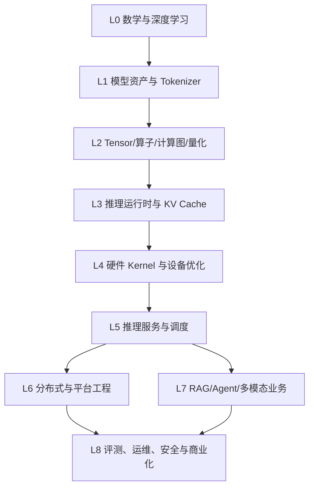

# 大模型推理业务知识地图

> **用途**：构建从底层计算到上层业务的大模型推理全栈能力，作为系统学习、实践规划、团队分工和能力评估的长期知识索引。
>
> **适用对象**：推理引擎工程师、模型工程师、系统/性能工程师、推理平台工程师、应用架构师、SRE、解决方案架构师和技术管理者。
>
> **核心方法**：先理解模型如何计算，再理解运行时如何执行，最后理解服务如何创造业务价值。

## 1. 总览：大模型推理到底是什么

大模型推理是将一个训练完成的模型，在给定输入和约束下转换为输出的完整业务系统。它同时包含四类问题：

1. **模型问题**：模型结构、权重、Tokenizer、上下文、精度和生成策略；
2. **系统问题**：算子、Kernel、内存、设备、调度、并行和运行时；
3. **服务问题**：API、并发、批处理、流式输出、可靠性和可观测性；
4. **业务问题**：效果、时延、成本、安全、合规、SLA 和用户体验。

完整链路：

```text
业务场景
  ↓
应用编排：聊天、RAG、Agent、多模态、工具调用
  ↓
推理服务：API、流式输出、队列、限流、鉴权、SLA
  ↓
服务运行时：批处理、调度、KV Cache、Prefix Cache、多租户
  ↓
推理引擎：模型加载、计算图、算子、内存规划、采样
  ↓
硬件运行时：CPU/GPU/NPU、Kernel、编译器、通信、驱动
  ↓
模型资产：权重、Tokenizer、模型格式、量化、版本
  ↓
基础理论：线性代数、概率、数值计算、深度学习、Transformer
```

## 2. 知识地图与层级依赖



### 2.1 分层能力表

| 层级 | 主要问题 | 核心产出 |
|---|---|---|
| L0 | 模型为什么这样计算 | 能读懂 Transformer 公式和张量形状 |
| L1 | 模型如何被加载和输入输出 | 能校验模型资产并完成 Tokenizer/权重加载 |
| L2 | 算子如何表达和执行 | 能实现、测试和分析核心算子 |
| L3 | 如何高效运行一次生成 | 能实现图执行、内存规划、KV Cache 和采样 |
| L4 | 如何利用硬件获得性能 | 能写 Kernel、做量化和性能剖析 |
| L5 | 如何服务多个请求 | 能构建 API、批处理、调度和流式服务 |
| L6 | 如何规模化部署 | 能做多卡、多机、弹性、发布和多租户 |
| L7 | 如何解决真实业务问题 | 能做 RAG、Agent、工具调用和多模态 |
| L8 | 如何稳定、低成本、合规地运营 | 能建立评测、SLA、观测、安全和成本闭环 |

## 3. L0：数学、深度学习与 Transformer 基础

### 学习目标

能够从数学和模型结构层面解释一次 Token 生成过程，理解计算复杂度、显存占用和数值误差来源。

### 核心知识

- 向量、矩阵、张量、转置、广播、范数、矩阵分解；
- 概率分布、条件概率、Softmax、交叉熵、采样；
- 浮点数、FP32、FP16、BF16、FP8、INT8、INT4、舍入和溢出；
- 梯度、反向传播、训练与推理的区别；
- Transformer、残差连接、归一化、激活函数；
- Self-Attention、Multi-Head Attention、GQA、MQA、Cross-Attention；
- RoPE、位置编码、因果 Mask；
- FFN、SwiGLU、GeGLU、ReGLU；
- Encoder-only、Decoder-only、Encoder-Decoder、MoE；
- Prefill 与 Decode 的计算特征。

### 必须回答的问题

1. 为什么 Attention 需要 Q、K、V？
2. 为什么 Decode 阶段需要 KV Cache？
3. 为什么 Prefill 更偏计算密集，Decode 更偏内存带宽密集？
4. Hidden Size、层数、Head 数量如何影响计算量？
5. 为什么累加经常使用比输入更高的精度？
6. 为什么同一模型在不同后端可能出现微小数值差异？

### 实践产出

- 手算一个单层 Attention 的张量形状；
- 用 NumPy/Python 实现单头 Attention、RoPE、RMSNorm 和 Greedy Decode；
- 绘制 Prefill/Decode 的数据流和复杂度说明。

### 验收标准

能够不依赖框架解释一次 Token 从输入到 logits 的完整计算过程，并能估算指定模型的权重、激活和 KV Cache 大小。

## 4. L1：模型资产、权重、Tokenizer 与模型格式

### 学习目标

能够判断一个模型资产是否可用，理解模型结构配置、权重布局、Tokenizer 和文件格式之间的契约。

### 4.1 模型结构与配置

重点字段：

- 层数 `n_layer`；
- Hidden Size；
- Attention Head 和 KV Head 数量；
- Head Dimension；
- Intermediate Size；
- Vocabulary Size；
- Context Length；
- RoPE 参数；
- 激活函数和归一化类型；
- MoE Expert 数量、Top-K 和共享 Expert；
- Sliding Window 和稀疏 Attention。

这些配置决定：

| 配置 | 主要业务影响 |
|---|---|
| 层数 | 权重规模、推理时延、KV Cache 层数 |
| Hidden Size | 矩阵乘法规模、显存占用 |
| KV Heads | KV Cache 大小和 Attention 带宽 |
| Context Length | 最大输入长度和资源上限 |
| Vocabulary Size | 输出层计算量、Tokenizer 覆盖范围 |
| Expert/Top-K | MoE 权重规模、路由和通信成本 |

### 4.2 模型文件与权重生命周期

需要掌握：

- PyTorch checkpoint、Safetensors、Hugging Face 格式；
- GGUF、ONNX、TensorRT Engine、OpenVINO IR 等部署格式；
- Tensor 名称、形状、数据类型、偏移、对齐和分片；
- mmap、Lazy Loading、权重去重、权重共享；
- 权重转置、重排、预打包和设备放置；
- CPU/GPU 分层、权重 Streaming 和模型热加载；
- 权重校验、版本兼容和完整性验证。

对于 ggml，重点结合：

- `docs/gguf.md`：GGUF 规范；
- `src/gguf.cpp`：GGUF 读写；
- `include/ggml.h`：Tensor 类型和量化类型；
- `docs/ggml-system-architecture.md`：整体运行时边界。

### 4.3 Tokenizer 与对话模板

知识点：

- BPE、SentencePiece、Unigram、WordPiece、Byte-level BPE；
- Vocabulary、Merge Rules、Token ID；
- BOS、EOS、PAD、UNK 和控制 Token；
- UTF-8、Unicode、中文、代码、Emoji 和特殊字符；
- Chat Template、系统消息、用户消息、工具消息；
- Token 计数、上下文窗口和 Token 计费。

Tokenizer 错误会造成：

- 模型输入语义变化；
- 上下文长度估计错误；
- Chat Template 不匹配；
- 输出无法正确解码；
- 线上 Token 成本统计错误。

### 实践产出

- 编写模型元数据检查器；
- 实现 Tokenizer encode/decode 和 Token 计数工具；
- 将一个模型从原始格式转换为部署格式；
- 校验转换前后 Tensor 名称、形状、数值范围和权重总量。

## 5. L2：Tensor、算子、计算图、精度与量化

### 学习目标

能够实现一个小型推理图，理解张量布局、算子契约、内存访问和量化误差。

### 5.1 Tensor 与数据布局

掌握：

- Shape、维度、Stride、Contiguous、View；
- Reshape、Transpose、Permute、Broadcast；
- Row-major/Column-major；
- 内存对齐、Padding 和 Block Layout；
- Tensor 的输入、输出、临时和权重属性；
- Host Buffer、Device Buffer 和跨设备 Tensor。

### 5.2 核心算子

- MatMul、GEMM、Batched MatMul；
- Embedding Lookup、Gather、Scatter；
- RMSNorm、LayerNorm；
- Softmax、Mask；
- RoPE；
- Attention、FlashAttention；
- SwiGLU、GeGLU；
- Add、Mul、Scale、Copy、Concat；
- Reshape、View、Permute、Transpose；
- Top-K、Argmax、采样相关算子；
- Quantize、Dequantize。

每个算子都要记录：

```text
输入/输出形状
数据类型与精度
Stride 和布局要求
是否支持原地执行
临时工作区大小
计算复杂度
内存访问量
后端支持矩阵
数值误差容忍度
```

### 5.3 计算图

需要理解：

- 节点、边、叶子、输入和输出；
- 前向图、反向图和拓扑排序；
- 图分区、设备放置和算子回退；
- Constant Folding、Dead Code Elimination；
- Operator Fusion、Layout Transform；
- Graph Capture、CUDA Graph 和执行计划；
- 静态 Shape 与动态 Shape。

### 5.4 量化

基础概念：

- PTQ、QAT、动态量化、静态量化；
- 对称/非对称量化；
- Per-Tensor、Per-Channel、Per-Group、Per-Token；
- Weight-only、W8A8、W4A16；
- Scale、Zero Point、Quantization Block；
- GPTQ、AWQ、SmoothQuant、HQQ、AQLM；
- INT8、INT4、NF4、FP8、MXFP4、NVFP4。

量化不能只看模型大小，还要评估：

- Perplexity；
- 任务准确率；
- 长上下文能力；
- 多语言和代码能力；
- 首 Token 延迟；
- Decode 速度；
- 显存、功耗和温度。

### 实践产出

- 用 CPU 实现 MatMul、RMSNorm、Softmax 和 RoPE；
- 实现一个简化计算图和内存复用器；
- 为 F16、BF16、INT8、INT4 做误差与性能对比；
- 为一个量化算子建立 reference/kernel 一致性测试。

## 6. L3：推理运行时、内存、KV Cache 与生成

### 学习目标

能够构建一个可重复执行、可控制内存、支持流式生成的本地推理运行时。

### 6.1 Prefill 与 Decode

**Prefill**：一次处理完整 Prompt，建立 KV Cache，通常计算密集、并行度高，决定 TTFT。

**Decode**：每次生成一个或少量 Token，复用历史 KV Cache，通常内存访问密集，决定 ITL 和输出 Token 速度。

运行时必须分别观测：

- Prompt Token 数；
- Prefill 时间；
- 首 Token 时间；
- Decode 每 Token 时间；
- 输出 Token 数；
- 总耗时。

### 6.2 内存模型

推理内存通常由以下部分组成：

```text
模型权重
+ KV Cache
+ 中间激活
+ 临时 Workspace
+ 输入输出 Tensor
+ Runtime 元数据
+ 通信缓冲区
```

需要掌握：

- Arena、Memory Pool、Workspace；
- Tensor Lifetime 和内存复用；
- Buffer 对齐与碎片；
- mmap、Pinned Memory、Unified Memory；
- CPU Offload、GPU Offload、权重 Streaming；
- 显存不足时的降级策略。

### 6.3 KV Cache

KV Cache 保存历史 Token 的 Key 和 Value。其大小主要取决于：

```text
层数 × 序列长度 × KV Heads × Head Dimension × 元素大小 × 2
```

核心知识：

- K Cache、V Cache、Cache Slot；
- Cache Position 和序列生命周期；
- Paged Attention、Paged KV Cache；
- Prefix Cache、Prompt Cache；
- KV Cache 量化和压缩；
- Cache Eviction、TTL 和优先级；
- 多租户隔离和敏感数据清理。

### 6.4 Sampling 与生成控制

- Greedy、Temperature、Top-K、Top-P、Min-P；
- Typical Sampling、Mirostat、Beam Search；
- Repetition/Frequency/Presence Penalty；
- Stop Token、Stop Sequence、Logit Bias；
- Grammar、JSON Schema 和结构化输出；
- 函数调用、工具调用和参数校验；
- Speculative Decoding、Draft Model、接受率。

### 实践产出

- 实现单请求 Prefill/Decode 循环；
- 实现 KV Cache 分配、复用和淘汰；
- 实现流式 Token 输出和取消；
- 实现 Top-P/Top-K/Temperature/JSON 约束采样；
- 输出一份内存峰值和 Token 时延报告。

## 7. L4：CPU、GPU、NPU、Kernel 与硬件优化

### 学习目标

能够根据硬件特性选择数据布局、Kernel 和并行策略，并使用性能工具定位瓶颈。

### 7.1 CPU

- x86 SSE、AVX、AVX2、AVX-512、AMX；
- ARM NEON、SVE；RISC-V Vector；
- Cache、NUMA、线程绑定和 CPU Affinity；
- SIMD、Tiling、Blocking、Prefetch；
- OpenMP、pthread、BLAS；
- 内存带宽、Cache Miss 和伪共享。

### 7.2 GPU

- CUDA、ROCm、Metal、Vulkan、OpenCL、WebGPU；
- Thread、Warp、Block、Grid；
- Tensor Core、Shared Memory、Global Memory；
- Occupancy、Register Pressure、Coalesced Access；
- Kernel Launch Overhead、Stream、Event、CUDA Graph；
- cuBLAS、CUTLASS、Triton、NCCL；
- Peer-to-Peer 和 Host-to-Device Copy。

### 7.3 NPU 与专用加速器

- NPU Runtime、DSP、Hexagon、Apple Neural Engine；
- OpenVINO、CANN、QNN、专用 SDK；
- 算子支持矩阵、图分区和 CPU Fallback；
- 离线编译、设备内存和数据格式约束；
- 设备初始化、错误恢复和版本兼容。

### 7.4 性能模型

必须区分：

- Compute Bound；
- Memory Bound；
- Communication Bound；
- Launch Bound；
- Synchronization Bound；
- IO Bound。

使用 FLOPS、MACs、Arithmetic Intensity、Memory Bandwidth 和 Roofline Model 分析，不能只看设备利用率。

### 实践产出

- 为 MatMul 或 RMSNorm 编写 SIMD/CUDA Kernel；
- 比较不同 Batch、Sequence Length 和数据类型；
- 使用 `perf`、Nsight、VTune 或系统工具生成 Profile；
- 找出一次性能下降的根因并提交优化前后报告。

## 8. L5：推理服务、API、批处理与调度

### 学习目标

能够把本地推理引擎包装成稳定的多请求在线服务。

### 8.1 请求生命周期

```text
请求接入 → 鉴权/限流 → Tokenizer → 排队
→ Prefill → KV Cache 分配 → Decode
→ Sampling → 流式返回 → 资源释放 → 统计与审计
```

### 8.2 API 能力

- Completion、Chat Completion；
- Embedding、Rerank、多模态接口；
- REST、gRPC、WebSocket、SSE；
- OpenAI-compatible API；
- Streaming、取消、超时、背压和错误事件；
- `model`、`messages`、`prompt`、`max_tokens`、`temperature`、`top_p`、`stop`、`seed`、`stream`、`tools`、`response_format` 等参数；
- Request ID、Usage、Token 统计和错误码。

### 8.3 批处理和调度

- Static Batching；
- Dynamic Batching；
- Continuous/In-flight Batching；
- Micro-batching；
- Chunked Prefill；
- Prefill/Decode Disaggregation；
- FIFO、优先级、截止时间和公平调度；
- Token Budget、最大并发和队列背压。

必须同时优化：

- TTFT；
- ITL；
- E2E Latency；
- 吞吐；
- GPU 利用率；
- 请求公平性；
- 高优先级 SLA。

### 实践产出

- 实现 OpenAI-compatible Chat API；
- 实现 SSE 流式输出、客户端取消和超时；
- 实现连续批处理和请求队列；
- 加入限流、重试、熔断和健康检查；
- 用负载测试生成 P50/P95/P99 报告。

## 9. L6：分布式推理与平台工程

### 学习目标

能够将单机推理扩展为多卡、多机、多模型、多租户平台。

### 9.1 并行方式

| 并行方式 | 适用场景 | 主要成本 |
|---|---|---|
| Data Parallelism | 多副本处理不同请求 | 权重副本和负载均衡 |
| Tensor Parallelism | 单模型跨多卡 | AllReduce/AllGather 和互联带宽 |
| Pipeline Parallelism | 按层切分大模型 | 流水线气泡和跨卡激活 |
| Expert Parallelism | MoE Expert 分布 | Token 路由和 All-to-All |
| Sequence/Context Parallelism | 长上下文 | 通信和状态切分 |

### 9.2 系统能力

- PCIe、NVLink、NVSwitch、RDMA、RoCE；
- AllReduce、AllGather、ReduceScatter、All-to-All；
- 服务发现、负载均衡、会话粘性和 KV Cache 路由；
- 节点故障、重试、幂等、故障转移；
- 模型仓库、镜像、容器、Kubernetes、GPU 调度；
- 节点标签、资源配额、弹性伸缩、灰度和回滚；
- 多租户隔离、配额、优先级和成本归属。

### 实践产出

- 部署多副本推理服务并实现健康检查；
- 实现简单的 GPU 资源调度和模型路由；
- 对比 Tensor Parallel 与 Data Parallel 的吞吐/延迟；
- 设计多租户配额、故障转移和发布回滚方案。

## 10. L7：RAG、Agent、多模态与业务编排

### 10.1 RAG

```text
文档接入 → 清洗/切分 → Embedding → 向量索引
→ 召回 → 重排 → Context 压缩 → Prompt 拼接 → 生成 → 引用
```

知识点：

- 文档解析和 Chunking；
- Embedding、向量数据库、ANN、BM25、Hybrid Search；
- Reranker、Query Rewrite、Multi-query；
- Context Compression、Citation、知识库更新；
- 召回率、准确率、引用正确性和时延；
- 输入 Token 膨胀、Prompt Cache、数据权限和知识安全。

### 10.2 Agent 与工具调用

- 任务拆解、规划、执行、反思和状态管理；
- 工具注册、参数 Schema、权限、超时和重试；
- 函数调用、工具结果验证、循环检测；
- 长上下文、记忆、工作流和人工介入；
- 最大步数、预算、失败恢复和审计。

Agent 推理系统必须控制：

```text
每步推理次数
上下文增长
工具调用成本
最大执行时长
权限边界
结果可信度
```

### 10.3 多模态

- 图像编码器、ViT、Patch、图像 Token；
- 音频编码器、视频帧采样、OCR；
- 跨模态投影和图文对齐；
- 图像分辨率、Token 数和 KV Cache；
- 多模态 Prompt、输出解析和内容安全。

### 实践产出

- 构建带引用的 RAG Demo；
- 构建一个带两个工具的 Agent，并加入权限和循环限制；
- 完成图文输入、模型推理和结构化输出链路；
- 为业务场景建立召回、生成和端到端评测集。

## 11. L8：评测、可观测性、可靠性、安全与成本

### 11.1 质量评测

模型能力：

- Perplexity；
- MMLU、GSM8K、HumanEval、MBPP、TruthfulQA；
- 长文本、多语言、多模态和领域数据集；
- 人工评测、Pairwise、LLM-as-a-Judge。

推理质量：

- Tokenizer 和 Chat Template 正确性；
- 模型加载和权重完整性；
- 算子数值一致性；
- 量化前后质量；
- 单请求、Batch 和多后端结果一致性；
- Stop、JSON、Tool Call 和 Streaming 正确性；
- Prefix Cache 命中前后结果一致性。

### 11.2 性能指标

| 类别 | 指标 |
|---|---|
| 延迟 | TTFT、ITL、E2E、Queue Latency、P50/P95/P99 |
| 吞吐 | Output TPS、Input TPS、Requests/s、并发数 |
| 资源 | GPU/CPU 利用率、显存、KV Cache、带宽、功耗 |
| 服务 | 成功率、错误率、超时率、取消率、队列长度 |
| 缓存 | Prefix Cache 命中率、KV Cache 使用率、淘汰率 |

### 11.3 可观测性

日志建议包含：

- Request ID、模型、租户、设备；
- 输入/输出 Token 数；
- TTFT、ITL、总耗时；
- Batch、Cache 命中和 Fallback；
- 采样参数、错误码、取消原因。

工具与平台：

- `perf`、`top`、`vmstat`、`iostat`、`numactl`；
- Nsight Systems/Compute、VTune、Apple Instruments；
- Tracy、Chrome Trace、OpenTelemetry；
- Prometheus、Grafana、日志和告警平台。

### 11.4 可靠性

需要处理：

- 模型加载失败、显存不足和算子不支持；
- CPU/GPU Fallback；
- 请求超时、客户端断开和服务端取消；
- GPU Hang、驱动错误、死锁和资源泄漏；
- 节点故障、服务重启、版本回滚；
- 内存碎片、KV Cache 泄漏和上下文污染。

### 11.5 安全与合规

输入侧：Prompt Injection、Jailbreak、超长输入、Unicode 混淆、恶意 JSON、工具参数注入、SSRF。

输出侧：PII 脱敏、敏感内容过滤、代码安全、结构化输出校验、工具权限、水印和审计。

基础设施：模型签名、权重完整性、依赖扫描、容器安全、GPU/租户隔离、密钥管理、网络隔离、加密和数据留存。

### 11.6 成本与商业指标

成本构成：

```text
设备与托管 + 电力散热 + 网络 + 存储
+ 模型加载和运维 + 监控安全 + 人力
```

核心指标：

- 每百万输入/输出 Token 成本；
- 每请求和每用户平均成本；
- GPU 小时成本、吞吐和利用率；
- 峰值容量、低谷利用率和副本数；
- Cache 节省比例、量化节省比例；
- 模型加载成本和扩缩容成本。

## 12. 核心业务流程地图

### 12.1 模型上线流程

```text
模型选择 → 权重获取 → 完整性校验 → 格式转换
→ Tokenizer 校验 → 量化/编译 → 离线质量评测
→ 性能基准 → 安全扫描 → 灰度发布 → 线上观测 → 正式上线
```

### 12.2 在线请求流程

```text
接入/鉴权 → 配额检查 → Tokenizer → Cache 查找
→ 排队调度 → Prefill → KV Cache → Decode 循环
→ Sampling/结构化约束 → 流式输出 → 统计/审计 → 释放资源
```

### 12.3 性能定位流程

```text
SLA 变差
  ↓
区分 TTFT / ITL / E2E / Queue
  ↓
区分 Prefill / Decode / 网络 / Tokenizer
  ↓
定位模型层和算子
  ↓
定位 Kernel、内存带宽、同步和通信
  ↓
验证优化并进行回归
```

### 12.4 故障定位流程

```text
用户错误 → API/参数 → Tokenizer/模板 → 模型加载
→ 图/算子 → 设备/Kernel → 内存/KV Cache
→ 调度/网络 → 节点/驱动 → 版本与配置
```

## 13. 能力矩阵与角色映射

| 角色 | 必备知识 | 关键交付 |
|---|---|---|
| 模型工程师 | 模型结构、Tokenizer、量化、评测 | 可部署模型、质量报告 |
| 推理引擎工程师 | Tensor、图、算子、内存、Runtime | 高正确性推理引擎 |
| 性能工程师 | Kernel、硬件、Profile、并行 | 性能优化和基准报告 |
| 平台工程师 | 调度、批处理、KV Cache、服务 | 稳定高吞吐推理平台 |
| 分布式工程师 | 多卡、多机、通信、容错 | 可扩展分布式推理 |
| 应用架构师 | RAG、Agent、工具、多模态 | 业务工作流和应用方案 |
| SRE/运维 | 观测、SLA、发布、故障、安全 | 生产稳定性和应急体系 |
| 解决方案架构师 | 业务场景、成本、质量、合规 | 端到端交付与容量方案 |

## 14. 分阶段系统学习路线

### 阶段一：读懂并运行模型

**目标**：能够完成本地单模型推理。

学习内容：L0、L1 基础，Tokenizer、模型配置、权重加载、Greedy Sampling。

实践项目：用 Python 或 C++ 实现最小 GPT/Transformer 推理程序。

交付物：模型加载器、Tokenizer 工具、单请求性能报告。

验收：能解释 Token、权重、层、logits、采样和输出之间的关系。

### 阶段二：实现推理核心

**目标**：能够实现 Tensor、核心算子、计算图和内存规划。

学习内容：L2、L3，MatMul、Norm、RoPE、Attention、KV Cache。

实践项目：实现 CPU-only 小型推理引擎。

交付物：reference kernel、图执行器、KV Cache、采样器。

验收：支持 Prefill/Decode、流式输出，并能报告内存峰值。

### 阶段三：进行硬件和量化优化

**目标**：让模型在目标硬件上高效运行。

学习内容：L4，SIMD、CUDA/NPU、量化、融合、FlashAttention、Profile。

实践项目：实现一个量化 MatMul 或优化 RMSNorm，并完成跨精度对比。

交付物：Kernel、benchmark、Profile、准确率回归报告。

验收：能解释优化收益来自计算、带宽、布局还是调度。

### 阶段四：构建推理服务

**目标**：提供多请求、流式、可观测的在线 API。

学习内容：L5，API、SSE、动态/连续批处理、调度、限流、取消。

实践项目：构建 OpenAI-compatible 推理服务。

交付物：服务端、压测脚本、SLA 仪表盘和故障处理方案。

验收：能稳定处理并发请求，报告 TTFT、ITL、吞吐和 P99。

### 阶段五：平台化和分布式

**目标**：支持多模型、多卡、多租户和灰度发布。

学习内容：L6，TP/PP/EP、通信、资源调度、模型仓库、弹性和容灾。

实践项目：实现多副本或多卡模型服务平台。

交付物：部署清单、容量模型、发布/回滚、配额和故障转移设计。

验收：能根据模型规模、并发和 SLA 选择硬件与并行方案。

### 阶段六：业务智能化

**目标**：把推理能力落到实际业务。

学习内容：L7、L8，RAG、Agent、多模态、质量、安全、成本和合规。

实践项目：完成带权限、引用、工具调用和评测的业务应用。

交付物：业务流程、评测集、成本模型、安全审计和运营指标。

验收：能用质量、时延、成本和风险指标证明业务价值。

## 15. 系统学习检查清单

### 模型层

- [ ] 能解释模型配置字段及其资源影响
- [ ] 能独立完成权重、Tokenizer 和模型格式校验
- [ ] 能解释 Prefill、Decode、KV Cache
- [ ] 能评估量化对质量和性能的影响

### 引擎层

- [ ] 能实现 Tensor、MatMul、Norm、RoPE、Attention
- [ ] 能构建和执行计算图
- [ ] 能实现内存复用和 KV Cache
- [ ] 能处理动态 Shape、错误和取消

### 硬件层

- [ ] 能区分计算、带宽、通信和启动开销
- [ ] 能使用至少一种 Profile 工具
- [ ] 能实现或优化一个 CPU/GPU Kernel
- [ ] 能完成量化 Kernel 和数值回归

### 服务层

- [ ] 能提供流式 API
- [ ] 能实现动态/连续批处理
- [ ] 能实现限流、超时、取消、重试和熔断
- [ ] 能输出 TTFT、ITL、吞吐和 P99

### 平台层

- [ ] 能设计多卡、多机和多副本方案
- [ ] 能管理模型版本、发布、灰度和回滚
- [ ] 能做容量规划、配额和多租户隔离
- [ ] 能建立故障转移和灾备流程

### 业务层

- [ ] 能构建 RAG、Agent 或多模态应用
- [ ] 能建立领域质量评测集
- [ ] 能评估 Token、设备和服务成本
- [ ] 能满足安全、合规和审计要求

## 16. 术语表

| 术语 | 含义 |
|---|---|
| Token | 模型处理的最小文本/多模态离散单元 |
| Prefill | 并行处理输入 Prompt 并建立 KV Cache 的阶段 |
| Decode | 基于已有上下文逐 Token 生成的阶段 |
| TTFT | 首 Token 延迟 |
| ITL | Token 间延迟 |
| KV Cache | Attention 历史 Key/Value 缓存 |
| Continuous Batching | 请求执行过程中动态加入/退出批次 |
| Prefix Cache | 复用相同前缀计算结果的缓存 |
| Quantization | 使用更低精度表示权重或激活 |
| Kernel | 在特定硬件上执行算子的底层程序 |
| Tensor Parallelism | 将一个算子/层的张量分片到多设备 |
| RAG | 检索增强生成 |
| Agent | 能够规划并调用工具完成任务的模型应用 |
| SLA | 服务等级协议 |
| P99 | 99% 请求延迟低于该值的分位指标 |

## 17. 持续更新机制

这份知识地图不是一次性教材，而应作为工程知识库持续维护：

1. 每增加一种模型结构，补充模型、Tokenizer、算子、KV Cache 和评测影响；
2. 每增加一种硬件，补充设备能力、Kernel、内存、通信和部署限制；
3. 每次性能优化，记录基线、瓶颈、改动、收益和回归结果；
4. 每次线上故障，沉淀请求、运行时、硬件、平台和业务层根因；
5. 每次模型上线，登记版本、格式、量化、质量、成本和回滚信息；
6. 每季度复查 SLA、质量、成本、安全和容量目标；
7. 将知识地图中的每个“实践产出”转化为代码、测试、文档或仪表盘，形成可验证的能力证据。
