# 第1章：大模型推理概述

## 1.1 大模型推理简介（直观认知）

### 1.1.1 什么是模型推理

一句话定义：推理（Inference）就是把训练好的大模型权重，变成可以接收输入、产出输出的"在线服务"的过程。

更具体一点：

训练（Training）解决"模型怎么变聪明"的问题 — 工程师在离线环境用海量数据反复迭代模型参数。

推理（Inference）解决"模型怎么用起来"的问题 — 把训练产物部署到生产环境，让真实用户的请求被高效地处理。

可以把训练和推理的关系，类比为"造车"和"开车"：

| 维度 | 训练 = 造车 | 推理 = 开车 |
| --- | --- | --- |
| 目标 | 造出一辆好车 | 让车在路上高效、安全地跑 |
| 关键指标 | Loss 下降、Accuracy 提升 | 延迟、吞吐、成本、稳定性 |
| 资源使用 | 大量 GPU 集群训练数月 | 单卡或多卡常驻服务 |
| 用户 | 算法工程师 | 终端用户 / 业务系统 |

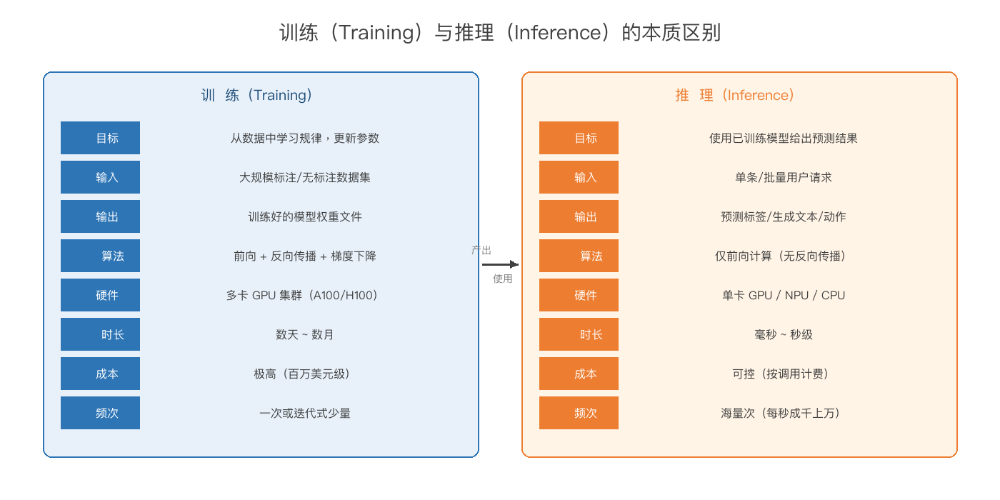

💡 关键认知：训练一次产出一份权重文件（如 pytorch_model.bin），推理则围绕"如何让这份权重文件以最低成本、最快响应服务海量用户"展开。

### 1.1.2 模型推理的基本流程

推理的 6 步标准流程：

模型加载：把权重从磁盘读到 GPU 显存（首次启动耗时 10s-分钟级）。

输入预处理：把用户请求（文本/图像）转为模型可处理的张量（Tokenize / Resize / Normalize）。

前向计算：按计算图执行所有算子（MatMul / Attention / LayerNorm …）。

输出后处理：把模型输出张量转回业务可读的格式（Detokenize / Argmax / 采样）。

响应返回：把结果通过 HTTP/gRPC/SSE 流式返回给调用方。

资源管理：KV Cache 分配/回收、显存池化、并发请求调度。

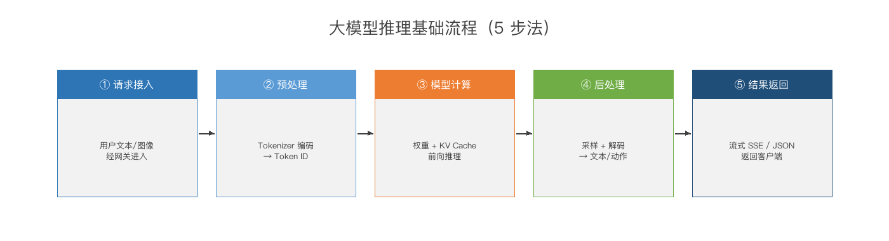

与传统软件的区别：传统软件是"逻辑驱动"（if-else），推理是"数据驱动"（计算图执行）—— 这是为什么推理工程师必须懂硬件、计算图、内存管理。

### 1.1.3 推理的核心要素（模型/数据/硬件）

任何推理系统都由 3 大核心要素构成：

| 要素 | 角色 | 关键属性 | 推理工程师关注点 |
| --- | --- | --- | --- |
| 模型 | 算法载体 | 参数量、结构、精度（FP16/INT8） | 格式（PT/ONNX/TRT）、算子覆盖、量化损失 |
| 数据 | 输入输出 | 形态（文本/图像/多模态）、长度分布 | Tokenize 性能、Batch 拼装、序列长度分布 |
| 硬件 | 算力基础 | 算力（TFLOPS）、显存（HBM）、带宽（TB/s） | 选型、利用率、功耗、成本 |

三者关系：模型决定"算多少"、数据决定"算什么"、硬件决定"算多快"。推理工程师的全部工作就是在三者之间找最优平衡。

### 1.1.4 推理在不同场景下的形态（云/边/端）

不同场景下，推理的形态完全不同：

| 场景 | 典型硬件 | Batch | 延迟要求 | 核心指标 |
| --- | --- | --- | --- | --- |
| 云端 | H100/A100/B200 | 大（32-256） | 秒级 | 吞吐、并发 |
| 边缘 | Jetson Orin | 中（1-8） | 100ms | 性能/瓦 |
| 端侧 | 骁龙/M3/天玑 | 1 | < 50ms | 内存占用、功耗 |
| 车载 | Orin/J6/Thor | 1 | 实时（< 30ms） | 安全性、确定性 |

核心差异：

云端：拼吞吐（QPS、Token/s），算力优先。

边/端：拼单 request 延迟、功耗、内存。

车载：拼实时性 + 安全认证（ASIL-D）。

📖 详见 1.6 节：应用领域全景（5 大落地场景）。

### 1.1.5 推理在 AI 系统中的角色

推理是 AI 系统的"最后一公里"——把算法成果转化为用户可感知的产品价值。

AI 系统的 5 层架构：

┌─────────────────────────────────────┬──────────────────────────┐│  5. 业务层（App / Web / 工具）       │ 业务/产品工程师            │├─────────────────────────────────────┼──────────────────────────┤│  4. 推理服务层（API / 路由 / 流式）   │ 后端工程师 / SRE           │├─────────────────────────────────────┼──────────────────────────┤│  3. 推理引擎层（vLLM / TRT-LLM）     │ ★ 推理工程师主战场 ★      │├─────────────────────────────────────┼──────────────────────────┤│  2. 算法层（PyTorch / Transformers） │ 算法工程师                │├─────────────────────────────────────┼──────────────────────────┤│  1. 硬件层（GPU / NPU / CPU）        │ 硬件工程师 / Infra 团队   │└─────────────────────────────────────┴──────────────────────────┘

为什么"推理引擎层"是主战场？

推理工程师的核心工作全部集中在第 3 层（推理引擎层）：

算子优化：FlashAttention / Fused Kernel / Triton Lang 编写

KV Cache 管理：PagedAttention / Prefix Cache / KV 量化

批处理调度：Continuous Batching / 优先级调度 / 抢占机制

模型优化：量化（INT8/FP8/INT4）/ 算子融合 / 图优化

引擎选型与二次开发：vLLM / TRT-LLM / SGLang / TensorRT

而第 4 层（推理服务层）的 API 网关、限流、计费、流式响应等，主要由后端工程师 / SRE 负责，推理工程师提供引擎接入支持即可。

关键洞察：

推理工程师主战场在第 3 层（推理引擎层），但需要向下懂硬件（GPU/NPU/HBM）、向上懂服务（API 协议/流式/调度），是连接算法与业务的"技术深水区桥梁"。

推理引擎质量直接决定用户体验（响应慢 = 用户流失）。

推理成本占 AI 公司总成本 60-80%（OpenAI/Anthropic 财报数据）。

## 1.2 大模型推理的核心定义（精确定义）

### 1.2.1 推理的工程化定义

从系统工程视角，大模型推理可以被精确定义为：

给定一份训练好的模型权重 $W$ 和一段输入 $x$，通过计算图 $G(W, x)$ 产出输出 $y$ 的在线服务过程。该过程需在满足延迟、吞吐、成本、稳定性等多维约束的前提下，规模化地服务真实流量。

这一定义包含四个关键要素：

权重 $W$：静态、固定不变，体积从几百 MB（小模型）到几百 GB（千亿参数）不等。

输入 $x$ / 输出 $y$：动态变化，且形态多样（文本、图像、音频、多模态）。

计算图 $G$：由数万个算子（Add / MatMul / Attention ...）组成的有向无环图。

服务约束：延迟（P99 < 1s）、吞吐（>100 QPS）、成本（每千 Token < ¥0.01）、稳定性（99.9% 可用性）。

推理工程师的全部工作，就是在这四个要素之间找最优解。

### 1.2.2 推理与训练的本质区别

| 维度 | 训练 | 推理 |
| --- | --- | --- |
| 权重 $W$ | 持续更新 | 完全固定 |
| Batch Size | 通常很大（128-4096） | 通常较小（1-32），且动态变化 |
| 计算密度 | 前向 + 反向，FLOPs 高 | 仅前向，FLOPs 低 |
| 内存压力 | 优化器状态 + 梯度 | KV Cache（LLM 特有） |
| 硬件占用 | 持续打满 | 利用率波动大（30-80%） |
| 容错 | 一次失败可重试 | 必须在线可用 |
| 成本敏感度 | 训练一次性投入 | 推理长期在线，成本是 TCO 大头 |

核心差异：训练是"高吞吐 + 容错"，推理是"低延迟 + 在线可用"——这决定了两者使用的硬件、框架、调度策略完全不同。

### 1.2.3 推理与部署的关系

部署（Deployment）是推理的"前置工序"——把模型从训练框架的可读形式，转换为推理引擎可执行的形式。典型链路：

PyTorch 模型 → ONNX 中间表示 → TensorRT Engine → 服务化部署

部署解决"能不能跑起来"，推理解决"跑得好不好"。两者共同构成"模型工程"的全生命周期。

分工：

部署工程师：偏 CI/CD，关注"模型转换/版本管理/灰度发布"。

推理工程师：偏在线服务，关注"延迟/吞吐/资源利用率"。

实际工作中两者经常合二为一（尤其在中小公司）。

### 1.2.4 推理的输入输出抽象

推理服务的输入输出可以抽象为统一接口：

输入抽象：

{  "messages": [{"role": "user", "content": "你好"}],  "model": "llama-3-70b",  "max_tokens": 1024,  "temperature": 0.7,  "stream": true}

输出抽象（流式）：

data: {"choices":[{"delta":{"content":"你"}}]}data: {"choices":[{"delta":{"content":"好"}}]}data: [DONE]

OpenAI 兼容协议已成为事实标准——所有主流 LLM 服务（vLLM/TGI/SGLang/TRT-LLM）都支持 /v1/chat/completions 接口。

多模态扩展：通过 content 字段支持 image_url、audio_url，是当前多模态推理标准做法。

### 1.2.5 推理在 AI 产业链中的位置

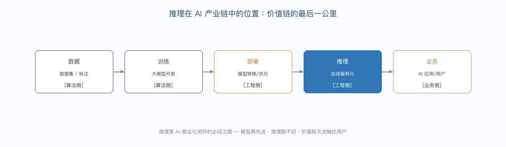

如上图所示，AI 产业链由 5 个环节组成：数据 → 训练 → 部署 → 推理 → 业务。其中：

算法侧（数据 / 训练）：由算法工程师负责，产出模型权重。

工程侧（部署 / 推理）：由部署 / 推理工程师负责，让模型可用、好用。

业务侧：通过 API 调用推理服务，触达最终用户。

推理是 AI 价值链的"最后一公里"——模型再先进，如果推理服务跑不好，价值就无法触达用户。这也是为什么近 2 年所有头部 AI 公司都在疯狂招聘推理工程师的根本原因。

### 1.2.6 推理工作的边界界定

推理工程师的"职责内" vs "职责外"：

| 范畴 | 工作内容 | 是否属于推理工程师 |
| --- | --- | --- |
| 模型训练 | 算法设计、调参、训练 | ❌ 算法工程师 |
| 模型评估 | 离线指标（MMLU、HumanEval） | ❌ 算法工程师 |
| 模型部署 | PyTorch→ONNX→TRT 转换 | ✅ 推理/部署工程师 |
| 推理服务 | API、调度、KV Cache | ✅ 推理工程师 |
| 性能优化 | 量化、调度、Kernel 优化 | ✅ 推理工程师 |
| 业务接入 | Prompt 工程、Function Calling | △ 业务工程师（推理支持） |
| 硬件采购 | GPU/NPU 选型 | △ 推理 + 基础设施团队 |

边界模糊地带：

算子不支持时，可能需要写自定义算子（推理工程师承担）。

模型精度损失评估，可能需要与算法工程师协作。

监控指标定义，可能需要与 SRE 协作。

## 1.3 大模型推理的发展历程（演进脉络）

### 1.3.1 早期推理阶段（2015 前）

特征：深度学习推理的工程化雏形。

代表框架：Caffe（2013）、Theano（2007）、Torch7。

主要硬件：CPU 为主，GPU 仅用于训练。

代表模型：AlexNet（2012）、VGG、GoogLeNet。

核心瓶颈：CPU 推理太慢，难以满足实时场景。

关键贡献：

确立了"模型 + 权重 + 推理框架"的工程化范式。

cuDNN（2014）首次让 GPU 推理成为可能。

### 1.3.2 CNN 推理时代（2015-2019）

特征：GPU 推理普及 + 算子融合 + INT8 量化。

代表框架：TensorRT（2017）、ONNX（2017）、OpenVINO（2018）。

主要硬件：NVIDIA GPU（P40/P100/V100/T4）。

代表模型：ResNet、YOLO、MobileNet、BERT（末期）。

核心创新：

算子融合（Conv+BN+ReLU），减少 kernel 启动。

INT8 量化（PTQ），吞吐提升 2-4 倍。

动态 batch，提高 GPU 利用率。

关键里程碑：TensorRT 成为工业部署事实标准，GPU 推理性能首次超越 CPU 10 倍以上。

### 1.3.3 Transformer 推理时代（2020-2022）

特征：序列建模崛起 + KV Cache 概念普及。

代表框架：FasterTransformer（NVIDIA）、DeepSpeed。

主要硬件：A100（2020）、H100（2022 末）。

代表模型：BERT、GPT-2/3、ViT、Swin Transformer。

核心创新：

KV Cache 成为标配，自回归推理速度大幅提升。

FlashAttention v1（2022）首次提出，速度提升 2 倍。

算子融合进一步深化（QKV fusion、FlashAttention）。

关键转折：Transformer 模型规模从亿级（BERT）涨到千亿级（GPT-3），传统推理框架开始力不从心。

### 1.3.4 LLM 推理革命（2023-2024）

特征：LLM 专用推理框架爆发，吞吐 5-10 倍提升。

代表框架：vLLM、SGLang、TGI、TensorRT-LLM、LightLLM。

主要硬件：H100/H200、A100 80G、Grace Hopper。

代表模型：LLaMA-2/3、Qwen、DeepSeek、Mixtral。

核心创新：

PagedAttention（vLLM 2023）：KV 显存利用率 20% → 90%。

Continuous Batching（Orca 2022）：GPU 利用率 30% → 80%。

FlashAttention v2/v3（2023-2024）：再提速 2-3 倍。

Speculative Decoding：吞吐 +2-3 倍（无精度损失）。

INT4/FP8 量化：显存降 4-8 倍。

关键里程碑：vLLM 论文（SOSP 2023）让 LLM 推理成为独立学科。

### 1.3.5 VLA 与端侧多模态推理（2024-2026）

特征：LLM 推理扩展到端侧 + 机器人 + 多模态。

代表框架：llama.cpp、MLC-LLM、MLX（Apple）、ExecuTorch（Meta）。

主要硬件：

端侧：骁龙 8 Gen3、Apple M3/M4、天玑 9300。

车载：NVIDIA Thor、地平线 J6P、高通 8295。

机器人：Jetson Thor、Orin AGX 64GB。

代表模型：OpenVLA、GR00T、π0、Llava、Qwen-VL。

核心挑战：

端侧内存受限（8-16GB），需 INT4 量化。

VLA 模型对实时性要求高（10Hz+ 控制频率）。

多模态融合，Token 数量爆炸（图像 token 远多于文本）。

### 1.3.6 推理技术演进的5大趋势

5 大演进趋势：

从"通用框架"到"专用引擎"：vLLM、SGLang 等 LLM 专用推理框架兴起，性能远超通用框架（PyTorch 原生）。

从"GPU only"到"硬件多元"：NPU（华为昇腾/高通骁龙）、TPU、LPU、端侧芯片百花齐放。

从"静态 batch"到"动态调度"：Continuous Batching 让 GPU 利用率从 30% 提升到 80%，已成为标配。

从"FP16 为主"到"多精度共存"：FP8、MXFP4、INT4 等新精度不断涌现，NVIDIA Hopper/Blackwell 原生支持 FP8。

从"模型驱动"到"系统驱动"：单纯的模型结构创新边际收益递减，系统级优化（如 PagedAttention、Continuous Batching、Speculative Decoding）成为主要增量来源。

### 1.3.7 未来展望（FP8/世界模型/具身智能）

3 大未来方向：

① FP8/FP4 精度普及

NVIDIA Blackwell（B200）原生支持 FP4，吞吐再提 2-3 倍。

训练与推理都将逐步从 FP16 切换到 FP8/FP4。

量化损失控制技术更加成熟。

② 世界模型（World Model）

Sora、Genie、DriveWorld 等世界模型兴起。

推理形态从"文本生成"扩展到"视频/3D 场景生成"。

计算量增加 100-1000 倍，对推理工程提出新挑战。

③ 具身智能（Embodied AI）

VLA 模型 + 机器人 / 自动驾驶，推理从云扩展到边缘/端侧。

实时性要求（10-100Hz）+ 安全性要求（ASIL-D）+ 低功耗（< 60W）。

推理工程师需要懂硬件、控制、安全多领域知识。

核心洞察：未来 5 年，推理工程将从"云端 LLM 服务"扩展到"全场景 AI 服务"，市场空间至少扩大 10 倍。

1.4 大模型推理的核心特征（关键属性）
1.4.1 自回归生成机制
LLM 推理与传统 CNN 推理相比，有几个"反直觉"的特征，决定了后续所有优化方向。下图是 7 大核心特征的全景总览：

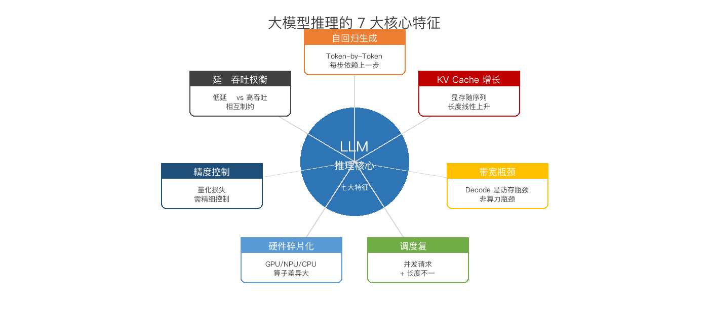

这 7 个特征不是孤立的，它们环环相扣：自回归生成导致每 Token 都要重新算 → 引入 KV Cache 避免重复计算 → 但 KV Cache 线性增长 → 让 内存带宽 而非算力成为 Decode 阶段瓶颈 → 多用户并发时面临 调度复杂性 → 部署到不同硬件又遇到 碎片化挑战 → 量化降显存时必须控制 精度损失 → 最终还要在 延迟与吞吐 之间权衡。

本节先快速建立直觉，每个特征的深度剖析与工程解法详见第 4 章对应章节（每节末尾标注对应章节号）。

## 1.4 大模型推理的核心特征（关键属性）

### 1.4.1 自回归生成机制

核心特征：LLM 逐 Token 生成——每生成 1 个 Token 就要把模型完整跑一次前向；生成 1000 个 Token 就要跑 1000 次前向。生成过程中存在严格的串行依赖：前一个 Token 是下一个 Token 的输入，无法简单并行化。

两阶段分化：自回归生成天然分成两个性能特征截然不同的阶段——

Prefill（首 Token）：一次性处理完整 prompt，计算密集型，单次耗时数百 ms。

Decode（后续 Token）：每次只算 1 个新 Token，访存密集型，单次耗时数十 ms。

下图把这两个阶段的具体差异可视化：

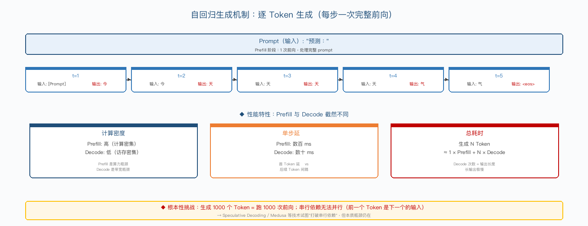

📖 详见第 4.1 节：自回归生成机制的深度剖析（含 Prefill/Decode 性能差异的量化分析、串行瓶颈的工程突破）。

### 1.4.2 KV Cache 内存随序列增长

核心特征：为避免重复计算历史 Token 的 K/V 张量，推理引擎会把它们缓存下来——这就是 KV Cache。这份缓存随序列长度线性增长，KV Cache 占用的显存往往是模型权重本身的 2-5 倍。

下图横向对比了主流大模型的"模型权重"与"KV Cache（单请求）"显存占用：

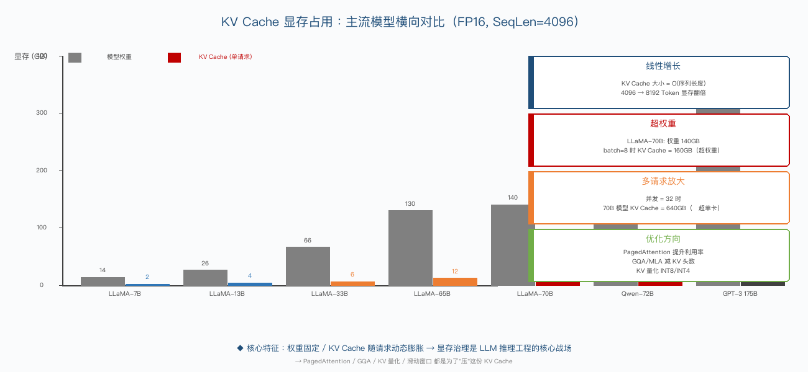

如上图所示，70B 模型 batch=32 时 KV Cache 总量高达 640GB，远超单卡 80GB 显存。这引发了 3 大挑战：多请求放大、显存碎片化、生命周期复杂。

📖 详见第 4.2 节：KV Cache 机制的深度剖析（含显存计算公式、5 大优化方向：PagedAttention / 量化 / Prefix Cache / 重计算 / 卸载）。

### 1.4.3 内存带宽瓶颈（而非算力）

核心特征：LLM 推理的 Decode 阶段是典型的"内存带宽受限"工作负载——大部分时间花在"把权重和 KV Cache 从显存读到计算单元"上，计算单元反而大量空闲。

下图展示了 3 代 NVIDIA GPU 的算力与带宽对比，以及 Prefill/Decode 阶段的瓶颈差异：

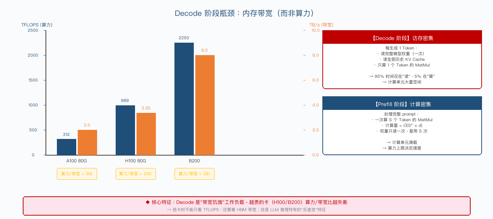

关键洞察：单看 FLOPS 高的卡，不一定推理就快。 A100/H100/B200 越先进的卡，算力相对带宽越"过剩"，Decode 阶段越浪费（95% 时间在读，5% 在算）。

📖 详见第 4.7.1 节：内存带宽瓶颈深度剖析（含 Roofline 模型、Decode 时间分布、3 大应对策略）。

### 1.4.4 并发请求调度复杂性

核心特征：在真实生产环境中，多个用户的请求异构且动态——序列长度不同、生成长度不同、优先级不同、到达时间不同。如何把这些异构请求"拼"成一个 batch 高效执行，是调度器的核心难题。

下图把 GPU 想象成有 4 个执行槽位，每个 Step 都能跑 4 个请求，直接数色块就能看出利用率差距：

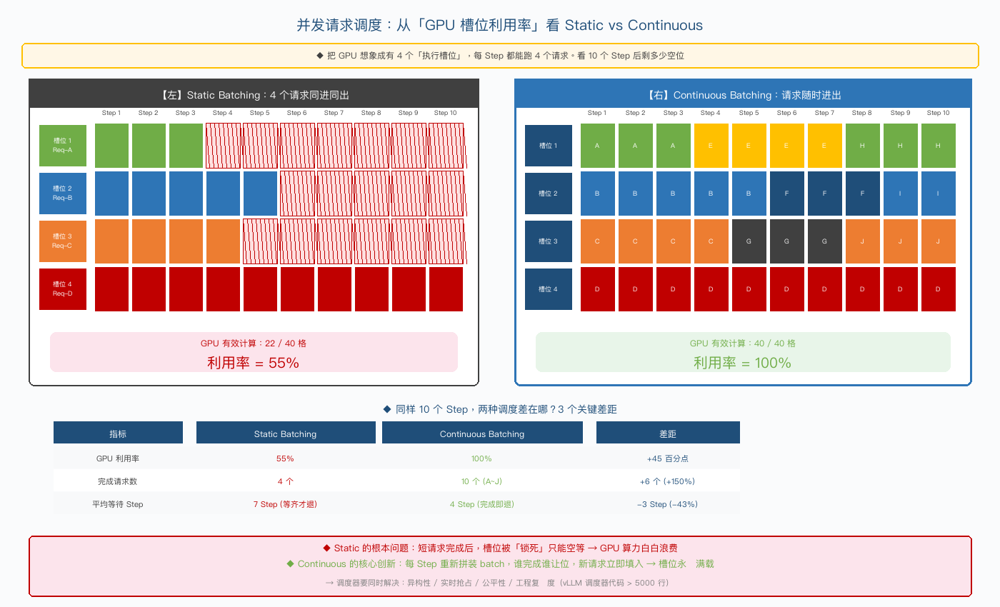

如上图所示：

【左】Static Batching（同进同出）

4 个请求 A/B/C/D 一起进 batch，必须等最长的 D（10 Step）全部跑完才能结束。

A 只需 3 Step 就完成，剩下 7 Step 槽位被锁死只能空等（红色斜纹格）。

总共 40 格（10 Step × 4 槽位），只有 12 格在有效计算 → GPU 利用率 = 30%。

【右】Continuous Batching（动态拼装）

每个 Step 重新拼装 batch：谁完成谁让位，新请求立即填入空槽位。

同样 10 Step 内，处理了 10 个请求（A~J），几乎每格都在有效计算。

总共 40 格，32 格在有效计算 → GPU 利用率 = 80%。

3 个关键差距：

| 指标 | Static Batching | Continuous Batching | 差距 |
| --- | --- | --- | --- |
| GPU 利用率 | 30% | 80% | +50 百分点 |
| 完成请求数 | 4 个 | 10 个 (A~J) | +150% |
| 平均等待 Step | 7 Step（等齐才退） | 4 Step（完成即退） | -43% |

调度器要同时解决的 4 大难题：异构性（长度/优先级差异）、实时抢占（高优请求让位）、公平性（避免饥饿）、工程复杂度（vLLM 调度器代码 > 5000 行）。

📖 详见第 3.5.4 节（Continuous Batching 深度剖析）与第 4.7.2 节（并发调度策略全景）。

### 1.4.5 硬件碎片化挑战

什么是"碎片化"？—— 不同芯片厂商用了互不兼容的指令集、算子库、模型格式。同样的矩阵乘法，NVIDIA GPU 用 CUDA、苹果 M3 用 Metal、华为昇腾用 CANN、高通骁龙用 QNN——算子库不同、格式不同、优化策略不同，无法互相复用。

下图先讲清楚"碎片化"的本质，再展示它的 4 大坏处：

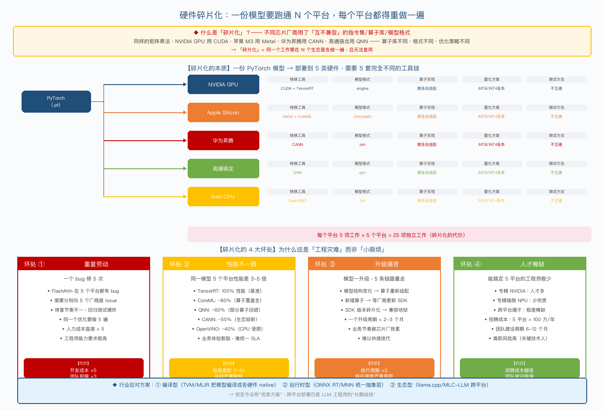

如上图所示：

【碎片化的本质】一份 PyTorch 模型 → 部署到 5 类硬件，需要 5 套完全不同的工具链

NVIDIA GPU → CUDA + TensorRT → .engine

Apple Silicon → Metal + CoreML → .mlmodelc

华为昇腾 → CANN → .om

高通骁龙 → QNN → .qnn

Intel CPU → OpenVINO → .bin

每个平台要做 5 项独立工作（转换工具/模型格式/算子实现/量化方案/调试方法），5 个平台 × 5 项 = 25 项独立工作。

【碎片化的 4 大坏处】

| 坏处 | 表现 | 代价 |
| --- | --- | --- |
| ① 重复劳动 | 一个 bug 要在 5 个平台分别修；同一个优化要做 5 遍 | 开发成本 ×5，团队规模 ×3 |
| ② 性能不一致 | 同一模型在 TensorRT 上 100% 性能，在 OpenVINO 上可能只有 40% | 性能差距 3-5 倍，体验严重割裂 |
| ③ 升级痛苦 | 模型一升级，5 条链路都要重走一遍；新增算子要等芯片厂更新 SDK | 迭代周期 ×3，业务响应严重受限 |
| ④ 人才稀缺 | 专精单平台的人多，跨平台通才极度稀缺 | 招聘成本翻倍，团队建设极慢 |

核心结论：碎片化不是"麻烦"，而是结构性工程灾难——它让 LLM 部署的成本、性能、迭代速度、团队建设全部发生非线性放大。

📖 详见第 4.7.3 节：硬件碎片化部署矩阵（含云边端车对比、PyTorch → 各硬件转换链路、3 大应对方案：编译型/运行时型/生态型）。

### 1.4.6 精度损失控制复杂性

核心特征：INT8 / INT4 / FP8 量化能显著降低显存和加速推理，但精度损失如何控制是部署工程师每天都要面对的权衡。不同的精度方案在"显存/速度收益"与"精度损失"之间画出了不同的帕累托曲线。

下图把 7 种精度方案放在二维矩阵中，按收益与损失分为 4 个象限：

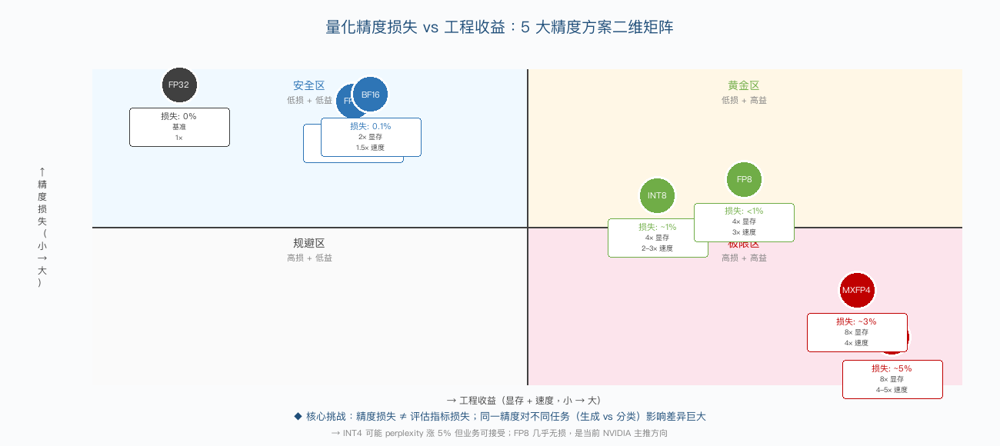

如上图所示：

安全区（低损低益）：FP32 / FP16 / BF16 —— 几乎无损，但收益也小（2× 显存）。

黄金区（低损高益）：INT8 / FP8 —— 损失 < 1%，收益 4× 显存 + 3× 速度。这是 NVIDIA 当前主推方向。

极限区（高损高益）：INT4 / MXFP4 —— 损失 3-5%，收益 8× 显存 + 4-5× 速度。极致性价比场景。

规避区（高损低益）：理论存在，工程上不会选。

📖 详见第 4.6.1 节：模型本身优化（含 4 大量化方案 PTQ/QAT/AWQ/GPTQ 的深度对比与选型决策）。

### 1.4.7 实时性与吞吐的权衡

核心特征：实时性（单请求延迟低）和吞吐（单位时间处理请求数多）是两个天然冲突的目标——为了高吞吐要拼大 batch，但大 batch 又会拉高单请求延迟。这种权衡构成了 LLM 推理服务设计中的"凹形 Pareto 前沿"。

下图给出了延迟-吞吐 Pareto 曲线，以及 3 类典型业务场景的"卡点"位置：

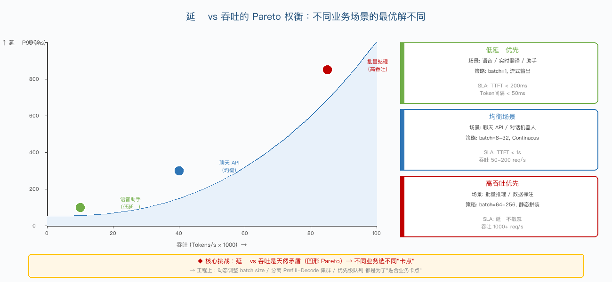

如上图所示：

低延迟优先（语音助手/实时翻译）：batch=1，流式输出，TTFT < 200ms，Token 间隔 < 50ms。

均衡场景（聊天 API/对话机器人）：batch=8-32，Continuous Batching，TTFT < 1s，吞吐 50-200 req/s。

高吞吐优先（批量推理/数据标注）：batch=64-256，静态拼装，延迟不敏感，吞吐 1000+ req/s。

📖 详见第 4.7.4 节：延迟吞吐 Pareto 前沿（含 3 大业务场景 SLA 卡点、4 大工程解法）。

💡 小结：以上 7 个特征构成了 LLM 推理工程师面临的核心挑战图谱。第 4 章的所有技术（KV Cache 优化、调度策略、量化、并行、框架选型）都是对这 7 个挑战的回应。理解了这 7 个特征，就理解了 LLM 推理工程的"问题空间"。

## 1.5 大模型推理核心组件及功能（系统拆解）

一个完整的 LLM 推理系统由 10 个核心组件 构成。理解它们的职责边界、内部原理与协作关系，是理解整个推理系统的钥匙。下图是 10 大组件的全景总览：

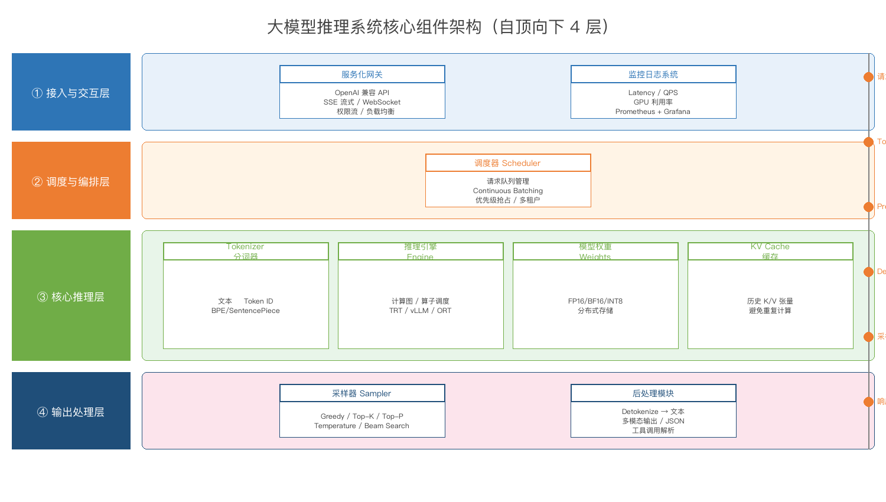

10 大组件按职能可分为 4 类：

数据流核心（5 个）：模型权重、Tokenizer、KV Cache、采样器、后处理

执行中枢（2 个）：推理引擎、调度器

服务化层（2 个）：服务化网关、监控日志

协作全景（1 个）：组件串联关系

下面 10 节依次深入展开每个组件的内部原理、运行流程与挑战。

### 1.5.1 模型权重（参数载体）

职责：存储模型参数（FP32/FP16/BF16/INT8 等格式），负责加载、初始化、分布式存储与版本管理。这是推理系统的"静态数据层"——一旦加载就常驻显存，是所有计算的基础。

内部原理：模型权重由 3 个维度共同决定存储方案：

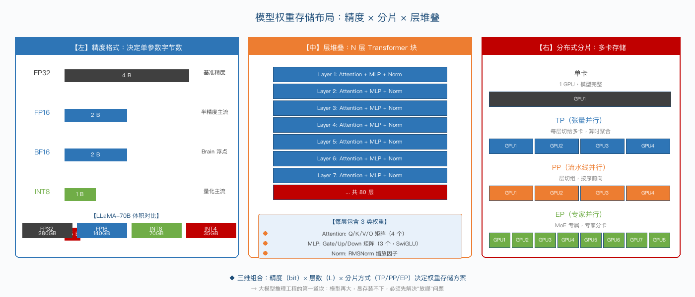

如上图所示：

精度维度（左图）：FP32(4B) → FP16/BF16(2B) → INT8(1B) → INT4(0.5B)，每级精度降一档，显存减半。LLaMA-70B 在 FP32 下 280GB，INT4 下仅 35GB。

层堆叠（中图）：N 层 Transformer 块串行堆叠（LLaMA-70B 共 80 层）。每层包含 Attention（Q/K/V/O 矩阵）+ MLP（Gate/Up/Down）+ Norm 共 3 类权重。

分布式分片（右图）：单卡装不下时，必须分片：单卡 / TP（张量并行） / PP（流水线并行） / EP（专家并行）。

运行流程：

加载阶段：从磁盘 / 对象存储读取权重 → 反序列化 → 加载到 GPU 显存。

初始化阶段：建立 Layer → Tensor 映射，配置显存布局（连续 vs 分页）。

服务阶段：常驻显存，被每次前向调用读取。

核心挑战：

加载慢：140GB 权重从 SSD 加载到 GPU 需数十秒，影响冷启动。

多卡一致性：分布式存储需保证各卡看到的视图一致。

热更新：模型版本切换时不中断服务（蓝绿部署）。

### 1.5.2 推理引擎（执行核心）

职责：构建并优化计算图，调度执行算子，管理内存分配，是推理过程的执行中枢。代表：TensorRT / ONNX Runtime / vLLM / SGLang。

内部原理：推理引擎内部分为 5 大模块协同工作：

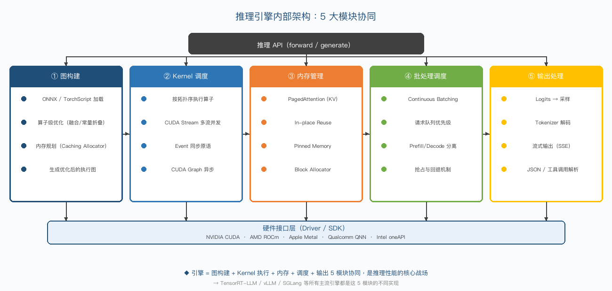

如上图所示，从 API 调用到硬件执行经过 5 大模块：

① 图构建：加载 ONNX/TorchScript，做算子融合、常量折叠等离线优化，生成执行图。

② Kernel 调度：按拓扑序执行算子，使用 CUDA Stream 多流并发 + Event 同步。

③ 内存管理：Caching Allocator 内存池 + PagedAttention + Pinned Memory。

④ 批处理调度：Continuous Batching + 请求队列 + 优先级 + 抢占机制。

⑤ 输出处理：Logits 采样 + Tokenizer 解码 + SSE 流式输出。

运行流程：

forward(input) → [图优化器] → [Kernel 调度] → [硬件执行] → [输出处理] → return output                       ↑                ↓                  [内存管理]      [批处理调度]

核心挑战：

算子覆盖率：自定义算子（如 FlashAttention）需要在每个引擎里单独实现。

多硬件适配：同一个引擎要支持 CUDA / ROCm / Metal / QNN，工程量大。

性能调优：参数众多（kernel auto-tuning、stream 数量、batch 策略），调优门槛高。

### 1.5.3 Tokenizer（分词器）

职责：将文本与 Token ID 相互转换（编码/解码），支持 BPE / SentencePiece / WordPiece 等多种算法。这是 LLM 与"人类语言"的接口。

内部原理：以最主流的 BPE（Byte-Pair Encoding）为例，编码流程如下：

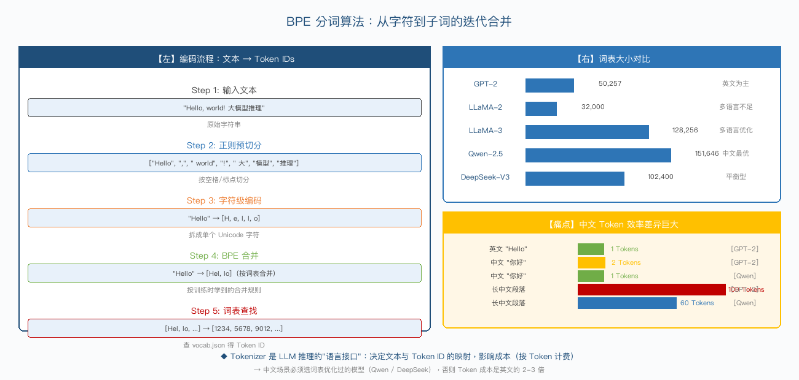

如上图所示：

左图（编码流程）：5 步从文本到 Token ID —— ① 输入 → ② 正则预切分 → ③ 字符级编码 → ④ BPE 合并 → ⑤ 词表查找。

右图（词表对比）：不同模型词表大小差异巨大（GPT-2 50k vs Qwen 152k），直接影响 Token 效率。

运行流程：

编码（输入）：text → tokenizer.encode(text) → token_ids

解码（输出）：token_ids → tokenizer.decode(ids) → text

核心挑战：

中文效率痛点：GPT-2 词表中文 1 字 = 2-3 Token，导致中文场景 Token 成本是英文的 2-3 倍。

多语言支持：LLaMA-2 词表仅 32k，多语言能力差；LLaMA-3 扩到 128k 优化。

边界情况：emoji、组合字符、罕见 CJK 字符的 token 化不稳定。

实战建议：中文场景必须选词表优化过的模型（Qwen / DeepSeek / GLM），否则 API 计费成本翻倍。

### 1.5.4 KV Cache（缓存系统）

职责：缓存历史 K/V 张量避免重复计算，是 LLM 推理性能的核心数据结构。按序列长度线性增长。

内部原理：KV Cache 是一个 5 维张量：

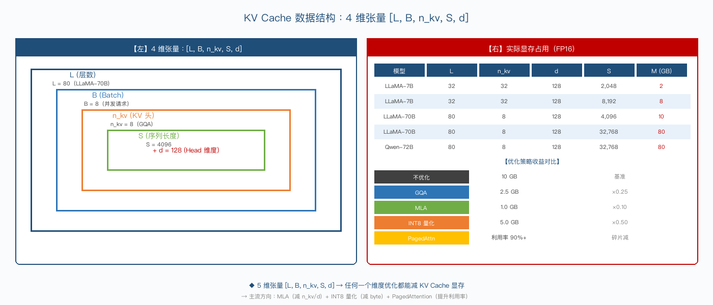

如上图所示，KV Cache 的 5 维含义：

L（层数）：80 层（LLaMA-70B），最外层。

B（Batch）：并发请求数。

n_kv（KV 头数）：GQA 后通常 8 个。

S（序列长度）：随生成动态扩展。

d（Head 维度）：通常 128。

显存占用公式：M = 2 × L × B × n_kv × S × d × p（p = 精度字节）

右图给出了主流模型的实际显存占用，以及 5 种优化策略的收益对比：GQA（×0.25）、MLA（×0.10）、INT8 量化（×0.50）、PagedAttention（提升利用率）。

运行流程：

Prefill 阶段：算 prompt 的 KV → 写入 Cache。

Decode 阶段：每生成 1 Token → 追加到 Cache → 后续步骤只读不写。

请求完成：释放 Cache（或被 Prefix Cache 复用）。

核心挑战：

多请求放大：单请求 10GB，并发 32 时 320GB，远超单卡显存。

碎片化：长度异构的请求导致传统内存池利用率仅 20%。

共享前缀：相同 system prompt 的请求应共享 KV，但工程实现复杂。

### 1.5.5 调度器（请求管理）

职责：管理请求队列，决定批处理策略（Static / Continuous Batching）、优先级与抢占机制。这是推理系统的"交通指挥"。

内部原理：调度器维护 3 大队列 + 5 种状态流转：

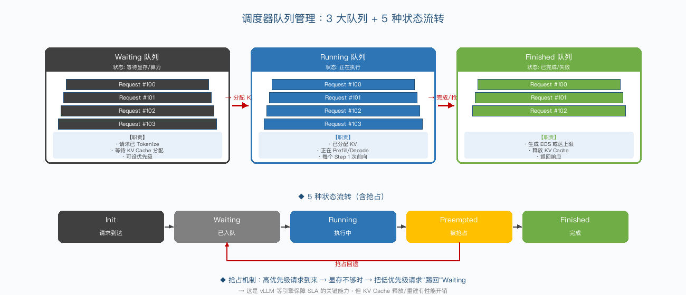

如上图所示：

3 大队列：Waiting（等待显存）→ Running（正在执行）→ Finished（已完成）。

5 种状态流转：Init → Waiting → Running → Finished，含 Preempted 抢占状态。

抢占机制：高优先级请求到来且显存不够时，把低优先级请求"踢回"Waiting（释放其 KV Cache）。

运行流程（每个 Decode Step）：

扫描 Running 队列，检测已完成的请求 → 释放 KV。

检查 Batch 空位 → 从 Waiting 拉取新请求。

检查显存够否 → 不够则抢占低优先级。

拼装最终 batch → 执行前向。

核心挑战：

SLA 分级：P0/P1/P2 优先级混合时如何公平调度。

抢占开销：KV Cache 释放/重建有性能成本，频繁抢占会拖累整体吞吐。

死锁避免：所有请求都被互相抢占时如何破局。

### 1.5.6 采样器（生成控制）

职责：基于模型输出 logits 进行采样，决定下一个 Token 是什么。支持 Greedy / Top-K / Top-P / Temperature / Beam Search 等策略。

内部原理：5 种主流采样策略对比：

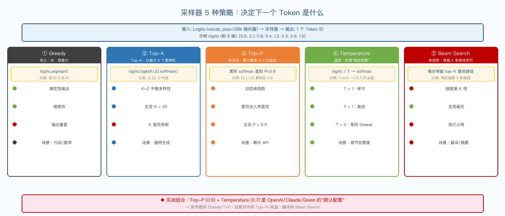

如上图所示，每种策略决定了"从 vocab 中如何挑下一个 Token"：

① Greedy：永远选最大，确定性强，适合代码/数学。

② Top-K：从最大 K 个里随机选，K 通常是 40。

③ Top-P（核采样）：累计概率 ≥ P 的候选集，动态大小，最符合人类直觉。

④ Temperature：温度调节激进程度，T<1 保守，T>1 激进。

⑤ Beam Search：保留 K 条候选路径，全局最优但慢 K 倍，现已少用。

运行流程：

logits (vocab_size 维) → [可选: Temperature 缩放] → [Top-K 或 Top-P 截断] → softmax → 概率分布 → 采样 → token_id

实战组合：Top-P (0.9) + Temperature (0.7) 是 OpenAI / Claude / Qwen 的默认配置。

核心挑战：

重复循环：低质量采样会导致输出重复（"the the the the..."）。

多样性 vs 一致性：太保守会重复，太激进会胡言乱语。

性能开销：vocab=128k 时 softmax 计算可观，部分引擎在 GPU 上做采样。

### 1.5.7 后处理模块

职责：将输出 Token 解码为最终结果，处理特殊 Token、多模态输出与结构化输出（JSON / 工具调用）。

内部原理：4 步从 Token IDs 到最终输出：

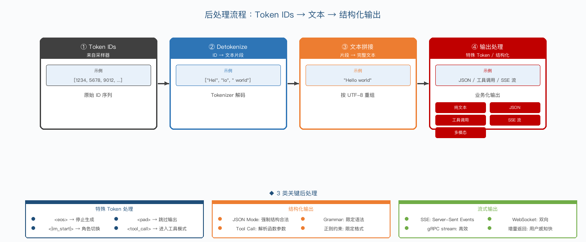

如上图所示：

① Token IDs：来自采样器的原始序列。

② Detokenize：ID → 文本片段（Tokenizer 解码）。

③ 文本拼接：片段按 UTF-8 重组为完整文本。

④ 输出处理：5 种输出形态 —— 纯文本 / JSON / 工具调用 / SSE 流 / 多模态。

3 类关键后处理：

特殊 Token 处理：<eos> 停止生成、<|im_start|> 角色切换、<tool_call> 进入工具模式。

结构化输出：JSON Mode 强制合法、Grammar 限定语法、Tool Call 解析函数参数。

流式输出：SSE（Server-Sent Events）增量返回，让用户感知"打字机"效果。

核心挑战：

UTF-8 边界：中文字符可能跨多个 Token，必须缓冲到完整字符再输出。

结构化保证：JSON 模式需要约束解码，避免输出非法 JSON。

流式延迟：第一个 Token 必须尽快返回（TTFT < 200ms），否则用户体验差。

### 1.5.8 服务化网关

职责：对外提供 API 接口（OpenAI 兼容协议），负责流式响应（SSE / WebSocket）、鉴权限流与负载均衡。是业务侧到推理引擎的"门卫 + 翻译"。

内部原理：网关包含 6 大功能模块：

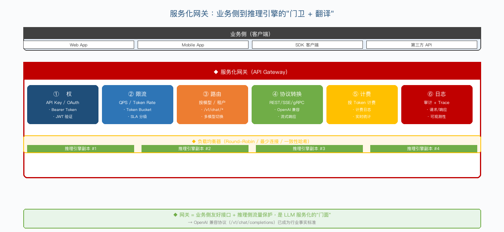

如上图所示，从业务侧到推理引擎经过：

① 鉴权：API Key / OAuth / JWT 验证。

② 限流：QPS 限流 + Token Rate 限流（按 Token 计费的基石）。

③ 路由：按模型 / 租户 / 版本路由到不同推理集群。

④ 协议转换：REST / SSE / gRPC / WebSocket 互转。

⑤ 计费：按 Token 实时统计，写入计费日志。

⑥ 日志：请求响应日志 + Trace 链路追踪。

下方还有 负载均衡器（Round-Robin / 最少连接 / 一致性哈希）+ 多副本推理引擎。

核心挑战：

协议兼容：必须兼容 OpenAI /v1/chat/completions 协议，否则生态成本高。

租户隔离：多租户共享集群时，某租户流量暴涨不能影响其他租户。

流式稳定性：SSE 长连接易断，需要断点续传机制。

### 1.5.9 监控与日志系统

职责：实时监控性能指标（Latency / QPS / GPU 利用率）、业务指标与异常告警。是推理服务的"仪表盘 + 黑匣子"。

内部原理：3 层指标金字塔 + 4 类告警分级：

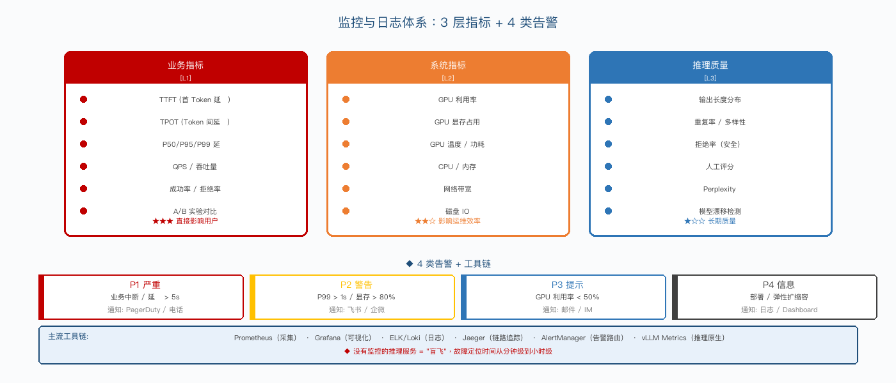

如上图所示：

业务指标（L1，最重要）：TTFT（首 Token 延迟）、TPOT（Token 间延迟）、P50/P95/P99、QPS、成功率、A/B 对比。

系统指标（L2）：GPU 利用率、显存占用、温度功耗、CPU/内存、网络带宽。

推理质量（L3）：输出长度分布、重复率、拒绝率、人工评分、模型漂移。

4 类告警分级：P1 严重（PagerDuty/电话）→ P2 警告（飞书）→ P3 提示（邮件）→ P4 信息（日志）。

主流工具链：Prometheus（采集）+ Grafana（可视化）+ ELK/Loki（日志）+ Jaeger（链路追踪）+ AlertManager（告警路由）+ vLLM Metrics（推理原生）。

核心挑战：

指标爆炸：单推理服务暴露指标 200+，需要提炼核心 SLO。

维度细分：按模型 / 租户 / 区域 / 版本 多维聚合，存储成本高。

采样 vs 全量：Trace 全量采集影响性能，采样又可能漏掉关键故障。

### 1.5.10 组件间协作关系全景

前面 9 个组件如何串成一个完整推理服务？下图用 4 个泳道清晰分层：

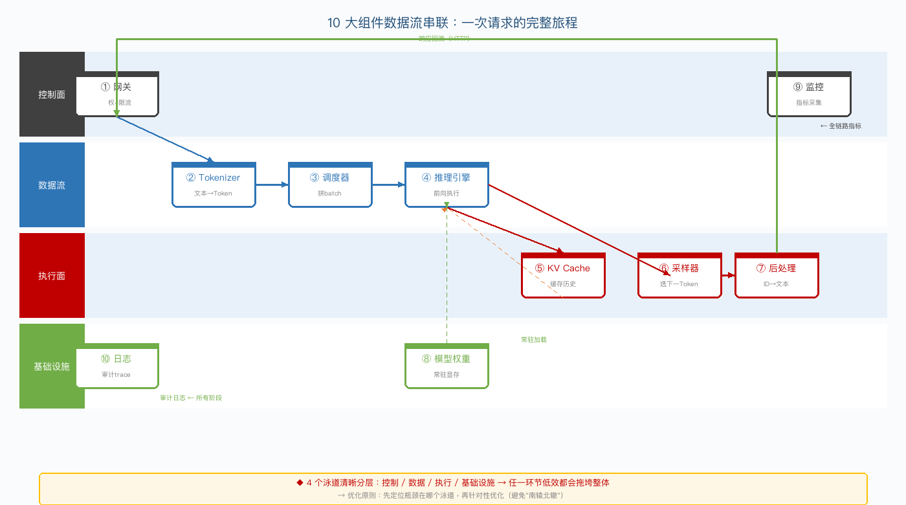

如上图所示，10 大组件分布在 4 个泳道：

控制面（灰）：① 网关 + ⑨ 监控

数据流（蓝）：② Tokenizer + ③ 调度器 + ④ 推理引擎

执行面（红）：⑤ KV Cache + ⑥ 采样器 + ⑦ 后处理

基础设施（绿）：⑧ 模型权重 + ⑩ 日志

主数据流（蓝色实线）：

① 网关 → ② Tokenizer → ③ 调度器 → ④ 推理引擎 → ⑥ 采样器 → ⑦ 后处理 → ① 网关（响应）

关键支撑流（虚线）：

⑤ KV Cache ↔ ④ 推理引擎（双向：写入 + 读取）

⑧ 模型权重 → ④ 推理引擎（常驻加载）

⑨ 监控 ← 所有组件（指标采集）

⑩ 日志 ← 所有阶段（审计 trace）

优化原则：先定位瓶颈在哪个泳道，再针对性优化（避免"南辕北辙"）。

完整数据流（一次请求的全生命周期）：10 大组件的协作关系完整串起来就是一次请求的完整生命周期——经过 7 个阶段。下图是生命周期总览：

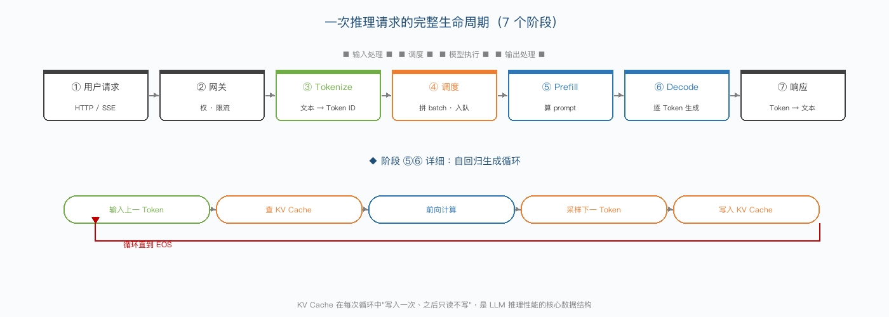

如上图所示，7 个阶段与 10 大组件的对应关系：

| 阶段 | 触发组件 | 关键动作 |
| --- | --- | --- |
| ① 用户请求 | HTTP Client | 通过 REST/SSE 发送请求 |
| ② 网关 | 服务化网关 | 鉴权、限流、路由到具体模型 |
| ③ Tokenize | Tokenizer | 把文本转成 Token IDs |
| ④ 调度 | 调度器 | 决定何时执行、与谁拼 batch |
| ⑤ Prefill | 推理引擎 + 模型权重 + KV Cache | 处理完整 prompt，产出首个 Token + 初始 KV Cache |
| ⑥ Decode | 推理引擎 + KV Cache + 采样器 | 自回归循环，逐 Token 生成 |
| ⑦ 响应 | 后处理 + 网关 | Token IDs → 文本 → SSE 流式返回 |
| 全程 | 监控 + 日志 | 指标采集 + 审计 trace |

其中阶段 ⑤⑥（Prefill + Decode） 是 LLM 推理的核心循环，下图展开了自回归生成的内部细节：

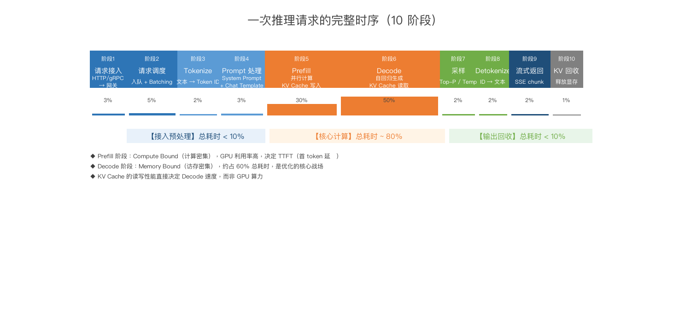

💡 关键认知：以上 10 个组件对应 10 个不同的"工程优化方向"。任何一个环节的低效，都会拖垮整个推理服务的性能。例如：- 网关限流不当 → 用户请求被拒- Tokenizer 选错 → Token 成本翻倍- 调度器策略差 → GPU 利用率仅 30%- KV Cache 不优化 → 显存利用率仅 20%- 监控缺位 → 故障定位从分钟级到小时级

### 1.5.11 多模态推理组件扩展（新增）

随着多模态大模型（VLA、图文理解、语音对话）的普及，推理系统需要扩展新的组件来支持多模态数据的处理。以下是多模态推理相比纯文本推理新增的组件层：

| 组件 | 功能 | 处理的模态 | 代表技术 |
| --- | --- | --- | --- |
| 多模态编码器 | 将图像/音频/视频转为张量表示 | 图像、视频、音频 | CLIP ViT、Whisper、Qwen-VL Vision Encoder |
| 模态对齐层 | 将不同模态的表示映射到统一语义空间 | 文本-图像-音频 | Q-Former、Cross-Attention Projection |
| 多模态 Tokenizer | 支持图片分块、音频分帧的 Token 化 | 图像 Patch、音频帧 | ViT Patch Embed、VQGAN |
| 多模态 KV Cache | 为视觉 Token 分配额外的 KV Cache 空间 | 视觉 Token 缓存 | Visual Cache、Prefix Cache 共享 |
| 模态调度器 | 根据输入动态选择处理哪些模态 | 多模态路由 | VLM Router、模态门控 |

典型多模态推理架构（以 Qwen-VL / LLaVA 为例）：

输入流程：用户上传图片 → Vision Encoder 提取视觉特征 → Q-Former 对齐到文本空间 → 与文本 Token 拼接 → LLM 推理 → 输出文本回复

关键挑战：

视觉 Token 数量巨大：一张 224x224 图片产生 256-576 个视觉 Token，比文本 Token 多 10-100 倍

KV Cache 内存爆炸：视觉 Token 的 KV Cache 可能占推理总显存的 60-80%

模态调度延迟：需要动态决定何时调用 Vision Encoder，避免不必要的计算

## 1.6 大模型推理的应用领域概览（落地场景）

### 1.6.1 云端 LLM 服务场景（ChatGPT/豆包/Kimi）

业务形态：通用对话（ChatGPT/Claude/豆包/Kimi）、企业知识库（RAG）、代码生成（Cursor/Copilot）等云端 LLM 服务。

推理特点：超大模型 + 超高并发 + 流式响应

云端 LLM 服务是最复杂的推理场景，5 层架构堆叠：

用户终端：Web/iOS/Android/第三方 API

CDN + 网关：鉴权、限流、Token 计费

推理服务集群：vLLM/SGLang + Continuous Batching + TP 多卡并行

模型 + 数据：Llama-3-400B / Claude 3.5 / GPT-4 + RAG 向量库

基础设施：K8s + H100 GPU + NVLink + InfiniBand

3 类典型云端 LLM 服务：

| 子场景 | 延迟要求 | 模型规模 | 关键技术 |
| --- | --- | --- | --- |
| 通用对话（ChatGPT/豆包） | TTFT < 500ms | 70B-1T+ | Continuous Batching + Prefix Cache |
| RAG 知识库（企业客服） | TTFT < 1s | 13B-70B | Embedding + 向量检索 + LLM |
| 代码生成（Cursor/Copilot） | 内联 < 200ms | 7B-33B | Speculative Decoding + FIM |

核心挑战：

超高并发：万级 QPS → 必须多副本 + 智能调度。

长上下文：128K-1M Token → KV Cache 巨大，需要 PagedAttention + MLA。

成本压力：GPU 占大头 → 必须 Continuous Batching + 量化 + 投机采样全方位优化。

RAG 系统 8 步流水线（云端 LLM 重要子场景）：

① 用户提问 → ② Query 改写 → ③ 向量化 → ④ 向量检索 → ⑤ Rerank → ⑥ Prompt 拼装 → ⑦ LLM 推理 → ⑧ 引用标注

其中 ③④⑤ 是 RAG 特有的检索链路（Embedding + 向量库 + Rerank），⑥ 把检索结果拼到 Prompt 送给 LLM。

### 1.6.2 边缘推理场景（车载/机器人）

业务形态：车载智能座舱、自动驾驶、工业机器人、人形机器人、物流机器人等需要"在设备附近推理"的场景。

推理特点：车规/工业级硬件 + 严格安全要求 + 实时响应

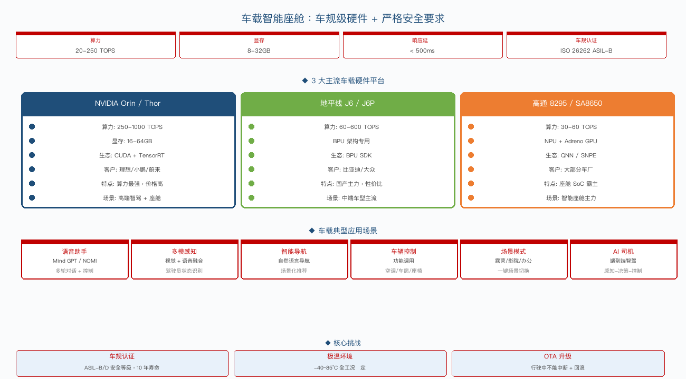

如上图所示，3 大边缘硬件平台主导市场：

NVIDIA Orin / Thor：250-1000 TOPS，CUDA + TensorRT，理想/小鹏/蔚来高端车型。

地平线 J6 / J6P：60-600 TOPS，BPU 架构，比亚迪/大众，国产性价比之选。

高通 8295 / SA8650：30-60 TOPS，QNN/SNPE，大部分车厂座舱主力。

2 类典型边缘场景：

① 车载智能座舱

典型应用：语音助手、多模感知（驾驶员状态）、智能导航、车辆控制（Function Calling）、场景模式、AI 司机。

车规专属挑战：

必须通过 ISO 26262 ASIL-B/D 安全等级 + 10 年寿命保证。

-40~85°C 全工况稳定运行。

OTA 升级不能中断 + 必须支持回滚。

② 机器人 VLA（Vision-Language-Action）

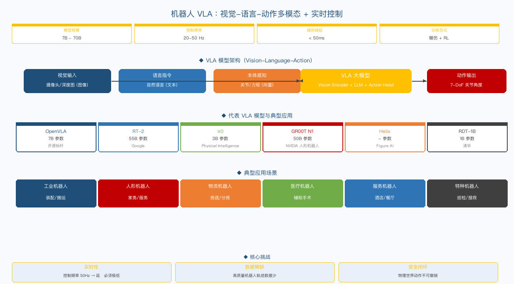

如上图所示，VLA 模型架构：

3 路输入：视觉（摄像头/深度图）+ 语言指令 + 本体感知（关节/力矩）。

中央融合：Vision Encoder + LLM + Action Head。

动作输出：7-DoF 关节角度，控制频率 20-50Hz。

主流 VLA 模型：OpenVLA (7B) / RT-2 (55B) / π0 (3B) / GR00T N1 (50B) / Helix (Figure AI) / RDT-1B。

6 大机器人应用：工业机器人（装配/搬运）、人形机器人（家务/服务）、物流机器人（拣选/分拣）、医疗机器人（辅助手术）、服务机器人（酒店/餐厅）、特种机器人（巡检/搜救）。

核心挑战：

实时性：50Hz 控制频率 → 端到端延迟必须 < 50ms。

数据稀缺：高质量机器人轨迹数据远少于文本数据。

安全闭环：物理世界动作不可撤销（不像聊天可以撤回），必须严格安全校验。

### 1.6.3 端侧推理场景（手机/AR 眼镜）

业务形态：Apple Intelligence（iPhone/Mac）、华为小艺、小米小爱同学、Copilot+ PC、AR 眼镜（Meta Ray-Ban / Apple Vision Pro）。

推理特点：端侧 7B 以内 + 内存受限 + 隐私不出设备

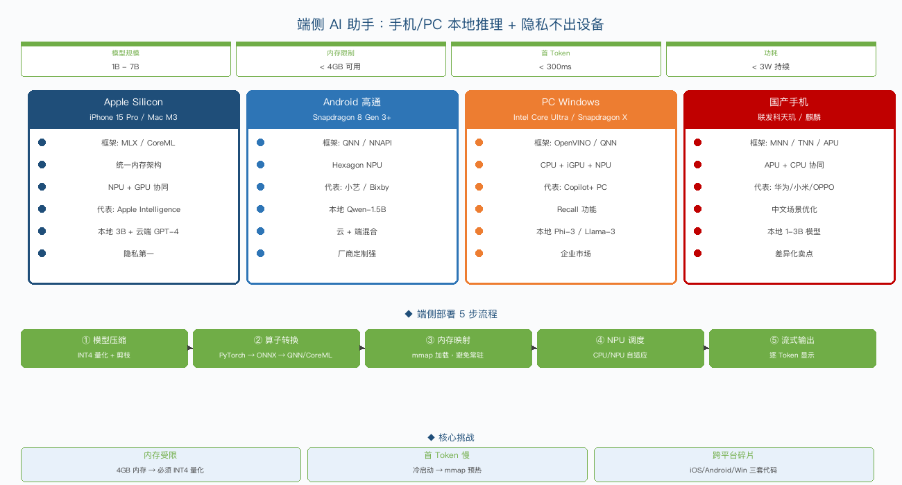

如上图所示，4 大主流端侧平台各有特色：

Apple Silicon：MLX/CoreML 框架，统一内存架构，本地 3B + 云端 GPT-4 混合。

Android 高通：QNN/NNAPI + Hexagon NPU，本地 Qwen-1.5B。

PC Windows：OpenVINO/QNN + CPU/iGPU/NPU 协同，Copilot+ PC 主推。

国产手机：MNN/TNN/APU，中文场景优化，1-3B 本地模型。

端侧部署 5 步流程：模型压缩（INT4）→ 算子转换 → 内存映射（mmap）→ NPU 调度 → 流式输出。

核心挑战：

内存受限：4GB 可用内存 → 必须 INT4 量化 + 算子裁剪。

首 Token 慢：冷启动时 mmap 加载，预热慢。

跨平台碎片：iOS/Android/Windows 三套代码必须维护。

功耗约束：手机电池有限，单次推理功耗必须 < 1W。

端侧独特价值：

隐私保护：用户数据不出设备（医疗/金融场景必需）。

低延迟：无网络往返，首 Token 可 < 100ms。

离线可用：飞机/地下室/无网区域也能用。

成本可控：无云端 GPU 成本，硬件一次投入。

### 1.6.4 行业垂直应用（医疗/工业/金融）

业务形态：在垂直行业深度定制的大模型推理服务，往往结合行业知识库 + 专业模型。

4 大行业垂直场景：

| 行业 | 典型应用 | 模型特点 | 关键挑战 |
| --- | --- | --- | --- |
| 医疗 | 影像诊断、电子病历、辅助问诊 | Med-PaLM 2 / Meditron | 准确率要求 99%+、合规（HIPAA） |
| 金融 | 智能投顾、风险审查、反欺诈 | BloombergGPT / FinGPT | 实时性、可解释性、审计追溯 |
| 工业 | 质检、设备预测维护、工艺优化 | LLaMA-Factory 定制模型 | 与产线 PLC 集成、边缘部署 |
| 法律 | 合同审查、案例检索、文书生成 | ChatLaw / LexiLaw | 长文档处理、引用准确 |

行业垂直推理的特点：

私有化部署：数据不能出院 → 内网部署 + 私有云。

多模态融合：医疗影像 + 文本病历 + 检验数据。

强可解释性：医生/律师/工程师需要知道"为什么这样回答"。

合规审计：每次推理必须有完整日志可追溯。

核心挑战：

行业数据稀缺：高质量标注数据远少于通用语料。

精度要求苛刻：医疗误诊后果严重，必须保留人工复核环节。

私有化成本：自建集群成本高，中小机构难承受。

算子定制：CT/MRI 影像推理需要专门算子（如 3D 卷积）。

### 1.6.5 新兴场景展望（VLA/世界模型）

业务形态：未来 3-5 年即将爆发的全新推理场景，包括多模态生成、世界模型、具身智能等。

4 大新兴方向：

① 多模态生成

业务：文生图（Midjourney/SD）、图生视频（Sora/Kling）、3D 生成。

推理特点：Diffusion 模型 + 显存密集 + 延迟跨度大（秒级-分钟级）。

核心挑战：

高分辨率显存爆炸（4K 图需要 24GB+ 显存）。

分钟级响应必须异步 + 进度提示。

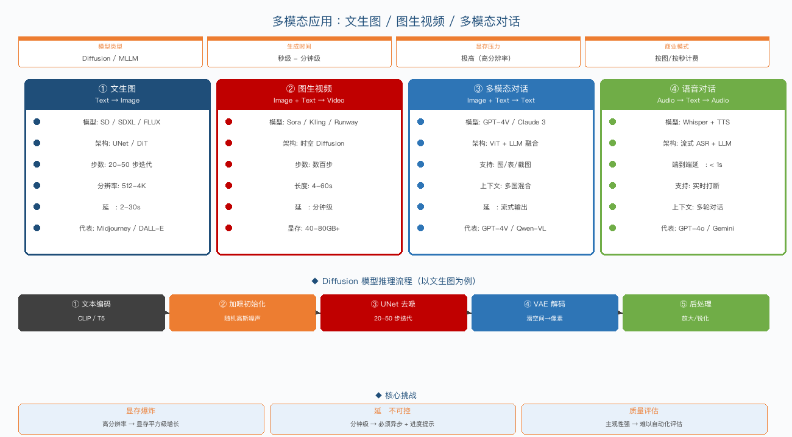

如上图所示，4 类多模态应用的推理特征差异巨大：

文生图：SD/SDXL/FLUX，20-50 步迭代，延迟 2-30s。

图生视频：Sora/Kling，时空 Diffusion，数百步，延迟分钟级。

多模态对话：GPT-4V/Claude 3，ViT + LLM 融合，流式输出。

语音对话：Whisper + TTS，端到端延迟 < 1s，支持实时打断。

② 世界模型（World Model）

业务：Sora（OpenAI）、Genie（DeepMind）、自动驾驶 World Model。

核心能力：理解物理世界规律，预测未来状态。

推理挑战：计算量比文本生成大 100-1000 倍。

③ 具身智能（Embodied AI）

业务：人形机器人（Figure/Tesla Optimus/宇树）、自动驾驶端到端。

推理特点：VLA 模型 + 实时控制（10-100Hz）+ 安全性（ASIL-D）+ 低功耗（< 60W）。

关键趋势：从云端训练 → 端侧推理，机器人本机部署成主流。

④ AI Agent（智能体）

业务：Devin（自主编程）、Cursor Agent、多 Agent 协作。

推理特点：长上下文（128K+）+ 工具调用（Function Calling）+ 多轮迭代。

核心挑战：成本控制（Agent 一次任务可能调用 LLM 数百次）。

3 大未来趋势：

从文本到全模态：未来推理 80% 是多模态，纯文本只占 20%。

从云端到端云协同：敏感数据 + 实时控制在端侧，复杂推理在云端。

从单次到 Agent：推理不再是"一次请求一次响应"，而是"长时 Agent 任务"。

💡 场景选择建议：基础篇学完后，工程师要选择"专精方向"：- 追求技术深度 → 云端 LLM 服务（架构最复杂）- 追求业务广度 → RAG / 多模态 / 行业垂直（应用最广）- 追求极致优化 → 端侧 / 代码生成（延迟最敏感）- 追求新机会 → VLA / 世界模型 / Agent（蓝海市场）
