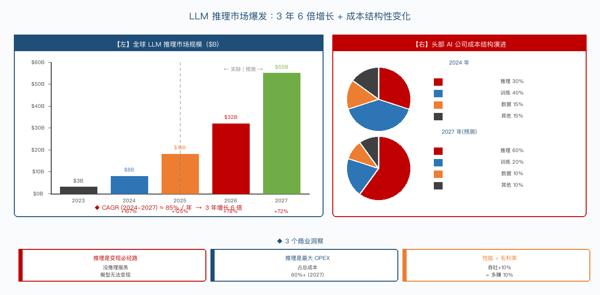
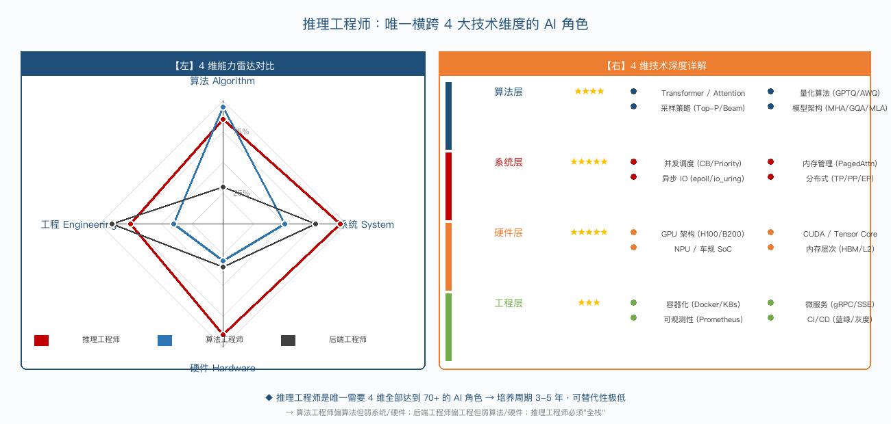
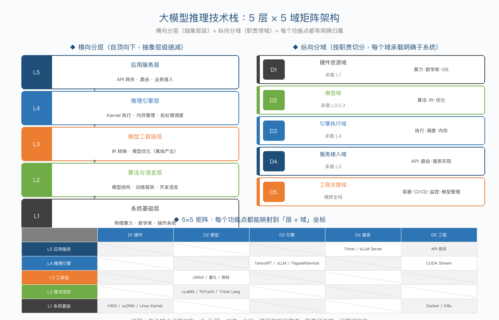
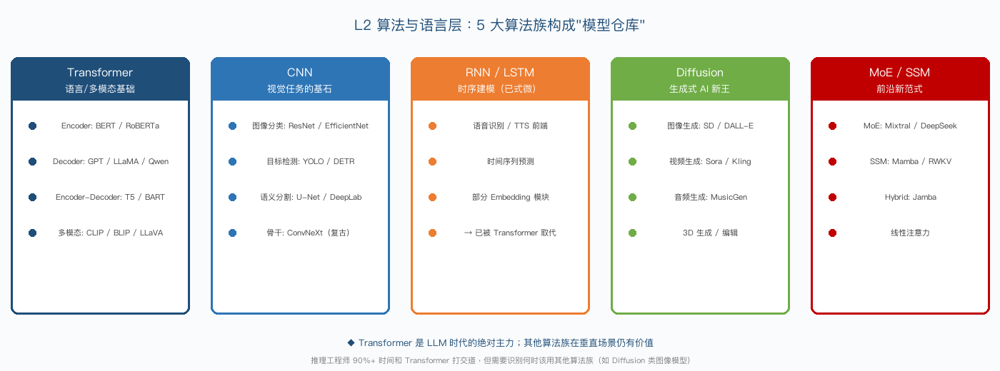

# 第2章：大模型推理的价值与必要性

本章从 4 个维度（商业 / 技术 / 个人 / 端侧）解读推理的价值。下图给出了四层价值金字塔的总览：

如上图所示，价值从下往上递进：

底层（端侧价值）：让 AI 跑到设备上，是所有上层价值的基础。

个人价值：推理工程师作为稀缺岗位，享受产业升级红利。

技术价值：推理是 AI 系统的核心瓶颈，决定商业化成败。

顶层（商业价值）：千亿级市场，所有 AI 公司的"最后一公里"。

下面 5 节分别展开。

## 2.1 大模型推理的商业价值

大模型推理市场正在经历前所未有的爆发，下图展示了 2023-2027 年市场规模预测与头部 AI 公司成本结构演进：

如上图所示：

左图（市场规模柱状图）：全球 LLM 推理市场规模从 2023 年 $3B → 2027 年 $55B，3 年 6 倍增长（CAGR ~85%）。

右图（成本结构饼图）：头部 AI 公司（OpenAI/Anthropic 等）的成本结构发生根本性变化 —— 推理成本占比从 2024 年的 30% 飙升到 2027 年的 60%+，而训练成本占比从 40% 降到 20%。

详细市场数据：

| 指标 | 2024 年 | 2027 年（预测） | 复合增长率 |
| --- | --- | --- | --- |
| 全球 LLM 推理市场规模 | $8B | $50B+ | ~85% |
| 单家头部云厂商 GPU 推理算力 | 50 万卡 | 300 万+ 卡 | 80% |
| 头部 AI 公司推理成本占比 | 30% | 60%+ | — |
| 推理服务平均毛利率 | 40% | 60%+ | 性能优化驱动 |
| 单 Token 推理成本（年度下降） | 基准 | -70% | 硬件 + 算法叠加 |

3 个关键商业洞察：

推理是 AI 商业化闭环的必经之路：没有推理服务，模型权重就是一堆"二进制垃圾"。所有 AI 公司的营收都来自推理调用量。

推理成本是 AI 公司最大的 OPEX：OpenAI 推理成本占总成本 60%+，Anthropic、Character.ai 等公司比例更高。谁能在同样性能下把推理成本打下去，谁就赢。

推理性能 = 毛利率：每提升 10% 的吞吐 ≈ 多赚 10% 利润。这也是为什么所有头部 AI 公司都在疯狂招聘推理工程师。

### 2.1.1 AI 商业化的最后一公里

推理是 AI 商业化的必经之路。没有推理服务，模型权重就是一堆无法对外提供价值的二进制文件。所有 AI 公司的营收都来自推理调用量——无论是 ChatGPT 的订阅费、API 的按量计费，还是企业级模型部署的授权费。

核心观点：推理是模型价值变现的唯一路径。训练是投资，推理是产出。

OpenAI 的营收结构中，推理服务贡献了 90%+ 的收入；Anthropic 的 Claude API 也是按 Token 计费，完全依赖推理服务产生收入。

### 2.1.2 部署质量决定产品体验

推理系统的部署质量直接决定了用户体验和产品竞争力。响应速度、稳定性、并发能力等指标直接影响用户留存率和产品口碑。

推理质量的关键指标：

| 指标 | 用户体验影响 | 行业基准 |
| --- | --- | --- |
| 首 Token 延迟（TTFT） | 用户感知的响应速度 | P99 < 500ms |
| Token 生成速度 | 阅读流畅度 | > 30 Token/s |
| 服务可用性 | 能否正常使用 | > 99.9% |
| 并发能力 | 高峰期体验 | 单卡支持 100+ 并发 |

### 2.1.3 部署效率与数据中心成本

推理部署效率直接影响数据中心成本和企业毛利率。在同等算力下，推理效率提升 10% 意味着每年可节省数百万到数千万的 GPU 成本。

部署效率的优化空间：

| 优化方向 | 优化幅度 | 节省成本（年） | 技术手段 |
| --- | --- | --- | --- |
| KV Cache 管理 | 30-50% | 500-1000 万 | PagedAttention / Prefix Caching |
| 批处理调度 | 2-5x | 1000-3000 万 | Continuous Batching |
| 模型量化 | 2-4x | 500-2000 万 | INT4/INT8/FP8 量化 |
| 算子优化 | 20-30% | 200-500 万 | FlashAttention / Fused Kernel |

### 2.1.4 商业模式与变现路径

AI 推理的商业化呈现多种变现路径，不同路径对应不同的商业模式和定价策略。

主流商业模式：

| 模式 | 代表公司 | 定价方式 | 毛利率 |
| --- | --- | --- | --- |
| API 按量计费 | OpenAI、Anthropic | 每千 Token 计费 | 60-80% |
| 订阅制 | ChatGPT Plus、Claude Pro | 月费固定 | 70-85% |
| 企业私有部署 | 智谱、百度 | 项目制/年费 | 40-60% |
| 端侧授权 | Apple、三星 | 硬件溢价 | N/A |

## 2.2 大模型推理的技术价值

从技术维度看，推理工程是当前 AI 领域最具技术深度的方向之一。下图通过 4 维能力雷达，对比了推理工程师与其他 AI 角色的能力要求差异：

如上图所示：

左图（雷达对比）：推理工程师在 4 个维度全部达到 70+ 分，是唯一"全栈"的 AI 角色。算法工程师偏算法（95）但弱硬件（30）；后端工程师偏工程（90）但弱算法（30）。

右图（4 维详解）：4 大技术维度的具体知识点分布。

4 大技术维度详解：

| 维度 | 涉及知识 | 难度 | 主要内容 |
| --- | --- | --- | --- |
| 算法层 | Transformer / Attention / 量化算法 | ★★★★ | 模型架构、采样策略、量化算法（GPTQ/AWQ）、MHA/GQA/MLA |
| 系统层 | 并发调度 / 内存管理 / 异步 IO | ★★★★★ | Continuous Batching、PagedAttention、epoll/io_uring、TP/PP/EP |
| 硬件层 | GPU 架构 / CUDA / NPU | ★★★★★ | H100/B200 架构、CUDA/Tensor Core、NPU/车规 SoC、HBM/内存层次 |
| 工程层 | 容器化 / 微服务 / 可观测性 | ★★★ | Docker/K8s、gRPC/SSE、Prometheus、CI/CD 蓝绿部署 |

核心结论：推理工程师是唯一需要横跨"算法-系统-硬件-工程"四个维度的 AI 角色。这种复合性带来两个直接结果：

培养周期长（3-5 年），市场供不应求。

可替代性低，每个维度都需要深度，难以速成。

### 2.2.1 连接算法与硬件的桥梁

推理工程师是连接算法与硬件的关键桥梁。算法工程师产出模型，硬件工程师设计芯片，而推理工程师负责让模型在芯片上高效运行。

桥梁作用的具体体现：

算法视角：理解 Transformer 架构、Attention 机制、量化算法，确保模型转换后的精度无损

硬件视角：理解 GPU SIMT 架构、Tensor Core、HBM 带宽，充分利用硬件特性进行算子优化

工程视角：设计分布式推理系统、调度策略、容错机制，确保推理服务的稳定性和高可用

### 2.2.2 反向驱动硬件设计

推理需求正反向驱动着硬件设计。GPU 架构的演进从最初为训练优化，到如今越来越多地考虑推理场景的特殊需求。

推理驱动硬件设计的典型案例：

H200 的 141GB HBM3e 显存：专门为满足长上下文推理的 KV Cache 需求而设计

B200 的 FP8 Tensor Core：为推理场景的 INT8/FP8 量化推理提供原生支持

Apple Neural Engine：从 iPhone 15 Pro 开始专门优化端侧 Transformer 推理

高通 Hexagon NPU：为端侧多模态推理提供专用硬件加速

### 2.2.3 技术护城河的构建

推理工程是 AI 公司的核心技术护城河。模型的算法差距在缩小，但推理系统的工程差距在拉大。

推理作为护城河的原因：

培养周期长：优秀的推理工程师需要 3-5 年沉淀，市场供给严重不足

经验积累不可替代：性能调优依赖大量实战经验，无法通过理论学习替代

跨学科门槛高：需要同时精通硬件、系统、算法、工程四个维度

系统级优化复杂：推理系统涉及分布式调度、内存管理、网络通信等系统工程问题

### 2.2.4 推理需求推动芯片创新

推理需求的爆发式增长正在推动芯片产业的全面创新。从 NVIDIA 的 GPU 到国产 AI 芯片，都在围绕推理场景进行架构优化。

推理推动芯片创新的 3 个方向：

1）低精度计算单元：FP8/INT4 Tensor Core 成为标配，专为推理量化场景设计

2）大容量高带宽显存：HBM3e 将显存容量推到 141GB+，带宽达 3.35TB/s

3）专用推理芯片：Groq LPU、Cerebras Wafer-Scale、华为昇腾 NPU 等专用推理芯片百花齐放

## 2.3 端侧推理的独特价值

端侧推理（On-Device Inference）是 2024-2026 年最热门的细分方向。下图从 5 个维度详细展开端侧推理的独特价值与对应应用场景：

如上图所示，端侧推理有 5 大独特价值，每项都对应具体的商业场景：

| 价值维度 | 核心优势 | 典型应用场景 |
| --- | --- | --- |
| ① 隐私保护 | 数据不出端 | 医疗病历分析、金融交易数据、政企内部文档、个人短信/通讯录 |
| ② 零延迟 | 无网络往返 | 实时翻译对话、AR 实时标注、游戏 NPC 智能、输入法预测 |
| ③ 零流量 | 离线可用 | 飞机模式、地铁通勤、户外探险、网络不稳定区域 |
| ④ 零边际成本 | 一次部署永久使用 | 免费 AI 助手、C 端裂变获客、硬件差异化卖点 |
| ⑤ 个性化 | 端上数据可定制 | 基于用户画像的本地知识库、使用习惯学习、隐私保护下的个性化 |

端侧推理的独特挑战（与云端推理的本质差异）：

资源严重受限：可用内存 < 4-8GB，必须 INT4 量化 + 算子裁剪。

功耗敏感：影响电池续航，必须低功耗优化（CPU/NPU 自适应调度）。

芯片碎片化严重：高通 / 苹果 / 联发科 / 华为每家 NPU 都不同，同一份模型要适配多套 SDK。

### 2.3.3 离线可用性

端侧推理支持离线使用，这是云端推理无法替代的独特价值。即使在没有网络的环境中，端侧推理也能正常工作。

适用场景：飞机模式下的 AI 助手、地铁通勤场景、户外探险、偏远地区/网络不稳定区域

### 2.3.1 隐私保护价值

端侧推理的核心价值之一是数据隐私保护。在端侧设备上运行推理，用户的敏感数据不需要上传到云端，从根本上避免了数据泄露风险。

适用场景：医疗病历分析（数据不出院）、金融交易数据（合规要求）、政企内部文档（保密要求）、个人短信/通讯录分析（隐私优先）

### 2.3.2 低延迟响应优势

端侧推理消除了网络延迟，实现了真正的零延迟响应。对于实时交互场景，云端推理的 100-500ms 网络延迟是不可接受的。

适用场景：实时翻译对话（需要毫秒级响应）、AR 实时标注（与视觉同步）、游戏 NPC 智能、输入法预测

### 2.3.4 成本可控性

端侧推理的边际成本几乎为零。一次部署可以永久使用，不需要为每次推理调用付费。

商业模式：免费 AI 助手（如 Apple Intelligence）、C 端裂变获客（通过 AI 功能吸引用户）、硬件差异化卖点（AI 功能成为换机驱动力）
