# 第3章：大模型推理技术栈全景

## 3.1 技术栈架构总览

### 3.1.1 横向分层架构

将整个推理技术栈按"抽象层级"压缩为 5 层，每层职责高度内聚：

| 层 | 名称 | 关键职责 | 承载内容 |
| --- | --- | --- | --- |
| L5 | 应用服务层 | 业务接入与 API 暴露 | API 网关 · 路由 · 业务编排 |
| L4 | 推理引擎层 | 模型执行 + 调度 + 内存 | Kernel 执行 · 内存管理 · 批处理调度 |
| L3 | 模型工具链层 | 离线工具链，产出可部署产物 | IR 转换 · 模型优化（量化/剪枝/蒸馏） |
| L2 | 算法与语言层 | 模型结构 + 训练框架 + 开发语言 | 5 大算法族 · PyTorch · C++/CUDA |
| L1 | 系统基础层 | 物理算力 + 算子库 + OS 资源调度 | GPU/NPU/CPU · 数学库 · 操作系统 |

### 3.1.2 纵向分域架构

按"职责领域"切分为 5 大领域，每个领域承载明确子系统：

| 域 | 名称 | 承载范围 |
| --- | --- | --- |
| D1 硬件资源域 | 物理算力 + 数学库 + 操作系统 | 主要承载 L1 |
| D2 模型域 | 算法 + IR + 模型优化 | 主要承载 L2 / L3 |
| D3 引擎执行域 | 执行 + 调度 + 内存 | 主要承载 L4 |
| D4 服务接入域 | API + 路由 + 服务实现 | 主要承载 L5 |
| D5 工程支撑域 | 容器 + CI/CD + 监控 + 模型管理 | 横跨全栈 |

### 3.1.3 设计原则与目的：（高内聚/低耦合/正交性/可演进）

为什么采用 5 层 × 5 域矩阵设计？

| 原则 | 含义 | 价值 |
| --- | --- | --- |
| 高内聚 | 同一子系统内的功能紧密相关 | 改动影响局部化，便于维护 |
| 低耦合 | 不同子系统之间接口清晰 | 可独立演进、独立测试 |
| 正交性 | 横向分层与纵向分域不互相干扰 | 同一个功能可以从两个维度定位 |
| 可演进 | 单点技术替换不影响整体 | 例如：TensorRT → vLLM 平滑迁移 |

矩阵设计的目的：让每一个技术点都能在「层 × 域」坐标系中找到唯一归属，从而：

学习时：知道每个知识点放在哪个抽屉里

排查问题时：能快速定位是哪一层、哪个域的故障

选型时：能横向对比同位置的不同实现方案

2.1.3 部署效率与数据中心成本
L1 是整个技术栈的"地基"——所有上层的执行效率，最终都受限于这一层的能力。L1 由 物理算力、数学库、操作系统 三足鼎立构成：

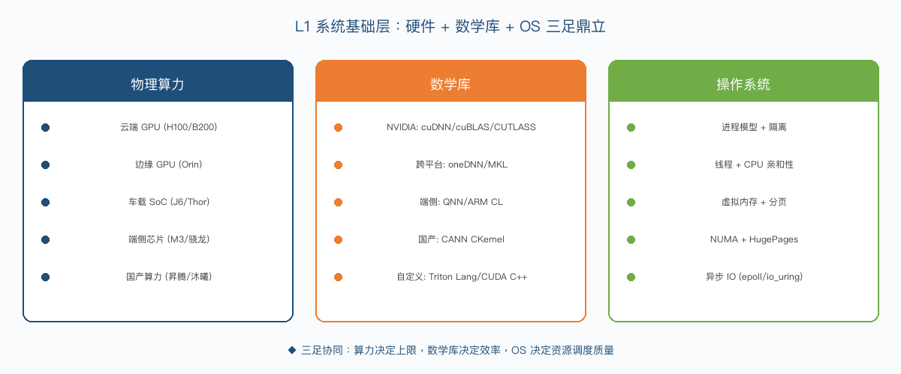

如上图所示，三者协同决定推理性能上限：

物理算力：决定"算力天花板"和"显存容量"。

数学库：决定算力能否被高效利用（同样的硬件，数学库好坏可差 5-10 倍）。

操作系统：决定资源调度质量（CPU/内存/IO 是否合理分配）。

下面三节分别展开。

## 3.2 L1 系统基础层（硬件+数学库+OS）

### 3.2.1 D1 物理算力子系统

按部署场景划分的算力体系：

| 场景 | 代表硬件 | 算力 (TFLOPS) | 显存 | 典型用途 |
| --- | --- | --- | --- | --- |
| 云端 GPU | H100 / H200 / B200 / A100 / L40S | 700-2000+ | 80-192 GB | LLM 大模型服务 |
| 边缘 GPU | Jetson Orin Nano / NX / AGX | 20-275 | 4-64 GB | 机器人、智能终端 |
| 车载 SoC | NVIDIA Orin / 地平线 J6/J6P / 高通 8295 / Thor | 200-1000 | 16-64 GB | 智能驾驶、智能座舱 |
| 端侧芯片 | Apple M3/M4 / 骁龙 8 Gen 3 / 天玑 9300 | 30-100 | 8-24 GB | 手机 / PC 本地推理 |
| 国产算力 | 昇腾 910B / 沐曦 / 壁仞 / 寒武纪 | 200-800 | 32-128 GB | 信创、政企、自主可控 |

💡 关键认知：选硬件不是"算力越高越好"，而是要匹配场景。例如端侧 LLM 推理，Apple M3 的 16GB 统一内存比 H100 的 80GB HBM 更适合——因为功耗、成本、用户体验综合考虑。

### 3.2.2 D1 数学库子系统（关键层·强化）

数学库是连接"算法描述"和"硬件执行"的桥梁。同一个 MatMul 算子，写得好不好，性能差 5-10 倍。所以各大硬件厂商都有自己的数学库：

| 厂商 | 数学库 | 用途 |
| --- | --- | --- |
| NVIDIA | cuDNN | 深度学习算子（卷积、池化、归一化） |
|  | cuBLAS | 线性代数（MatMul 主力） |
|  | CUTLASS | 模板化算子（自定义算子开发） |
|  | cuFFT / cuSPARSE | FFT 与稀疏矩阵 |
| 跨平台 | oneDNN (Intel) | CPU 深度学习加速 |
|  | MKL / OpenBLAS | 通用 BLAS 接口 |
| 端侧 | QNN HTP (高通) | 骁龙 NPU 算子库 |
|  | ARM Compute Library | ARM Mali/Adreno |
|  | CoreML MLProgram | Apple Neural Engine |
| 国产 | CANN CKernel (华为) | 昇腾 NPU |
|  | TensorRT-Plugin | 自定义算子扩展 |

自定义算子开发：当标准数学库不支持的算子（如 FlashAttention、PagedAttention）出现时，工程师需要用 Triton Lang 或 CUDA C++ 自己写。这正是当前推理领域技术含量最高的工作之一。

数学库选型决策三角：精度（数值准确性）↔ 性能（吞吐）↔ 可移植性（跨硬件）。三者往往不可兼得。

### 3.2.3 D1 操作系统子系统(资源调度视角)

这是基础篇的"新增视角"。传统推理文档往往忽略 OS，但 OS 是 LLM 推理很多关键优化的灵感来源。

| OS 概念 | 在推理中的作用 | 典型应用 |
| --- | --- | --- |
| 进程模型 | 推理进程隔离、多 Worker 并发 | vLLM 的多 Worker 模式 |
| 线程模型 | CPU 亲和性、绑核、线程池 | 推理线程独占物理核 |
| 虚拟内存 + 分页 | 内存隔离与按需分配 | PagedAttention 直接借鉴 OS 分页机制 |
| HugePages | 减少 TLB Miss | 加速大块显存访问 |
| NUMA 架构 | CPU-GPU 绑核优化 | 多卡服务器避免跨 NUMA 访问 |
| 异步 IO (epoll / io_uring) | 流式响应与并发 | SSE 流式输出、高并发 API |
| GPU 驱动 + CUDA Runtime | 硬件抽象层 | 驱动版本管理、容器透传、MIG 切片 |

💡 关键认知：vLLM 的核心创新 PagedAttention，本质上就是把操作系统的"虚拟内存 + 分页 + 块管理"思想搬到了 KV Cache 上。理解 OS 是理解现代 LLM 推理框架的前提。

下图直观对比了 OS 虚拟内存机制与 vLLM PagedAttention 的对应关系——左右两侧的设计思想完全同构：

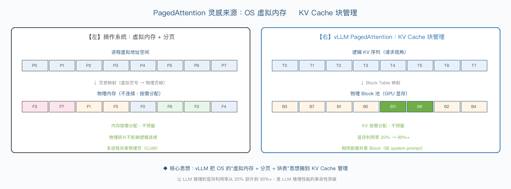

关键对照：

| OS 虚拟内存 | vLLM PagedAttention |
| --- | --- |
| 进程虚拟地址空间 | 请求视角的逻辑 KV 序列 |
| 页表（Page Table） | Block Table |
| 物理 Page Frame | 物理 KV Block |
| 物理 Page Frame 池 | GPU 显存 Block 池 |
| CoW（Copy-on-Write） | 共享前缀 Block（system prompt 共享） |

正是这种"借鉴 OS"的设计，让 KV Cache 显存利用率从传统方案的 20% 跃升到 90%+，是 LLM 推理性能的革命性突破。

## 3.3 L2 算法与语言层

### 3.3.1 D2 算法族子系统（5大主流结构）

按演进顺序，5 大主流模型结构。不同算法族对推理系统的需求差异巨大，决定了推理引擎的算子库、调度策略、显存管理都要针对性设计：

| 算法族 | 代表模型 | 推理特点 | 推理优化重点 |
| --- | --- | --- | --- |
| CNN | ResNet / YOLO / DETR | 单次前向、结构规整、batch 友好 | 算子融合（Conv+BN+ReLU）、INT8 量化 |
| Transformer | BERT / GPT / ViT / Swin | 序列建模、KV Cache 起点 | Attention 优化、FlashAttention |
| Diffusion | DDPM / Stable Diffusion | 多步迭代（10-50 步）、显存密集 | UNet 优化、显存池化、步数优化（DPM++） |
| LLM | GPT / LLaMA / Qwen / DeepSeek | 自回归生成、超长序列、KV Cache 核心 | PagedAttention / Continuous Batching / Prefix Cache |
| VLA | OpenVLA / GR00T / π0 | 多模态输入（视觉+语言）+ 动作输出 | ViT+LLM 融合、实时控制（10-50Hz） |

算法族对推理架构的影响：

| 算法族 | 计算特性 | 调度策略 | 显存管理 | 典型框架 |
| --- | --- | --- | --- | --- |
| CNN | Compute Bound | 静态 Batching | 简单池化 | TensorRT / ONNX RT |
| Transformer-Encoder | Compute Bound | Dynamic Batching | 简单池化 | Triton / ONNX RT |
| Diffusion | 显存密集 | 单请求串行 | 显存池化 | Diffusers / TRT |
| LLM | Prefill Compute / Decode Memory Bound | Continuous Batching | PagedAttention | vLLM / TRT-LLM |
| VLA | 多模态融合 + 实时 | 优先级调度 | KV + Activations | MLX / TRT-LLM |

关键洞察：LLM/VLA 与传统 CNN/Transformer 的推理系统架构完全不同——这就是为什么 vLLM/SGLang 等"LLM 专用框架"会在 2023 年后异军突起。

### 3.3.2 D2 训练框架子系统

训练框架虽然主要服务训练，但其产出的模型格式 + 算子语义直接决定推理工具链的兼容性。

| 框架 | 地位 | 推理相关用法 | 推理友好度 |
| --- | --- | --- | --- |
| PyTorch | 事实标准（>90% 算法工程师使用） | 训练产出 .pt / .safetensors，作为推理的输入 | ★★★★★ |
| JAX | Google 主推（jax.export） | 训练产出 StableHLO，可跨框架 | ★★★★ |
| TensorFlow | 工业场景存量 | TF-Serving / SavedModel | ★★★ |
| PaddlePaddle | 国产主流（百度） | Paddle Inference / Paddle2ONNX | ★★★ |
| MXNet | 边缘化 | 主要在 AWS 早期场景 | ★ |

与推理的衔接点：

PyTorch 2.x `torch.export`：AOT 编译，产出可跨平台 IR（ATen IR）。

PyTorch `torch.compile`：JIT 编译，内部用 Inductor 后端生成 Triton/CUDA 代码。

JAX `jax.export`：产出 StableHLO，可对接 MLIR/TVM。

ONNX 导出：所有框架的"通用出口"，仍是当前事实标准。

模型格式对比：

| 格式 | 提出 | 特点 | 适用场景 |
| --- | --- | --- | --- |
| .pt / .pth | PyTorch 原生 | Python pickle，含完整计算图 | 训练 checkpoint |
| .safetensors ★ | HuggingFace | 二进制安全，加载快（推荐） | LLM 推理首选 |
| .bin | 旧 PyTorch | 与 .pt 类似 | 逐步淘汰 |
| .ckpt | TensorFlow | TF 原生 | TF 生态 |
| .msgpack | Flax/JAX | 序列化紧凑 | JAX 生态 |

### 3.3.3 D5 编程语言工具链

推理工程师掌握的语言直接决定能进入的"工程深度"。下表按角色定位给出语言选择：

| 语言 | 角色定位 | 典型场景 | 工程深度 | 学习难度 |
| --- | --- | --- | --- | --- |
| Python | 原型与编排层 | 模型定义、调度逻辑、API 服务 | 浅 | ★ |
| C++ | 引擎与服务层 | TensorRT、ONNX Runtime、vLLM 核心代码 | 深 | ★★★★ |
| CUDA C++ | 算子开发（最深度） | FlashAttention、PagedAttention 等核心算子 | 极深 | ★★★★★ |
| Triton Lang | 算子开发（友好） | OpenAI Triton，Python 风格的 CUDA DSL | 中深 | ★★★ |
| MLIR / TVM | 编译器 | 算子自动生成、跨平台编译 | 极深 | ★★★★★ |
| Rust | 新兴方向 | Candle 等轻量推理框架 | 中 | ★★★★ |
| Go | 服务层 | API Gateway / 推理服务网关 | 中 | ★★ |

生产推理团队的语言分工：

算法工程师：Python + PyTorch

推理工程师：Python + C++（少量）

资深推理工程师：C++ + CUDA / Triton Lang

推理架构师：C++ + CUDA + MLIR（最稀缺）

关键洞察：能写 CUDA Kernel 是推理工程师的"分水岭"——掌握后薪资溢价 50-100%，且职业护城河极深。

## 3.4 L3 模型工具链层（离线工具链）

### 3.4.1 D2 中间表示（IR）子系统

中间表示（Intermediate Representation, IR）是模型在不同框架、不同硬件之间流通的"通用语言"。

| IR | 提出方 | 主要用途 |
| --- | --- | --- |
| ONNX | 微软 + Facebook (2017) | 跨框架交换的事实标准 |
| TorchScript | PyTorch 官方 | PyTorch 内部 IR |
| SavedModel | TensorFlow 官方 | TF 体系内部 |
| GGUF | llama.cpp 社区 | 端侧 LLM 专用，量化友好 |
| TRT Engine/Plan | NVIDIA | TensorRT 编译后二进制（不可跨版本） |
| OM | 华为昇腾 | ATC 工具转换产物 |
| MLIR | LLVM 社区 | 编译器基础设施（新兴） |

### 3.4.2 D2 转换工具链（5条主流链路）

不同硬件生态有不同的"转换链路"，工程师至少要熟悉其中一条。下图展示了从 PyTorch 出发，5 条主流链路的全景：

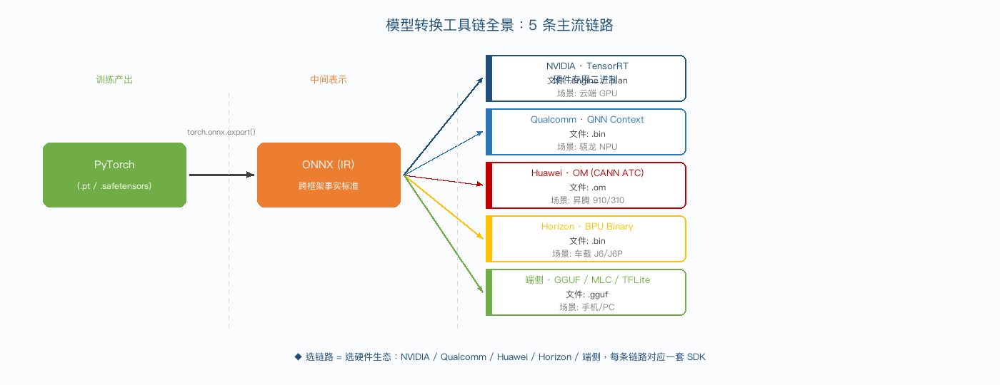

如上图所示，所有链路都遵循"训练框架 → 中间表示 → 硬件专用二进制"三段式架构：

| 阶段 | 角色 | 关键产物 |
| --- | --- | --- |
| 训练产出 | 算法工程师交付 | .pt / .safetensors |
| 中间表示 | 跨框架事实标准 | .onnx |
| 硬件专用二进制 | 各厂商 SDK 编译 | .engine / .bin / .om / .gguf |
| 链路 | 转换流程 | 主要文件 |
| NVIDIA 链路 | PyTorch → ONNX → TensorRT Engine | .onnx → .engine/.plan |
| 高通链路 | PyTorch → ONNX → QNN Context | .onnx → .bin/.dll |
| 华为链路 | PyTorch → ONNX → OM | .onnx → .om |
| 地平线链路 | PyTorch → ONNX → BPU Binary | .onnx → .bin |
| 端侧链路 | PyTorch → GGUF / MLC / TFLite | .pt → .gguf / .tflite |

### 3.4.3 D2 模型优化子系统

系统定位：模型优化是"在不显著损失精度的前提下，让模型跑得更快、显存更省"的离线技术，位于「IR 转换之后、引擎构建之前」的工具链中间环节，是离线工具链的"优化中枢"。

下图展示了 5 大核心优化技术在转换工具链中的位置：

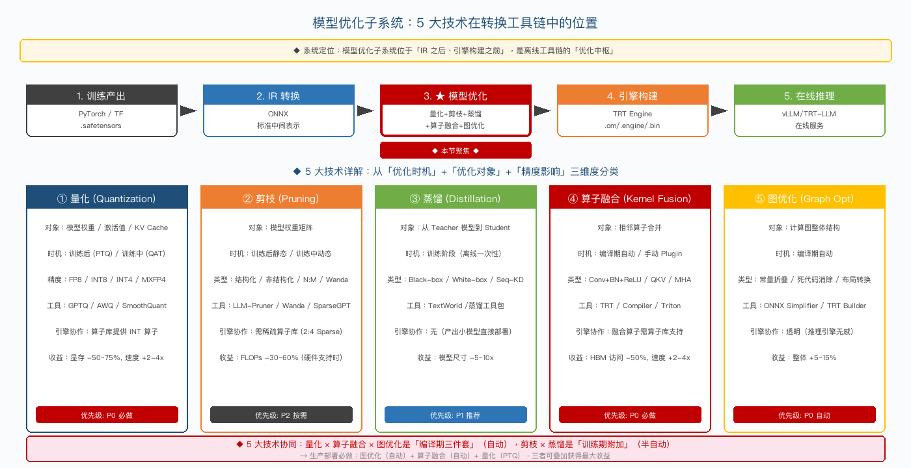

如上图所示，5 大技术按"优化时机 + 优化对象 + 精度影响"三维度分类：

| 技术 | 优化对象 | 优化时机 | 精度影响 | 优先级 |
| --- | --- | --- | --- | --- |
| 量化 | 模型权重 / 激活值 / KV Cache | 训练后 (PTQ) / 训练中 (QAT) | INT8 < 1%, INT4 1-5% | P0 必做 |
| 剪枝 | 模型权重矩阵 | 训练后静态 / 训练中动态 | 视方法而定 | P2 按需 |
| 蒸馏 | 从 Teacher 到 Student | 训练阶段（一次性） | 接近 Teacher | P1 推荐 |
| 算子融合 | 相邻算子合并 | 编译期自动 / 手动 Plugin | 0（数学等价） | P0 必做 |
| 图优化 | 计算图整体结构 | 编译期自动 | 0 | P0 自动 |

💡 协同关系：量化 × 算子融合 × 图优化是"编译期三件套"（自动），剪枝 × 蒸馏是"训练期附加"（半自动）。生产部署必做：图优化 + 算子融合 + 量化（PTQ），三者可叠加获得最大收益。

### 3.4.4 D2 转换过程关键问题

模型转换不是"一键完成"的简单流程，而是充满工程坑的"反复迭代"过程。下表列出了工程师在生产中每天都会遇到的 4 大类问题，每一类都有具体的应对策略：

| 问题 | 表现 | 应对策略 |
| --- | --- | --- |
| 算子支持度 | 某些自定义算子目标 IR 不支持 | 写 Plugin / Custom Op |
| 动态 Shape | LLM 序列长度变化 | 配置 dynamic profile |
| 精度损失 | FP32 → INT8 误差累积 | 敏感层保留高精度（混合精度） |
| 版本兼容 | TRT 8.5 的 Engine 不能在 8.6 跑 | 严格版本对齐 + CI 校验 |

下面分别从系统架构层面深度剖析这 4 大类问题。

① 算子支持度问题（最常见）

根因：训练框架（PyTorch）算子集合远大于 ONNX 标准 → 转换时遇到不支持的算子。

| 场景 | 表现 | 应对 |
| --- | --- | --- |
| 标准 PyTorch 算子 | 转 ONNX 报错 "Unsupported op" | 检查 opset 版本，升级到 17+ |
| 自定义算子（如 FlashAttention） | ONNX 不支持 | 写 ONNX Custom Op 或 TRT Plugin |
| 算子融合后的中间结果 | 转换链路某一步丢失信息 | 用 Polygraphy 逐步对比 |

典型解决方案 3 路径：

路径 A：替换等价算子（如 torch.einsum → torch.matmul）

路径 B：注册 Custom Op（PyTorch → ONNX 注册自定义算子）

路径 C：写 TRT Plugin（C++ 实现 + 序列化机制）

② 动态 Shape 问题（LLM 特有）

根因：LLM 输入 token 数变化（1-128K），但 TensorRT 默认优化固定 shape。

3 种应对方案：

| 方案 | 实现 | 适用场景 |
| --- | --- | --- |
| Optimization Profile | 配置 min/opt/max 3 档 shape | TensorRT 标准 |
| 多 Engine 切换 | 为不同长度档位构建多个 Engine | 极致性能（复杂度高） |
| CUDA Graph | 录制固定 shape，运行时切换 | 适合 LLM Decode 阶段 |

典型 profile 配置：

profile = builder.create_optimization_profile()profile.set_shape("input", min=(1, 1), opt=(8, 1024), max=(32, 4096))config.add_optimization_profile(profile)

③ 精度损失问题（量化副作用）

根因：FP32 → INT8 量化误差累积，敏感层（如 LayerNorm、Attention）精度退化明显。

3 大应对策略：

| 策略 | 实现 | 收益 |
| --- | --- | --- |
| 混合精度量化 | 敏感层 FP16、其他 INT8 | 精度损失 < 1% |
| 校准集精选 | 用业务真实数据 1000+ 样本校准 | 精度提升 1-3% |
| QAT 微调 | 量化后做少量 QAT 训练 | 精度恢复到 FP16 水平 |

4 大敏感层：LayerNorm、Softmax、Attention Score、KV Cache（这些层应保持 FP16）。

④ 版本兼容问题（生产事故常因）

根因：TRT/CUDA/Driver 三方绑定，跨版本兼容性差。

| 兼容性矩阵 | TRT 8.5 | TRT 8.6 | TRT 10 |
| --- | --- | --- | --- |
| CUDA 11.x | ✓ | ✗ | ✗ |
| CUDA 12.x | △ | ✓ | ✓ |
| Driver 525+ | ✓ | ✓ | ✓ |
| Driver 545+ | ✗ | ✓ | ✓ |

工程实践：

用容器锁定全栈版本（nvcr.io/nvidia/tensorrt:24.01-py3）。

CI/CD 加入版本校验（构建时记录 CUDA/TRT 版本）。

Engine 文件版本化（.engine-v8.6.1 命名）。

跨集群升级时灰度（先小流量 1-2 周）。

先用一个生活化的类比建立直觉。下图把两种 batching 模式比作公交与地铁：

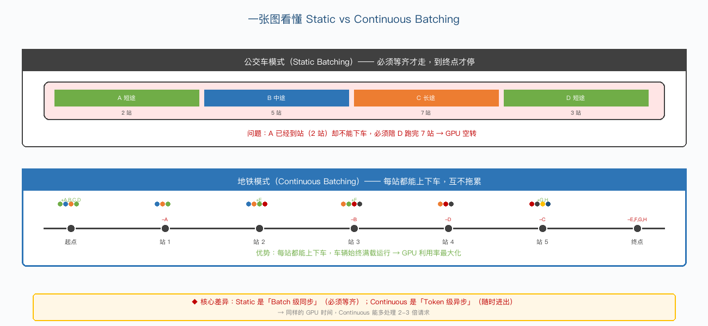

如上图所示：

🚍 公交车模式（Static Batching）

4 个乘客（A/B/C/D）同时上车，必须全部到终点才能下车。

乘客 A 只坐 2 站，但被迫陪着 D 跑完 7 站 → A 的"座位"在 Step 3-7 完全空转。

司机（GPU）虽然一直在开车，但乘客产出（生成 Token）严重不均。

🚇 地铁模式（Continuous Batching）

列车每个 Step 都能开关门，乘客随时上下车。

A 到第 2 站立即下车，新乘客 E 立即填入座位 → 座位永远满载。

列车满负荷运行，单位运力最大化。

核心差异：Static 是 「Batch 级同步」（必须等齐才走），Continuous 是 「Token 级异步」（每个 Token 都能进出）。

光看类比还不够，下面用真实推理的时间轴，逐 Step 拆解两种模式的差异：

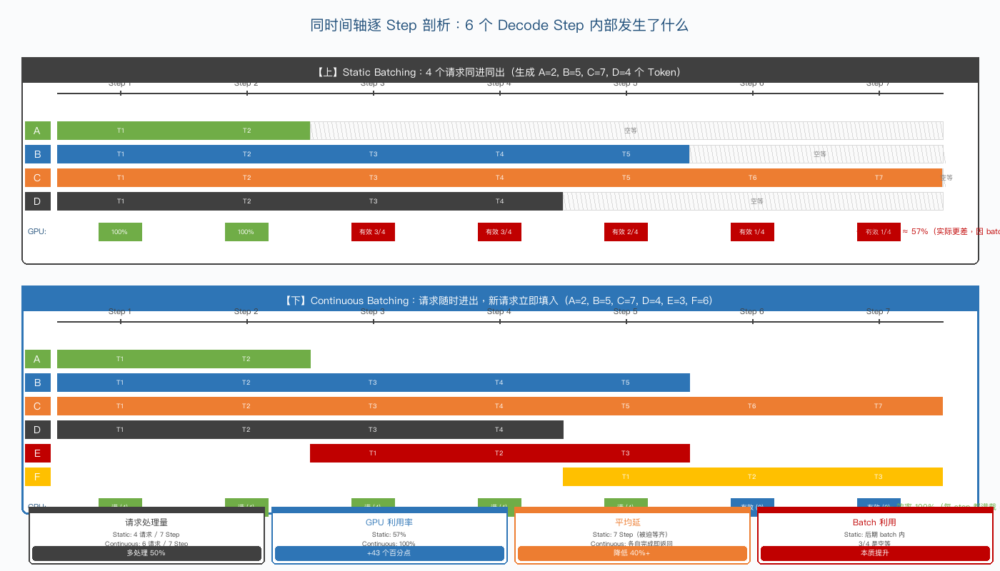

如上图所示，同样 7 个 Decode Step 内部发生了什么：

【上】Static Batching（4 请求：A=2, B=5, C=7, D=4 个 Token）

Step 1-2：所有 4 个请求都在生成，GPU 利用率 100%。

Step 3：A 已完成（只生成 2 个），但仍在 batch 里占位 → GPU 算了 4 个请求但只产出 3 个有效 Token。

Step 5：D 也完成 → batch 里 2/4 是"僵尸请求"。

Step 6-7：只剩 C 在生成 → GPU 算了 4 个请求但只产出 1 个有效 Token，75% 算力浪费。

整体效率：4/7 ≈ 57%（实际生产中由于 batch 内无效计算，约 30%）。

【下】Continuous Batching（同样 7 个 Step）

Step 1-2：A/B/C/D 都在生成。

Step 3：A 完成 → 立即释放 KV，新请求 E 立即填入 → batch 仍 4 个请求满载。

Step 4：D 完成 → F 进入排队。

Step 5：B 完成 → F 注入 → 满载继续。

Step 6-7：E/F 继续生成。

整体效率：100%（每 Step 都满载，无空等）。

4 个维度对比：

| 维度 | Static | Continuous | 提升 |
| --- | --- | --- | --- |
| 请求处理量 | 4 请求 / 7 Step | 6 请求 / 7 Step | +50% |
| GPU 利用率 | ~30%（含无效计算） | ~80-100% | +50-70 百分点 |
| 平均延迟 | 7 Step（被迫等齐） | 4 Step（完成即返回） | 降低 40%+ |
| Batch 利用 | 后期 3/4 空等 | 始终满载 | 本质提升 |

讲清楚机制后，下面用一组真实生产数据说明 Continuous Batching 的经济价值：

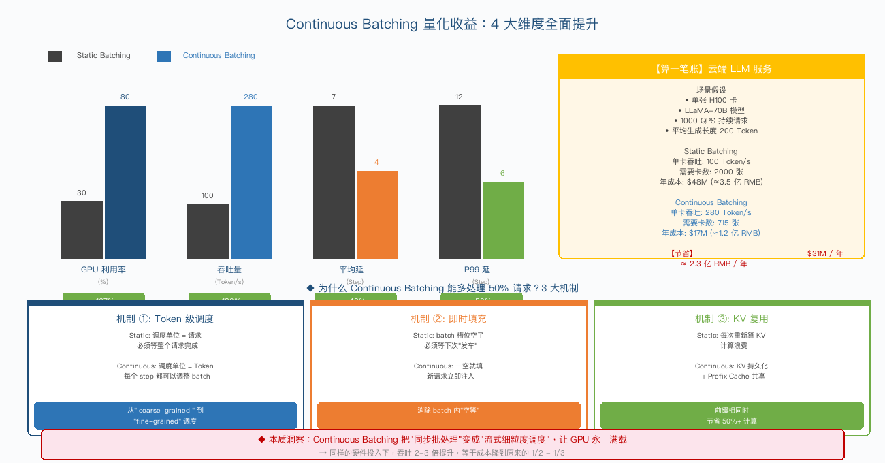

如上图所示：

4 大指标全面提升（左图柱状对比）：

GPU 利用率：30% → 80%（+167%）

吞吐量：100 → 280 Token/s（+180%）

平均延迟：7 → 4 Step（-43%）

P99 延迟：12 → 6 Step（-50%）

云端成本账（右上算账）：

假设：单 H100 卡 + LLaMA-70B + 1000 QPS + 平均 200 Token

Static Batching：单卡 100 Token/s，需 2000 张 H100，年成本 $48M ≈ 3.5 亿 RMB

Continuous Batching：单卡 280 Token/s，只需 715 张 H100，年成本 $17M ≈ 1.2 亿 RMB

节省：$31M / 年 ≈ 2.3 亿 RMB / 年（单集群！）

Continuous Batching 不是"魔法"，而是通过 3 个具体机制 实现了性能突破：

机制 ①：Token 级调度（最根本）

Static 的调度单位是请求（必须整个请求完成）。

Continuous 的调度单位是 Token（每个 Step 都可以重新拼装 batch）。

这是从 coarse-grained 到 fine-grained 的本质飞跃。

机制 ②：即时填充

Static：batch 槽位空了必须等下次"发车"。

Continuous：一空就填，新请求从 Waiting 队列立即注入，零延迟。

机制 ③：KV Cache 持久化 + 复用

Static：每次重新算 KV Cache，计算严重浪费。

Continuous：KV Cache 持久化存储，配合 Prefix Cache 让相同前缀（如 system prompt）的请求节省 50%+ 计算。

理解了 Continuous Batching 后，下面把它放在更大的调度技术矩阵中：

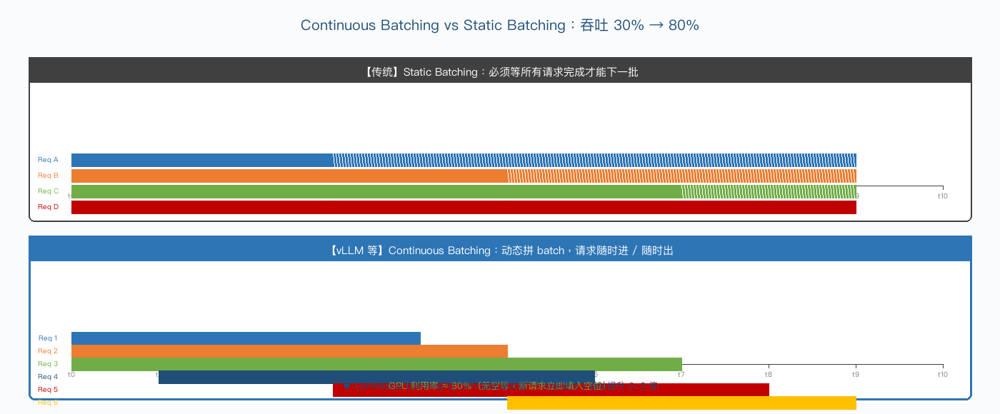

主流批处理调度技术一览：

| 技术 | 原理 | 收益 |
| --- | --- | --- |
| Continuous Batching | 动态拼 batch，新请求随时加入、完成请求随时退出 | GPU 利用率从 30% → 80% |
| 请求队列 + 优先级调度 | FIFO / SJF / 抢占式调度 | 满足不同 SLA 要求 |
| KV Cache 调度策略 | LRU / Prefix Cache / Radix Tree | 共享相同前缀的请求节省 50%+ 计算 |
| Prefill / Decode 分离 | 把首 Token 计算和后续生成分到不同 GPU | 提升整体吞吐 1.5-2 倍 |
| Speculative Decoding | 小模型预测 + 大模型校验 | 吞吐提升 2-3 倍（无精度损失） |

最后看一下 Continuous Batching 调度器在每个 Decode Step 内部的决策过程，包含 4 个关键判断：

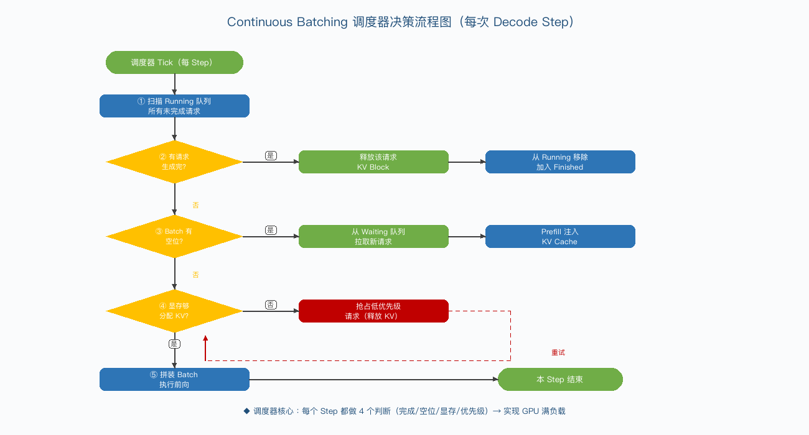

如上图所示，调度器在每个 Step 内做 4 个判断：

② 完成检测：有请求生成完，立即释放 KV Block，让出位置。

③ Batch 空位：batch 有空位时，从 Waiting 队列拉取新请求注入。

④ 显存治理：显存不够时，触发抢占机制——低优先级请求让位。

⑤ 拼装执行：最终拼装好 batch，执行一次前向。

💡 关键认知：模型优化（量化/剪枝）和运行时优化（内存/调度）是正交的——前者改的是"模型本身"，后者改的是"如何执行模型"。两者可叠加使用。Continuous Batching 是运行时优化中收益最大、必上的一项技术。

要理解 Attention 变体的演进，先要弄清标准 Attention 的内部计算流程。下图把它拆成 5 个串行步骤：

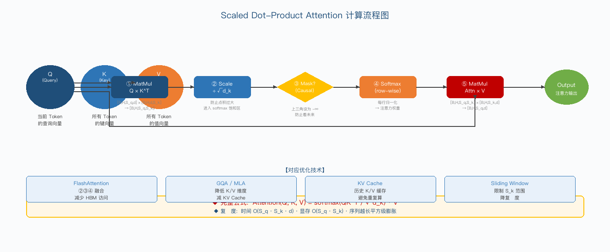

如上图所示，从输入 Q/K/V 到输出，经过 5 个阶段：

① MatMul（Q·K^T）：算 Query 与所有 Key 的相似度。

② Scale（÷√d_k）：防止点积过大导致 softmax 饱和。

③ Mask（可选）：因果掩码，防止"看到未来"。

④ Softmax：归一化为注意力权重。

⑤ MatMul（·V）：用注意力权重对 Value 加权求和。

对应的数学公式与各步骤物理含义，下图做了进一步图解：

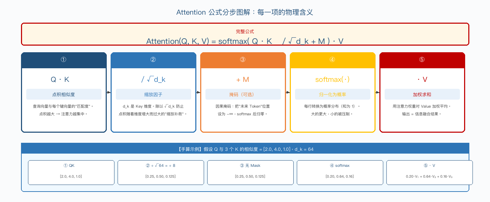

如上图所示，Attention(Q, K, V) = softmax(QK^T/√d_k + M)·V —— 每一项都有清晰的几何/物理含义：

QK^T：相似度矩阵。

÷√d_k：维度缩放补救。

+M：因果掩码（Causal）。

softmax：行级归一化。

·V：信息融合。

图下方还给出了一组手算示例：当 Q 与 3 个 K 相似度为 [2.0, 4.0, 1.0]、d_k=64 时，每一步的具体数值变化。

下图直观对比了 4 种主流 Attention 变体的 Q/KV 头部设计差异，以及它们对 KV Cache 占用的影响：

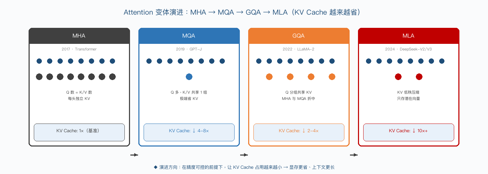

### 3.4.5 多模态模型转换特殊挑战（新增）

多模态模型（视觉-语言模型、语音模型等）的模型转换比纯文本模型复杂得多，主要原因在于多模态编码器的架构差异和算子支持度问题。

多模态模型转换的 5 大特殊挑战：

| 挑战 | 具体问题 | 影响范围 | 解决方案 |
| --- | --- | --- | --- |
| Vision Encoder 算子不兼容 | ViT 中的 2D 卷积、窗口注意力在推理引擎中可能不支持 | 所有视觉模型 | 使用 ONNX 自定义算子 / TensorRT Plugin |
| 多模态对齐层映射 | Q-Former、Cross-Attention 等结构在 IR 中缺少标准表示 | Qwen-VL、LLaVA | 将对齐层拆分为标准 Transformer 算子 |
| 动态输入尺寸 | 图像分辨率变化导致视觉 Token 数量动态变化 | 端侧部署 | 使用固定 Patch 数量 + Padding |
| 混合精度量化 | 不同模态对量化敏感度不同（视觉比文本更敏感） | INT4/INT8 量化 | 视觉编码器保留 FP16，LLM 部分量化 |
| 多模态权重合并 | 需要将 Vision Encoder + Projector + LLM 合并为一个模型 | 部署流程 | 权重拼接 + 调整 Token Embedding 表 |

推荐转换流程：

1) 导出各子模型的 ONNX（分开导出 Encoder / Projector / LLM）

2) 在 ONNX 层面合并计算图（消除不必要的拷贝和对齐操作）

3) 统一转换为目标格式（TensorRT Engine / OpenVINO IR / MNN）

4) 端到端精度验证（对比原始 PyTorch 输出）

## 3.5 L4 推理引擎层（执行+调度+内存）

### 3.5.1 D3 引擎实现矩阵

主流推理引擎按硬件生态分布，每个生态都有自己的"嫡系"引擎。选型核心是「硬件 → 引擎」强绑定关系：

| 引擎 | 厂商 | 主要场景 | 硬件绑定 | 性能等级 | 生态 |
| --- | --- | --- | --- | --- | --- |
| TensorRT / TRT-LLM | NVIDIA | 云端 GPU 旗舰 | NVIDIA only | ★★★★★ | 工业首选 |
| ONNX Runtime | 微软 | 跨平台 CPU/GPU/NPU | 跨硬件（EP 机制） | ★★★★ | 企业友好 |
| QNN / SNPE | 高通 | 移动端骁龙 NPU | 高通 only | ★★★★ | 半封闭 |
| BPU SDK | 地平线 | 车载 J6/J6P | 地平线 only | ★★★★ | 车规 |
| CANN / MindIE | 华为 | 昇腾 910/310 | 华为 only | ★★★★ | 信创 |
| CoreML / MLX | Apple | iOS / macOS | Apple Silicon | ★★★★ | 苹果生态 |
| vLLM / SGLang | 社区 / 创业公司 | LLM 专用推理（云端） | NVIDIA + AMD + 部分国产 | ★★★★★ | 开源主流 |
| llama.cpp / MLC-LLM | 开源社区 | 端侧 LLM 推理 | 跨平台 | ★★★ | 端侧主流 |
| TVM / MLIR | Apache/LLVM | 编译器基础设施 | 跨硬件 | ★★★ | 研究前沿 |

5 大引擎生态圈：

| 生态圈 | 核心引擎 | 主导厂商 | 适用场景 |
| --- | --- | --- | --- |
| NVIDIA 生态 | TensorRT / TRT-LLM / vLLM | NVIDIA | 云端 + Jetson |
| Apple 生态 | CoreML / MLX / ExecuTorch | Apple | iOS / macOS |
| 国产 NPU 生态 | CANN / BPU SDK / RKNN | 华为/地平线/瑞芯微 | 车载 / 信创 |
| 跨平台生态 | ONNX Runtime / TVM | 微软/Apache | 企业混合部署 |
| 开源 LLM 生态 | vLLM / SGLang / llama.cpp | 社区 | LLM 推理 |

关键洞察：LLM 时代之前（CNN/Transformer-Encoder），TensorRT 是绝对主流；LLM 时代后，vLLM/SGLang 等开源框架反超（社区贡献速度快 + 跨硬件兼容 + 持续集成最新研究成果）。

### 3.5.2 D3 Kernel 执行子系统

Kernel 执行子系统是 L4 推理引擎的"心脏"——直接决定算子多快能跑完、GPU 多大比例能打满。

5 大核心功能：

| 功能 | 原理 | 系统收益 | 代表实现 |
| --- | --- | --- | --- |
| Kernel 调度 | 决定算子执行顺序（拓扑排序 + 优先级） | 减少 GPU idle | TRT Executor / PyTorch Dispatcher |
| 多流并发 | 利用 CUDA Stream 让 H2D/D2H 与计算重叠 | 隐藏数据搬运延迟 | CUDA Stream / vLLM 双流 |
| 异步执行 | 用 CUDA Graph 提前录制计算图 | 减少 CPU 同步开销 | CUDA Graph / cudagraph_capture |
| Kernel Fusion | 把多个小算子融合成一个大 Kernel | 减少 kernel 启动 + HBM 读写 | FlashAttention / Triton Lang |
| JIT 编译 | 运行时根据 input shape 生成最优 kernel | 形状自适应最优 | TVM / Triton / torch.compile |

1. Kernel 调度的执行模型
PyTorch eager 模式（动态图）：  for op in graph:      dispatch(op) → 执行  → 每个 op 都有 Python 解释器开销PyTorch graph 模式（torch.compile）：  graph = capture(model)  # 编译期拓扑排序  execute(graph)          # 一次执行整个图  → 减少 90% Python 开销

收益：torch.compile 在 LLM 推理上典型提升 30-60%（无需改代码）。

2. 多流并发（CUDA Stream）
核心思想：把"数据搬运"和"计算"放在不同 stream，让 GPU 在搬运数据时同时计算。

Stream 0（计算）: [Matmul 1] ──────── [Matmul 2] ────────Stream 1（搬运）:      [H2D 数据] ──────── [H2D 数据]                  ↑ 重叠 ↑ 重叠

收益：理论上把"读权重"时间完全隐藏，Decode 延迟 -30%。

3. CUDA Graph（异步执行）
核心思想：把整个 LLM Decode 的计算图录制下来，每次 Decode Step 只重放 graph，跳过 CPU 调度。

# 录制with torch.cuda.graph(graph):    output = model(input)# 重放（每步 Decode）graph.replay()  # 0.1ms 内启动整个 step

收益：

CPU-GPU 同步开销从 ms 级降到 µs 级。

vLLM 在 LLaMA-7B 上启用 CUDA Graph 后 Decode 速度 +30%。

4. Kernel Fusion（算子融合）
LLM 推理中 5 大经典融合模式：

| 融合模式 | 原始算子序列 | 融合后 | 收益 |
| --- | --- | --- | --- |
| FlashAttention | QK^T → Scale → Mask → Softmax → ·V | 一个 fused kernel | 速度 +2-4x，HBM -50% |
| QKV Fusion | 3 个独立 Linear | 1 个 Batched Matmul | kernel 启动 -3 |
| Fused-MLP | Linear + Bias + Act | 一个 fused kernel | kernel 启动 -3 |
| RMSNorm + 残差 | RMSNorm + Add | 一个 fused kernel | HBM 读写 -50% |
| 量化融合 | Quantize + Matmul | 一个 fused kernel | 中间结果不出 HBM |

5. JIT 编译（Just-In-Time）
核心思想：运行时根据具体 input shape/precision 生成最优 kernel，比静态库多 1.5-2x 速度。

| JIT 编译器 | 出品 | 特点 |
| --- | --- | --- |
| Triton Lang | OpenAI | Python 风格 CUDA DSL（最流行） |
| TVM | Apache | 完整编译器栈 |
| torch.compile (Inductor) | PyTorch | PyTorch 2.x 原生 JIT |
| MLIR | LLVM | 编译器基础设施（未来） |

典型 Triton Kernel 示例（FlashAttention 简化版）：

@triton.jitdef attention_kernel(Q, K, V, O, ...):    # 一个 kernel 完成 QK^T + Softmax + ·V    # 中间矩阵不出 SRAM    ...

Kernel 执行子系统对整体性能的贡献：

基础优化（多流/CUDA Graph/Fusion）：+30-50%。

JIT 编译（Triton/torch.compile）：再 +20-30%。

合计：一个优秀的 Kernel 执行子系统可以让 LLM 推理速度从"基线"提升到 2-3 倍。

### 3.5.3 D3 内存管理子系统

这是 LLM 推理性能优化的核心战场。所有"运行时优化"中关于内存的部分都归属此子系统。

下图展示了 PagedAttention 的完整 KV Block 分配/回收流程，包含请求流程、逻辑 Block Table 状态、物理 Block 池三视图协同：

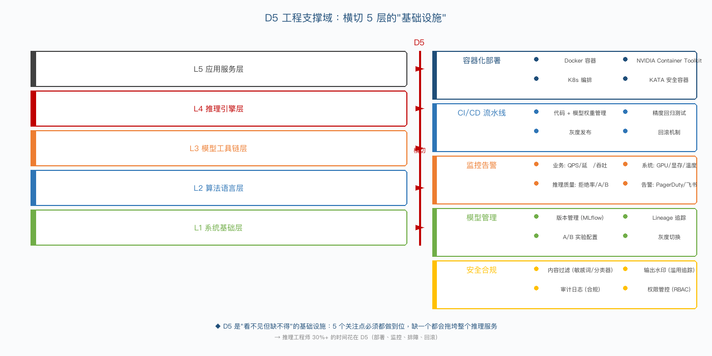

如上图所示，3 个视图协同工作：

左图（请求处理流程）：请求到达 → 分配 Block Table → Prefill/Decode 阶段按需扩展 → 序列结束释放 Block。

中图（逻辑 Block Table）：请求视角的逻辑 KV 序列，按阶段动态变化（0 → 3 → 5 → 0 块）。

右图（物理 Block 池）：GPU 显存的真实状态，包含空闲/占用/共享 3 种状态。其中"共享 Block"对应相同前缀（如 system prompt）的复用，是省显存的关键。

主流内存管理技术一览：

| 技术 | 原理 | 解决的问题 |
| --- | --- | --- |
| 内存池化 (Caching Allocator) | 预分配大块显存，避免频繁 malloc/free | 显存碎片、分配开销 |
| 内存复用 (In-place / Output Reuse) | 不同算子共享同一块显存 | 显存总量限制 |
| PagedAttention | 把 KV Cache 切成固定大小的 Block，借鉴 OS 虚拟内存 | KV Cache 碎片化，显存利用率从 20% → 90%+ |
| Pinned Memory | 锁定内存页，加速 H2D/D2H 传输 | CPU-GPU 数据搬运慢 |
| 显存碎片治理 | Block Allocator / Ring Buffer | 长期运行后的显存泄漏 |

### 3.5.4 D3 批处理调度子系统

这是 LLM 推理吞吐优化的核心战场。所有"运行时优化"中关于调度的部分都归属此子系统。

#### 3.5.4.1 直观理解：公交 vs 地铁

先用一个生活化的类比建立直觉。下图把两种 batching 模式比作公交与地铁：

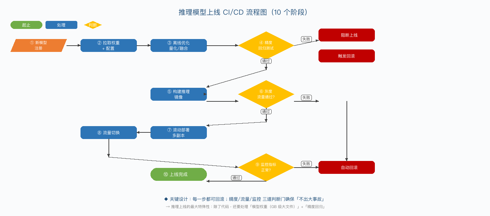

如上图所示：

🚍 公交车模式（Static Batching）

4 个乘客（A/B/C/D）同时上车，必须全部到终点才能下车。

乘客 A 只坐 2 站，但被迫陪着 D 跑完 7 站 → A 的"座位"在 Step 3-7 完全空转。

司机（GPU）虽然一直在开车，但乘客产出（生成 Token）严重不均。

🚇 地铁模式（Continuous Batching）

列车每个 Step 都能开关门，乘客随时上下车。

A 到第 2 站立即下车，新乘客 E 立即填入座位 → 座位永远满载。

列车满负荷运行，单位运力最大化。

核心差异：Static 是 「Batch 级同步」（必须等齐才走），Continuous 是 「Token 级异步」（每个 Token 都能进出）。

#### 3.5.4.2 逐 Step 时间轴剖析

光看类比还不够，下面用真实推理的时间轴，逐 Step 拆解两种模式的差异：

如上图所示，同样 7 个 Decode Step 内部发生了什么：

【上】Static Batching（4 请求：A=2, B=5, C=7, D=4 个 Token）

Step 1-2：所有 4 个请求都在生成，GPU 利用率 100%。

Step 3：A 已完成（只生成 2 个），但仍在 batch 里占位 → GPU 算了 4 个请求但只产出 3 个有效 Token。

Step 5：D 也完成 → batch 里 2/4 是"僵尸请求"。

Step 6-7：只剩 C 在生成 → GPU 算了 4 个请求但只产出 1 个有效 Token，75% 算力浪费。

整体效率：4/7 ≈ 57%（实际生产中由于 batch 内无效计算，约 30%）。

【下】Continuous Batching（同样 7 个 Step）

Step 1-2：A/B/C/D 都在生成。

Step 3：A 完成 → 立即释放 KV，新请求 E 立即填入 → batch 仍 4 个请求满载。

Step 4：D 完成 → F 进入排队。

Step 5：B 完成 → F 注入 → 满载继续。

Step 6-7：E/F 继续生成。

整体效率：100%（每 Step 都满载，无空等）。

4 个维度对比：

| 维度 | Static | Continuous | 提升 |
| --- | --- | --- | --- |
| 请求处理量 | 4 请求 / 7 Step | 6 请求 / 7 Step | +50% |
| GPU 利用率 | ~30%（含无效计算） | ~80-100% | +50-70 百分点 |
| 平均延迟 | 7 Step（被迫等齐） | 4 Step（完成即返回） | 降低 40%+ |
| Batch 利用 | 后期 3/4 空等 | 始终满载 | 本质提升 |

#### 3.5.4.3 量化收益：算一笔云端账

讲清楚机制后，下面用一组真实生产数据说明 Continuous Batching 的经济价值：

如上图所示：

4 大指标全面提升（左图柱状对比）：

GPU 利用率：30% → 80%（+167%）

吞吐量：100 → 280 Token/s（+180%）

平均延迟：7 → 4 Step（-43%）

P99 延迟：12 → 6 Step（-50%）

云端成本账（右上算账）：

假设：单 H100 卡 + LLaMA-70B + 1000 QPS + 平均 200 Token

Static Batching：单卡 100 Token/s，需 2000 张 H100，年成本 $48M ≈ 3.5 亿 RMB

Continuous Batching：单卡 280 Token/s，只需 715 张 H100，年成本 $17M ≈ 1.2 亿 RMB

节省：$31M / 年 ≈ 2.3 亿 RMB / 年（单集群！）

#### 3.5.4.4 为什么能做到？3 大核心机制

Continuous Batching 不是"魔法"，而是通过 3 个具体机制 实现了性能突破：

机制 ①：Token 级调度（最根本）

Static 的调度单位是请求（必须整个请求完成）。

Continuous 的调度单位是 Token（每个 Step 都可以重新拼装 batch）。

这是从 coarse-grained 到 fine-grained 的本质飞跃。

机制 ②：即时填充

Static：batch 槽位空了必须等下次"发车"。

Continuous：一空就填，新请求从 Waiting 队列立即注入，零延迟。

机制 ③：KV Cache 持久化 + 复用

Static：每次重新算 KV Cache，计算严重浪费。

Continuous：KV Cache 持久化存储，配合 Prefix Cache 让相同前缀（如 system prompt）的请求节省 50%+ 计算。

#### 3.5.4.5 主流批处理调度技术矩阵

理解了 Continuous Batching 后，下面把它放在更大的调度技术矩阵中：

主流批处理调度技术一览：

| 技术 | 原理 | 收益 |
| --- | --- | --- |
| Continuous Batching | 动态拼 batch，新请求随时加入、完成请求随时退出 | GPU 利用率从 30% → 80% |
| 请求队列 + 优先级调度 | FIFO / SJF / 抢占式调度 | 满足不同 SLA 要求 |
| KV Cache 调度策略 | LRU / Prefix Cache / Radix Tree | 共享相同前缀的请求节省 50%+ 计算 |
| Prefill / Decode 分离 | 把首 Token 计算和后续生成分到不同 GPU | 提升整体吞吐 1.5-2 倍 |
| Speculative Decoding | 小模型预测 + 大模型校验 | 吞吐提升 2-3 倍（无精度损失） |

#### 3.5.4.6 调度器内部决策流程

最后看一下 Continuous Batching 调度器在每个 Decode Step 内部的决策过程，包含 4 个关键判断：

如上图所示，调度器在每个 Step 内做 4 个判断：

② 完成检测：有请求生成完，立即释放 KV Block，让出位置。

③ Batch 空位：batch 有空位时，从 Waiting 队列拉取新请求注入。

④ 显存治理：显存不够时，触发抢占机制——低优先级请求让位。

⑤ 拼装执行：最终拼装好 batch，执行一次前向。

💡 关键认知：模型优化（量化/剪枝）和运行时优化（内存/调度）是正交的——前者改的是"模型本身"，后者改的是"如何执行模型"。两者可叠加使用。Continuous Batching 是运行时优化中收益最大、必上的一项技术。

## 3.6 L5 应用服务层

### 3.6.1 D4 通用推理服务（Triton）

NVIDIA Triton Inference Server 是"通用推理服务"的事实标准，是工业部署多模型服务的首选方案。

系统架构定位：Triton 是"多框架 + 多模型 + 多副本"的统一服务平台，介于推理引擎和业务网关之间。

核心特性：

| 特性 | 说明 |
| --- | --- |
| 多框架后端 | TensorRT / PyTorch / ONNX Runtime / Python / Custom Backend |
| Dynamic Batching | 自动把请求拼成 batch（适合 CNN / BERT 等非自回归模型） |
| 多模型并发 | 单实例并发加载多个模型，按 GPU 资源调度 |
| 多实例 (instance_count) | 同一模型加载多副本，提升并行度 |
| HTTP/gRPC 双协议 | HTTP 适合调试，gRPC 适合低延迟 |
| 模型热更新 | 通过 model repository 监控，自动加载新版本 |

典型部署结构：

model_repo/├── model_a/│   ├── config.pbtxt          # 配置（backend/batch_size/instance）│   └── 1/model.plan          # TensorRT Engine└── model_b/    ├── config.pbtxt    └── 1/model.onnx

适合场景：CV 模型服务（YOLOv8/ResNet）、BERT 类 encoder 模型、传统 ML 模型生产部署。

局限：对 LLM 自回归生成的支持不如 vLLM/SGLang（Dynamic Batching 不适合 LLM，需用 Continuous Batching）。

### 3.6.2 D4 LLM 专用服务（vLLM Server/SGLang/TGI）

LLM 专用推理服务是 2023 年后的"新蓝海"，专门针对自回归生成特性设计，全部默认启用 Continuous Batching + PagedAttention。

3 大代表框架对比：

| 框架 | 出品方 | 核心创新 | 优势 | 适用场景 |
| --- | --- | --- | --- | --- |
| vLLM | UC Berkeley | PagedAttention + Continuous Batching | 社区主流，吞吐领先 | 通用 LLM 云服务（默认首选） |
| SGLang | Vertex AI 创业团队 | RadixAttention（前缀复用） | Agent / 多轮对话性能最强 | AI Agent / RAG / Function Calling |
| TGI | HuggingFace | OpenAI 兼容好 + 量化全面 | HF 生态无缝 | HuggingFace 用户、快速原型 |

vLLM 系统架构：

┌─────────────────────────────────────────┐│  vLLM Server (Async Engine)              │├─────────────────────────────────────────┤│  Continuous Batching Scheduler           ││  ├── Waiting Queue（新请求）             ││  ├── Running Queue（执行中）             ││  └── Preemption（抢占机制）              │├─────────────────────────────────────────┤│  PagedAttention KV Cache Manager         ││  ├── Block Table（逻辑→物理映射）         ││  └── Prefix Cache（CoW 共享）             │├─────────────────────────────────────────┤│  Model Executor                          ││  ├── Tensor Parallel / Pipeline Parallel ││  └── FlashAttention / Fused Kernel       │└─────────────────────────────────────────┘

典型部署：

# 单机 4 卡 TP 并行vllm serve meta-llama/Llama-3-8B-Instruct \  --tensor-parallel-size 4 \  --enable-prefix-caching \  --max-model-len 32768

3 大框架的协同共存：生产中常多框架并行——vLLM 主力服务 + SGLang 服务 Agent 场景 + TGI 服务 HuggingFace 用户，由网关层做路由。

### 3.6.3 D4 端侧推理服务（llama.cpp Server/MLC-LLM）

系统架构差异：端侧"服务化"与云端完全不同——不走 HTTP/gRPC 网络，而是直接以库（Library）的形式嵌入 App 进程，进程内调用。

4 类端侧推理服务形态：

| 形态 | 代表 | 调用方式 | 优势 | 局限 |
| --- | --- | --- | --- | --- |
| 本地 HTTP Server | llama.cpp server / Ollama | localhost HTTP | 与云端 API 一致 | 进程间通信开销 |
| 嵌入式 Library | MLC-LLM / MLX / ExecuTorch | App 直接调用 SDK | 零网络延迟 | 需各平台 SDK |
| 跨平台 Runtime | ONNX Runtime Mobile / ncnn | 统一 API 跨平台 | 一份代码多平台 | 性能不如原生 |
| 操作系统服务 | Apple Intelligence Services | iOS 系统级 | 系统级优化 | 仅苹果生态 |

端侧服务的 4 大特殊设计：

进程内调用：避免 IPC 开销，延迟从 ms 级降到 µs 级。

统一内存架构（UMA）：Apple M 系列 / 高通骁龙等 NPU 与 CPU 共享内存，无需 H2D/D2H 拷贝。

冷启动优化：模型用 mmap 加载（不占内存直到首次访问），节省启动时间。

能耗管理：推理时 CPU/NPU 进入高功耗模式，空闲时立即降频（手机电池约束）。

典型部署示例（MLC-LLM iOS 集成）：

import MLCSwiftlet model = MLCModel(modelPath: "Llama-3-8B-Instruct-q4f16_1")let response = try await model.generate(prompt: "你好")

端侧服务的"无服务化"趋势：未来端侧 LLM 越来越倾向"无服务"模式——模型作为 App 的常规依赖库，开发者无需关心"服务"概念，直接 import 即可调用。

### 3.6.4 D4 API 网关与路由子系统

API 网关是 LLM 服务的"对外统一接口"，把内部多个模型副本/版本/框架，统一抽象为 OpenAI 兼容 API。这是 LLM 推理服务架构中"工程化程度最高"的一层。

| 功能 | 实现方案 | 关键技术 |
| --- | --- | --- |
| OpenAI 兼容 API | /v1/chat/completions / /v1/completions / /v1/embeddings | SSE 流式 / JSON Schema / Function Calling |
| 多模型路由 | A/B 测试、灰度发布、负载均衡 | 加权路由 / Header 路由 / 流量切分 |
| 限流与配额 | Token Rate Limit / RPM 限流 | Token Bucket / Leaky Bucket / 滑窗 |
| 流式响应 | SSE / WebSocket / HTTP/2 | chunked transfer / keep-alive |
| 鉴权 | API Key / JWT / OAuth2 | RBAC / 多租户隔离 |
| 计费 | 按 Token / 按请求 / 按模型 | 异步计费 / 实时账单 |
| 审计日志 | 全请求 trace | OpenTelemetry / Jaeger |

主流 API 网关方案：

| 方案 | 类型 | 适用场景 |
| --- | --- | --- |
| OpenAI API | 云服务 | 闭源 API 接入 |
| LiteLLM | 开源代理 | 统一接入多 LLM 服务（OpenAI/Anthropic/自建） |
| One-API / New-API | 国内开源 | 多模型聚合 + 计费 + 多租户 |
| FastAPI 自研 | 自研网关 | 大公司定制需求 |
| Kong / APISIX | 通用网关 | 复用现有基础设施 |

生产级 LLM API 网关的 4 大挑战：

Token 计费精度：流式响应下 Token 数需异步累计。

超长上下文路由：128K 上下文请求路由到内存够的副本。

多租户隔离：VIP 用户与普通用户资源隔离。

故障容错：单个推理引擎宕机时 30s 内切换。

## 3.7 D5 工程支撑域（横跨5 层）

### 3.7.1 容器化方案（Docker + Container Toolkit/KATA）

容器化是现代推理服务部署的"标准底座"——把 GPU 驱动、CUDA、PyTorch、模型权重等所有依赖打包到一个镜像，确保开发/测试/生产环境完全一致。

3 大容器化方案对比：

| 方案 | 代表 | 隔离方式 | 性能开销 | 适用场景 |
| --- | --- | --- | --- | --- |
| Docker + NVIDIA Container Toolkit | 主流方案 | namespace + cgroups | 极低（< 3%） | 生产默认方案 |
| KATA Containers | 安全容器 | lightweight VM | 中等（5-10%） | 政企/金融/安全敏感 |
| gVisor | Google | 系统调用拦截 | 高（10-20%） | 高隔离要求 |

NVIDIA Container Toolkit 工作原理：

通过把宿主机 GPU 设备文件（/dev/nvidia*）+ 驱动库（libcuda.so）透传到容器，让容器内进程能直接调用 GPU。

配置示例：

# docker run 时指定 GPUdocker run --gpus all \  -v /data/models:/models \  vllm/vllm-openai:latest \  --model /models/llama-3-8b

K8s + Device Plugin 部署：

apiVersion: apps/v1kind: Deploymentmetadata:  name: vllm-serverspec:  template:    spec:      containers:      - name: vllm        image: vllm/vllm-openai:latest        resources:          limits:            nvidia.com/gpu: 4  # 申请 4 张 GPU

镜像构建最佳实践：

多阶段构建：builder 阶段编译 CUDA kernel，runtime 阶段只复制产物，镜像体积从 10GB → 3GB。

分层缓存：基础层（CUDA/PyTorch）和业务层（模型/代码）分开，加速 CI/CD。

模型不打入镜像：模型动辄 10-100GB，应挂载独立卷（PVC/HostPath）。

### 3.7.2 CI/CD 体系（模型自动转换/测试/部署）

模型部署的 CI/CD 比传统软件复杂——除了代码，还要处理"模型权重"这个大文件，以及精度回归测试。下图展示了完整的推理模型上线 CI/CD 流程，包含 3 道判断门（精度回归、灰度流量、监控指标）：

如上图所示，整个流程由 10 个阶段 构成，每个阶段都可回滚。任一判断门失败都触发回滚机制 —— 这是推理上线"不出大事故"的关键保障。

3 道关键判断门：

| 判断门 | 位置 | 失败原因 | 失败处理 |
| --- | --- | --- | --- |
| ① 精度回归 | Engine 构建后 | MMLU/HumanEval 分数下降 > 2% | 回退到上一版本 Engine |
| ② 性能回归 | 灰度发布前 | 吞吐下降 > 10% 或 P99 翻倍 | 重新调优参数 |
| ③ 业务监控 | 灰度流量后 | 错误率/拒绝率上升 | 自动切回主流量 |

CI/CD 工具链选型：

| 阶段 | 工具 |
| --- | --- |
| 代码 CI | GitHub Actions / GitLab CI / Jenkins |
| 模型版本管理 | MLflow / DVC / HuggingFace Hub |
| 镜像构建 | Docker Buildx / Kaniko / BuildKit |
| 部署编排 | ArgoCD / Flux / Spinnaker |
| 灰度发布 | Istio / Linkerd / Nginx Ingress |
| 回滚机制 | Argo Rollouts / Flagger |

典型 LLM 服务的 CI/CD Pipeline：

代码提交 → 单元测试 → 模型转换（PyTorch→TRT Engine）       → 精度回归（128 样本评估）→ 性能压测（trtexec）       → 镜像构建 → 灰度部署（5% 流量）       → 监控 30 分钟 → 全量发布（或回滚）

### 3.7.3 监控告警体系

监控是推理服务的"眼睛"——故障发现速度直接决定 SLA。LLM 推理服务的监控指标分4 层：

| 层次 | 指标 | 告警阈值（参考） |
| --- | --- | --- |
| 业务指标 | QPS、TTFT、TPOT、P50/P95/P99 延迟、Tokens/s | P99 > 2s 或 QPS 跌幅 > 30% |
| 系统指标 | GPU 利用率、显存占用、温度、功耗、网络 IO | GPU 利用率 < 30% 或显存 > 90% |
| 推理质量 | 输出长度异常、拒绝率、A/B 实验对比、Hallucination 率 | 拒绝率 > 5% 或 A/B 差距 > 10% |
| 基础设施 | CPU/Memory/Disk、K8s Pod 状态、GPU 进程数 | Pod 重启次数 > 3 或 OOM 发生 |

主流监控工具链：

| 工具 | 角色 | 特点 |
| --- | --- | --- |
| Prometheus | 指标采集 | 时序数据库，pull 模式 |
| Grafana | 可视化 | 仪表盘、告警通知 |
| Loki / ELK | 日志聚合 | 结构化日志检索 |
| Jaeger / OpenTelemetry | 链路追踪 | 一次请求跨多服务的 trace |
| dcgmi / DCGM Exporter | GPU 专用监控 | NVIDIA 官方 GPU 指标导出 |

生产级 LLM 服务必监控的 10 大指标：

TTFT（首 Token 延迟）—— 用户体验直接相关

TPOT（每 Token 延迟）—— 流式输出流畅度

P99 延迟 —— SLA 兜底

QPS（每秒请求数）—— 业务规模

Tokens/s —— 真实吞吐

GPU 利用率 —— 资源效率

显存利用率 —— 容量预警

KV Cache 命中率 —— Prefix Cache 效果

错误率 —— 健康度

拒绝率（安全过滤）—— 内容合规

告警分级：

| 级别 | 触发条件 | 响应要求 |
| --- | --- | --- |
| P0（致命） | 服务完全不可用 | 立即响应（< 5 分钟） |
| P1（严重） | P99 翻倍 / 部分用户受影响 | 15 分钟内响应 |
| P2（警告） | 指标偏离基线 | 工作时间内响应 |
| P3（提示） | 趋势异常 | 日报/周报分析 |

### 3.7.4 模型管理体系（MLflow/DVC/MLOps）

模型管理是 LLM 推理服务的"版本控制中枢"——一份权重从训练完成到下线，会经历数十次迭代（量化/微调/对齐），需要完整的版本管理、lineage 追溯、回滚机制。

5 大核心功能：

| 功能 | 说明 | 代表工具 |
| --- | --- | --- |
| 模型注册表（Model Registry） | 模型版本管理（语义版本号 + Tag） | MLflow / Vertex AI Model Registry |
| 元数据管理 | 记录训练数据/超参/精度指标 | MLflow / W&B |
| Lineage 追溯 | 模型 ↔ 数据 ↔ 代码 的关联 | DVC / OpenMetadata |
| 生命周期管理 | Staging / Production / Archived 状态机 | MLflow / Kubeflow |
| 回滚机制 | 一键回滚到任意历史版本 | 配合 CI/CD |

典型模型生命周期：

训练 → 验证 → 注册（v1.0-staging）→ 灰度（v1.0-canary）     → 全量（v1.0-production）→ 监控     → 微调 → 注册（v1.1-staging）→ 灰度 → 全量     → ... → 归档（v1.0-archived）

主流模型管理工具对比：

| 工具 | 出品方 | 核心定位 | 适用规模 |
| --- | --- | --- | --- |
| MLflow | Databricks | 开源全能型（注册表+实验追踪+部署） | 中小团队首选 |
| DVC | Iterative | 数据 + 模型版本控制（Git-like） | 数据驱动的团队 |
| Weights & Biases | W&B | 商业 SaaS，可视化强 | 学术研究 / 中大型团队 |
| Vertex AI Model Registry | Google Cloud | 云原生 | GCP 用户 |
| HuggingFace Hub | HuggingFace | LLM 模型仓库（开源生态） | 开源 LLM 团队 |

LLM 模型管理的特殊挑战：

单模型文件巨大（70B FP16 = 140GB）—— 传统 Git 无法管理，需 LFS 或对象存储。

多版本并存（FP16/INT8/INT4 多个量化版本）—— 需 Tag 区分用途。

跨地域分发（多机房推理集群）—— 需 CDN 加速（HuggingFace CDN）。

### 3.7.5 安全与合规（内容过滤/水印/审计）

LLM 推理服务的安全合规是"业务能不能上线"的硬门槛——尤其在中国市场，内容合规直接决定产品能否运营。

4 大安全合规维度：

① 内容安全（Content Safety）

输入过滤：敏感词、prompt injection 检测、PII（个人身份信息）识别。

输出过滤：拒答策略、敏感内容检测、安全分类器（如 OpenAI Moderation）。

典型工具：Llama Guard / Perspective API / 阿里 / 百度内容安全 API。

② 模型安全（Model Safety）

对抗攻击防护：防止 jailbreak、prompt injection、DAN 等绕过技术。

越狱检测：通过监控异常输入模式识别攻击。

水印（Watermarking）：在生成内容中嵌入不可见水印，便于追溯。

③ 数据安全（Data Security）

传输加密：TLS 1.3、mTLS 双向认证。

存储加密：模型权重加密（如 safetensors 加密格式）。

多租户隔离：用户数据不出租户，KV Cache 不串扰。

④ 合规审计（Compliance）

| 合规标准 | 适用地区 | 要求 |
| --- | --- | --- |
| 生成式 AI 服务管理办法 | 中国 | 备案 + 训练数据合规 + 输出过滤 |
| GDPR | 欧盟 | 数据可删（Right to be Forgotten） |
| EU AI Act | 欧盟 | 高风险 AI 系统强制评估 |
| SOC 2 / ISO 27001 | 全球 | 信息安全管理体系认证 |
| HIPAA | 美国 | 医疗数据保护 |
| 等保 2.0 | 中国 | 网络安全等级保护 |

典型安全合规架构：

用户请求 → [WAF] → [API Gateway 鉴权限流]       → [Prompt 安全检查] → [LLM 推理]       → [输出敏感词过滤] → [审计日志]       → [水印嵌入] → 返回用户

关键洞察：生产级 LLM 服务的安全合规代码量往往超过推理本身——尤其在 ToB / ToG 场景，"能不能上线"经常由合规而非技术决定。

### 3.7.6 成本监控与能效管理（新增）

推理成本占 AI 公司总运营成本的 60-80%，成本监控与能效管理是推理平台的核心功能之一。

成本监控的关键指标：

| 指标 | 计算公式 | 目标值 | 说明 |
| --- | --- | --- | --- |
| 每 Token 成本 | 总 GPU 成本 / 总 Token 数 | < ¥0.01/千Token | 衡量推理效率的核心指标 |
| GPU 利用率 | 实际计算时间 / 总耗时 | > 70% | 反映 GPU 是否被充分利用 |
| 每卡吞吐 | Token 数 / (GPU 卡数 x 时间) | > 1000 Token/s/卡 | 衡量单卡生产效率 |
| 显存利用率 | 实际使用显存 / 总显存 | > 85% | 反映显存是否被充分利用 |
| 能效比 | Token 数 / 功耗（瓦时） | 持续优化 | 关注电费成本 |

能效管理策略：

动态频率调整：根据负载动态调整 GPU 核心频率和显存频率，低负载时降频节能

智能缩扩容：根据请求量自动调整推理实例数量，低峰期缩容释放 GPU

异构调度：将不同延迟要求的请求分配到不同规格的 GPU（如 A10 vs H100）

KV Cache 复用：共享相同前缀的请求（如 System Prompt），减少重复计算

## 3.8 前置知识建议（按需补充）

### 3.8.1 计算机体系结构（GPU SIMT/SRAM/DRAM/HBM/L1L2L3 Cache/Tensor Core/Coalesced Access/PCIe/NVLink）

| 关键概念 | 在推理中的作用 |
| --- | --- |
| GPU SIMT 执行模型 | 理解为什么 GPU 适合并行计算 |
| SRAM / DRAM / HBM | 理解显存层次与带宽瓶颈 |
| L1/L2/L3 Cache | 理解为什么 cache miss 影响性能 |
| Tensor Core | 理解 INT8/FP16/FP8 加速原理 |
| Coalesced Access | 理解显存访问模式优化 |
| PCIe / NVLink | 理解多卡通信开销 |

### 3.8.2 操作系统（虚拟内存+分页/进程线程协程/NUMA/CPU亲和性/HugePages/异步IO）

| 关键概念 | 在推理中的作用 |
| --- | --- |
| 虚拟内存 + 分页机制 | 理解 PagedAttention 灵感来源 |
| 进程 / 线程 / 协程 | 理解并发调度 |
| NUMA 架构 | 理解多卡服务器的核间优化 |
| CPU 亲和性 | 理解绑核优化 |
| HugePages | 理解大页内存加速 |
| 异步 IO | 理解流式响应 |

### 3.8.3 数学库与算子基础【新增】（BLAS/LAPACK/卷积 im2col/Winograd/GEMM 优化）

| 关键概念 | 在推理中的作用 |
| --- | --- |
| BLAS / LAPACK 接口 | 理解 cuBLAS / MKL 等数学库 |
| 卷积 im2col 算法 | 理解 CNN 算子优化 |
| Winograd 算法 | 理解小核卷积加速 |
| GEMM 优化 | 理解 MatMul 是 LLM 推理的核心算子 |

### 3.8.4 推荐学习路径（入门→实战→深入→进阶 4 步走）

| 阶段 | 目标 | 资源 |
| --- | --- | --- |
| 入门 | 建立直觉 | 本基础篇 + 论文精读 |
| 实战 | 动手部署 | 部署篇 + 官方教程 |
| 深入 | 理解底层 | 剖析篇 + 源码阅读 |
| 进阶 | 自主优化 | 扩展篇 + 论文复现 |

### 3.8.5 推荐资源（CSAPP/CUDA Programming Guide/vLLM 论文/CMU 15-418/FlashAttention 论文）

| 资源 | 用途 |
| --- | --- |
| CSAPP（《深入理解计算机系统》） | 操作系统与体系结构基础 |
| CUDA Programming Guide | NVIDIA 官方 CUDA 文档 |
| vLLM 论文 (SOSP'23) | PagedAttention 原始论文 |
| FlashAttention 论文 (NeurIPS'22) | Attention 算子优化经典 |
| CMU 15-418 | 并行计算机体系结构课程 |

### 3.8.6 知识点到剖析篇/扩展篇的章节映射

基础篇只是"知"，深入实战需要继续学习部署篇、性能篇、剖析篇、扩展篇。下表给出了本章知识点 → 后续篇章对应章节的完整映射：

| 基础篇知识点 | 本节位置 | 后续深入章节 |
| --- | --- | --- |
| 自回归生成两阶段 | 4.1 | 剖析篇 第 27 章 Prefill 剖析 / 第 28 章 Decode 剖析 |
| KV Cache 全生命周期 | 4.2 | 剖析篇 第 29 章 KV Cache 全生命周期 |
| Attention 变体 | 4.3 | 剖析篇 第 30 章 Attention 计算剖析 |
| RoPE 位置编码 | 4.4 | 剖析篇 第 30 章（含 YaRN/LongRoPE 深入） |
| 量化技术 | 3.4.3 | 剖析篇 第 31 章 量化技术深度剖析 |
| 显存优化 | 3.5.3 | 剖析篇 第 32 章 内存/显存优化剖析 |
| 算子融合 | 3.4.3 | 剖析篇 第 33 章 算子融合剖析 |
| PagedAttention | 4.6.2 | 剖析篇 第 29 章（Block Table 设计深入） |
| Continuous Batching | 4.6.3 | 剖析篇 第 25 章 请求接入与调度剖析 |
| Speculative Decoding | 4.6.4 | 剖析篇 第 28 章（Medusa/EAGLE 深入） |
| Prefix Caching | 4.6.5 | 剖析篇 第 26 章 Prefix Caching 命中分析 |
| 推理时序全景 | 1.5.10 | 剖析篇 第 24 章 推理服务时序全景图 |
| 性能瓶颈分析 | 4.6.x | 性能篇 第 22 章 性能瓶颈分析（Roofline 模型） |
| 性能优化策略 | 4.6.x | 性能篇 第 23 章 性能优化策略 |
| 自定义算子 | 3.2.2 | 扩展篇 第 34 章 自定义算子开发 |
| TRT Plugin | 5.1.1 | 扩展篇 第 35 章 TensorRT Plugin 开发 |
| CUDA Kernel | 3.2.2 | 扩展篇 第 36 章 CUDA Kernel 优化 |
| 硬件平台调优 | 3.2.1 | 扩展篇 第 37 章 硬件平台二次调优 |
