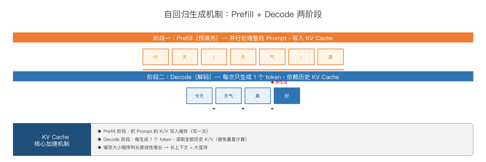
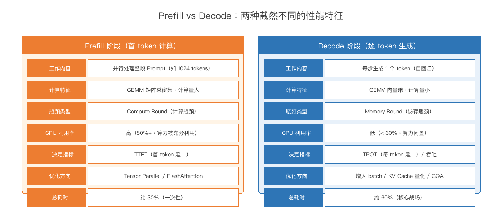
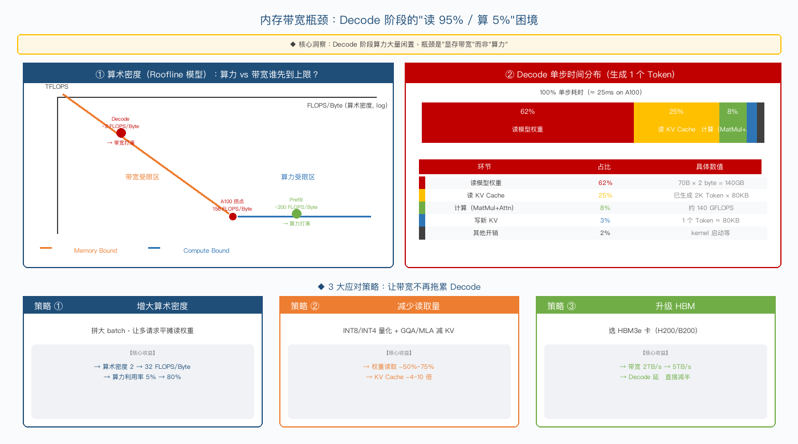
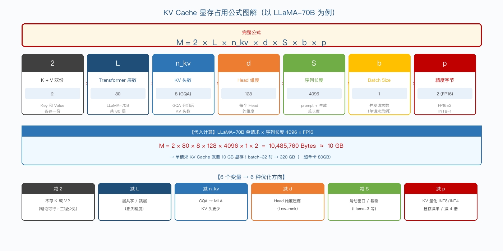
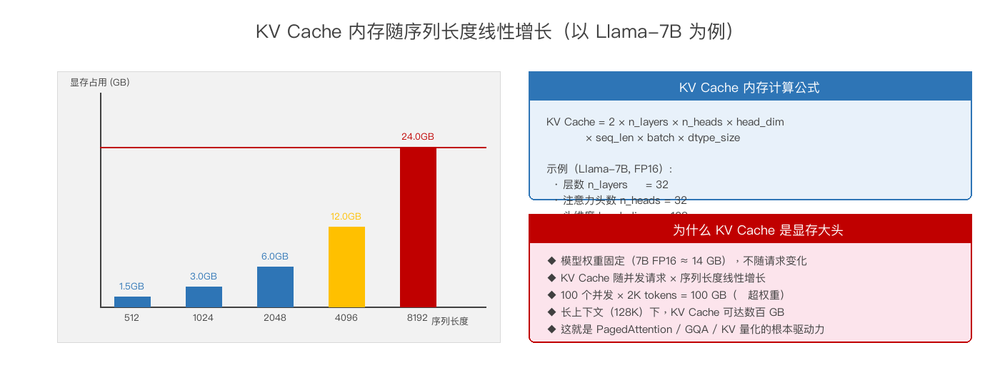
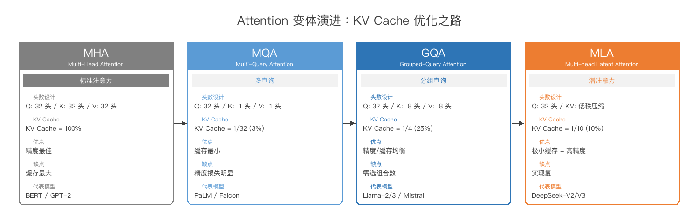
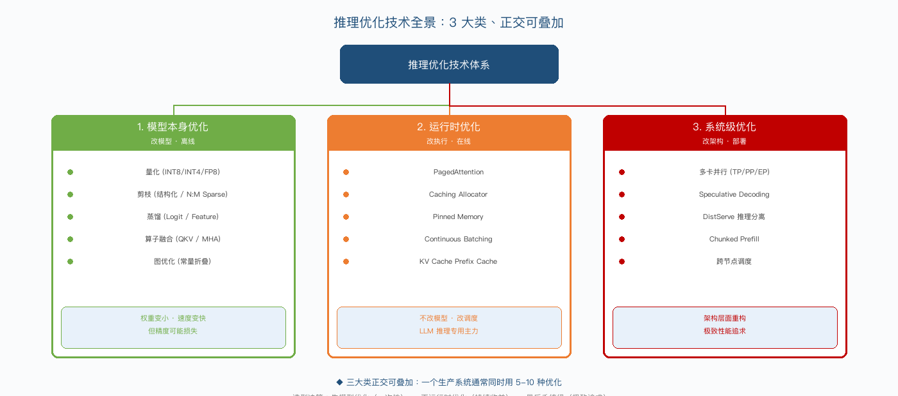
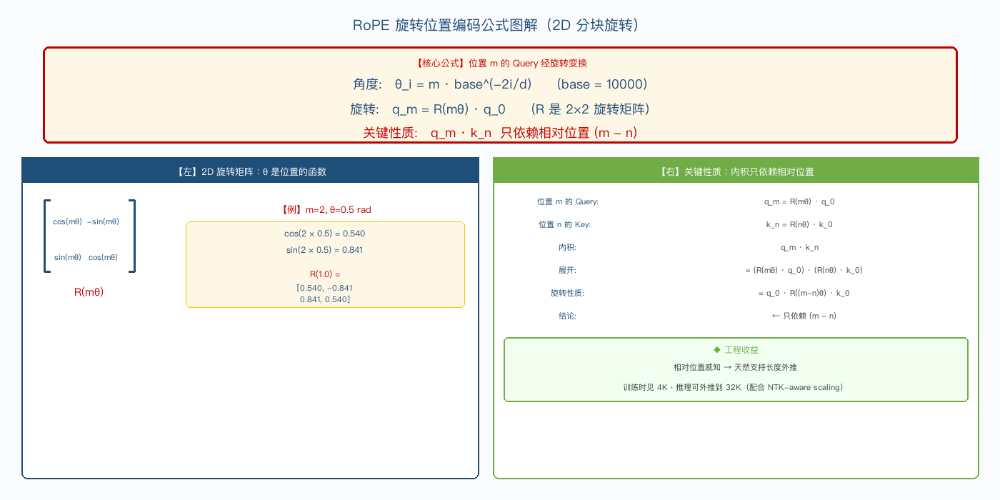
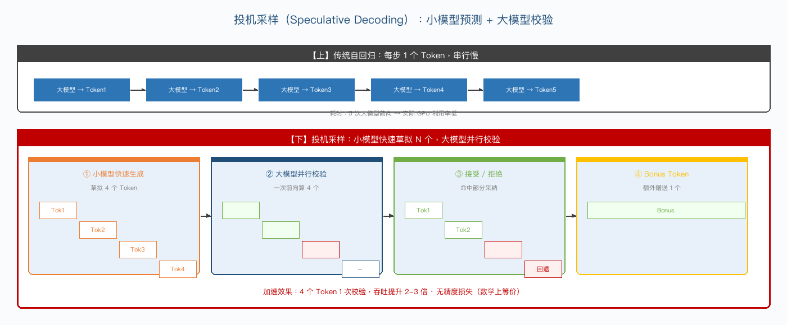
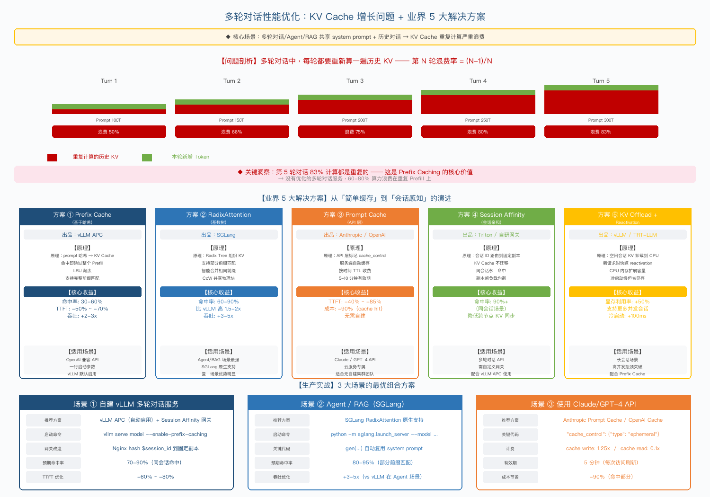

# 第4章：大模型推理核心技术体系

## 4.1 自回归生成机制

### 4.1.1 Token-by-Token 生成原理

LLM 的输出是基于已生成内容"预测下一个 Token"。每生成一个 Token，都要：

把"已有上下文 + 上一个 Token"作为输入

跑一次完整的前向计算

输出下一个 Token 的概率分布

通过采样策略（Greedy / Top-K / Top-P）选一个 Token

把选中的 Token 加入上下文，回到第 1 步

如此循环，直到遇到 EOS（End Of Sequence）或达到长度上限。

根本性挑战：

生成 1000 个 Token = 跑 1000 次前向；串行依赖无法并行（前一个 Token 是下一个的输入）。

这种 Token-by-Token 的串行依赖，是 LLM 推理"慢"的本质原因，也是后续所有优化（KV Cache、Continuous Batching、Speculative Decoding）所要解决的核心问题。

### 4.1.2 Prefill 阶段详解（首 token 并行计算）

由于自回归特性，LLM 推理被天然分为两个性能特征截然不同的阶段。Prefill 阶段是第一个阶段——处理用户输入的完整 Prompt。

Prefill 的核心特征：

输入：完整 Prompt（如 1000 个 Token）

计算方式：所有 Prompt Token 并行计算（一次前向）

计算密度：算术密度 ≈ 200 FLOPS/Byte → Compute Bound（算力受限）

典型耗时：单次 200-500ms（首 Token 延迟 TTFT 主要由它决定）

算子特征：GEMM（矩阵乘）密集，GPU 计算单元打满

Prefill 性能优化要点：

Tensor Parallel 友好：大矩阵乘法容易切分到多卡，加速比近线性。

算力优先：选高 TFLOPS 的卡（如 H100 SXM）。

FlashAttention 受益大：减少中间矩阵 HBM 读写，速度提升 2-4 倍。

Chunked Prefill：超长 Prompt（>32K）可拆分成 chunk 流式处理，避免单次 OOM。

### 4.1.3 Decode 阶段详解（自回归生成）

Decode 阶段是第二个阶段——基于 Prefill 的 KV Cache，逐个生成后续 Token。

Decode 的核心特征：

输入：上一步生成的 1 个 Token

计算方式：每步生成 1 个 Token，串行执行

计算密度：算术密度 ≈ 2 FLOPS/Byte → Memory Bound（带宽受限）

典型耗时：单步 20-50ms（生成长序列时累计耗时占比 60-80%）

算子特征：大量 GEMV（矩阵向量乘），GPU 计算单元大量闲置

Decode 单步时间分布（A100 上 70B 模型生成 1 个 Token）：

| 环节 | 占比 | 具体数值 |
| --- | --- | --- |
| 读模型权重 | 62% | 70B × 2 byte = 140GB |
| 读 KV Cache | 25% | 已生成 2K Token × 80KB |
| 计算（MatMul+Attn） | 8% | 约 140 GFLOPS |
| 写新 KV | 3% | 1 个 Token ≈ 80KB |
| 其他开销 | 2% | kernel 启动等 |

核心洞察：95% 时间在读，5% 在算 → 算力大量闲置，瓶颈在显存带宽而非算力。

Decode 性能优化 3 大策略：

策略 ① 增大算术密度：拼大 batch（多请求平摊读权重）→ 算力利用率 5% → 80%。

策略 ② 减少读取量：INT8/INT4 量化（权重读取 -50%~75%）+ GQA/MLA 减 KV（KV Cache -4~10 倍）。

策略 ③ 升级 HBM：选 HBM3e 卡（H200: 5TB/s, B200: 8TB/s）→ Decode 延迟直接减半。

💡 选卡黄金法则：不能只看 TFLOPS，必须同时看 HBM 带宽。算力/带宽比 < 200 的卡（如 A100: 156）适合 Prefill，> 200 的卡（如 H100: 295, B200: 281）适合 Decode。

下图用 Roofline 模型直观展示了 Prefill 与 Decode 在算力-带宽坐标系上的位置差异：

💡 关键认知：Prefill 和 Decode 性能特性完全不同，所以很多优化（如 Prefill/Decode 分离调度、Chunked Prefill、Continuous Batching）都是针对这一差异设计的。

### 4.1.4 采样策略（Greedy/Top-K/Top-P/Temperature/Beam Search）

采样策略决定模型如何从 logits 概率分布中"挑选"下一个 Token。不同策略直接影响生成质量、多样性与速度。

| 策略 | 原理 | 优点 | 缺点 | 适用场景 |
| --- | --- | --- | --- | --- |
| Greedy | 取 argmax（概率最大） | 速度最快、确定性强 | 容易重复、缺乏多样性 | 代码生成、数学推理 |
| Top-K | 只在概率最高的 K 个中采样 | 平衡质量与多样性 | K 固定不灵活 | 通用场景（K=40 常用） |
| Top-P（Nucleus） | 在累计概率达 P 的最小集合中采样 | 自适应集合大小 | 计算略复杂 | 对话生成（P=0.9 常用） |
| Temperature | 通过温度调节分布锐度 | 控制创造性 | T 太高会乱码 | 创意写作（T=0.7-1.0） |
| Beam Search | 保留 Top-N 序列同时搜索 | 质量最高 | 速度慢 N 倍 | 翻译、摘要 |

主流 LLM 服务默认配置：Top-P=0.9 + Temperature=0.7（兼顾质量与多样性）。

与推理性能的关系：

Greedy/Top-K/Top-P：单序列生成，性能相近。

Beam Search：需维护 N 条候选序列，显存与计算开销 ×N，LLM 推理已基本不用。

Speculative Decoding 与采样策略正交，可与 Top-P 等组合使用。

## 4.2 KV Cache 机制

### 4.2.1 KV Cache 工作原理

答案：不用。历史 Token 的 K/V 计算结果可以缓存下来，下次直接用。这就是 KV Cache。

KV Cache 的本质：把 Attention 计算中的 K（Key）和 V（Value）矩阵缓存到显存，每生成一个新 Token 时：

只需计算新 Token 的 Q/K/V（计算量 O(1)）

K/V 写入缓存（O(1) 写入）

新 Q 与缓存的所有 K 做点积（O(n) 计算）

这样把 Decode 阶段的复杂度从 $O(n^2)$ 降到了 $O(n)$，是 LLM 推理最重要的优化之一。

KV Cache 生命周期 4 阶段：

分配：请求到达时分配显存块。

扩展：每生成一个 Token，追加写入新的 K/V。

共享：相同前缀的请求可通过 CoW 共享物理块（Prefix Cache）。

释放：请求完成后释放显存块（或被 Prefix Cache 机制保留一段时间）。

### 4.2.2 KV Cache 内存计算公式

KV Cache 占用显存随序列长度线性增长。下图把显存占用公式做了完整图解，每个变量都有对应含义：

如上图所示，KV Cache 显存公式为：

M = 2 × L × n_kv × d × S × b × p

各变量含义对照：

| 符号 | 含义 | LLaMA-70B 取值 |
| --- | --- | --- |
| 2 | K + V 双份 | 2 |
| L | Transformer 层数 | 80 |
| n_kv | KV 头数（GQA 后） | 8 |
| d | Head 维度 | 128 |
| S | 序列长度 | 4096 |
| b | Batch Size | 1 |
| p | 精度字节 | 2 (FP16) |

代入计算：M = 2 × 80 × 8 × 128 × 4096 × 1 × 2 ≈ 10 GB

也就是说，单请求的 KV Cache 就要 10GB 显存。batch=32 时就是 320GB，远超单卡显存。

公式还揭示了 6 种优化方向：减 2（不存 K 或 V）/ 减 L（层共享）/ 减 n_kv（GQA→MLA）/ 减 d（低秩压缩）/ 减 S（滑窗）/ 减 p（KV 量化）。

### 4.2.3 KV Cache 实例分析（Llama-7B）

为加深理解，以 Llama-7B 为例做完整计算。

Llama-7B 配置：

层数 L = 32

注意力头数 n = 32

KV 头数 n_kv = 32（MHA，未做 GQA）

Head 维度 d = 128

最大序列长度 S = 2048

精度 p = 2（FP16）

单请求 KV Cache 显存：

M = 2 × 32 × 32 × 128 × 2048 × 1 × 2 = 1,073,741,824 byte ≈ 1 GB

对比模型权重：Llama-7B FP16 权重 ≈ 13.5 GB。

关键观察：

单请求时，KV Cache（1GB）≈ 权重（13.5GB）的 7%。

多请求放大效应：batch=64 时，KV Cache = 64GB，已经是权重的 4.7 倍！

这就是为什么 LLM 推理服务后期 KV Cache 占用显存远超模型权重。

生产实测（vLLM + Llama-7B + A100 80GB）：

模型权重：13.5 GB

系统/CUDA 上下文：≈ 2 GB

剩余可用：80 - 13.5 - 2 = 64.5 GB（全部用于 KV Cache）

单请求 1GB → 理论最大并发 ≈ 64 路

### 4.2.4 KV Cache 优化方向

针对 KV Cache 显存大的痛点，业界发展出 5 大优化方向：

| 方向 | 代表技术 | 收益 | 详见章节 |
| --- | --- | --- | --- |
| 显存管理 | PagedAttention | 利用率 20% → 90% | 4.6.2 |
| 量化压缩 | KV Cache INT8 / INT4 量化 | 显存降 2-4 倍 | 第 3.4.3 |
| 重新计算 | Hybrid (部分 cache + 部分重算) | 显存与计算的平衡 | - |
| 共享前缀 | Prefix Cache / Radix Tree | 多请求共享 system prompt | 4.6.5 |
| 卸载 | KV Cache Offload to CPU | 用 CPU 内存扩展容量 | - |

5 大方向可叠加使用，但 PagedAttention + Prefix Cache 是 P0 必装项。

### 4.2.5 KV Cache 压缩与淘汰机制（新增）

KV Cache 是 LLM 推理中最大的显存消耗者。当序列长度达到 128K 或 1M 时，KV Cache 可能占据 80% 以上的显存。KV Cache 压缩与淘汰机制是解决长上下文推理的关键技术。

主流 KV Cache 压缩技术对比：

| 技术 | 压缩比 | 原理 | 精度影响 | 代表方案 |
| --- | --- | --- | --- | --- |
| KV Cache 量化 | 2-4x | 将 FP16 的 K/V 矩阵量化为 INT8/INT4 | 轻微（<0.5%） | KIVI、KVQuant |
| KV 池化合并 | 2-8x | 将相邻的 KV 向量合并为一个 | 中等（1-2%） | CacheGen、H2O |
| Token 淘汰 | 2-4x | 根据注意力分数淘汰不重要 Token 的 KV | 轻微（<1%） | H2O、ScissorHands |
| 注意力池化 | 4-16x | 只保留关键注意力头的 KV Cache | 中到大 | SnapKV、StreamingLLM |
| 窗口缓存 | 可变 | 只保留最近 N 个 Token 的 KV | 长上下文有损 | StreamingLLM、LM-Infinite |

H2O（Heavy Hitter Oracle）原理：

H2O 是当前最流行的 KV Cache 淘汰方案。其核心思想是：根据注意力分数累积，识别出重击 Token（Heavy Hitters），只保留这些 Token 的 KV Cache，淘汰其余 Token。

步骤：1) 每个 Decode Step 记录每个 Token 的注意力分数；2) 累积分数，排序选出 Top-K；3) 只保留 Top-K 的 KV Cache；4) 新 Token 进入时重复评估

实际效果：Llama-2-7B 在 16K 序列长度下，KV Cache 从 2GB 降至 256MB（8x 压缩），PPL 损失仅 0.3。

### 4.2.6 百万级长上下文工程挑战（新增）

2024-2025 年，长上下文模型（如 Gemini 1M、Claude 200K、Kimi 200K）将上下文窗口推向百万级 Token。这对推理系统提出了前所未有的工程挑战。

百万级长上下文的 5 大工程挑战：

| 挑战 | 问题描述 | 影响 | 解决方案 |
| --- | --- | --- | --- |
| KV Cache 显存爆炸 | 1M 序列的 KV Cache 需要 120GB+ 显存（FP16） | 单卡放不下 | KV Cache 量化 + 分层卸载 |
| Prefill 计算瓶颈 | 1M Token 的 Prefill 需要 O(n²) 注意力计算 | 首 Token 延迟>10s | FlashAttention 2/3 + 稀疏注意力 |
| Attention 线性增长 | 标准 Attention 与序列长度平方成正比 | 计算量爆炸 | Ring Attention 分布式计算 |
| 位置编码外推 | 1M 序列远超训练时的位置编码范围 | 精度严重下降 | ALiBi / NTK-aware RoPE / YaRN |
| 显存碎片化 | 动态分配/释放大量 KV Block 导致碎片 | 可用显存减少 | PagedAttention 2.0 + 显存整理 |

工程方案的权衡：

纯 GPU 方案：1M 上下文需要 8xH100（80GB）才能装下，成本极高

CPU Offloading 方案：KV Cache 压缩后存到 CPU 内存，需要时搬回 GPU，但会引入 10-50ms 的额外延迟

分布式 Attention 方案：将长序列切分到多卡，每卡计算部分 Attention 后再聚合，需要高效通信

## 4.3 Attention 变体演进

### 4.3.1 MHA 标准 Attention

MHA（Multi-Head Attention） 是 2017 年 Transformer 论文提出的标准方案。

结构：

Query 头数 = KV 头数 = n（如 32）

每个头独立有自己的 Q/K/V 投影

各头独立计算 Attention，最后拼接

优势：表达能力最强，精度最佳。

劣势：KV Cache 占用最大。

KV Cache 公式：M_KV = 2 × L × n × d × S × p（n_kv = n）

代表模型：原始 Transformer、BERT、GPT-2、GPT-3、Llama-7B/13B。

适用场景：对精度要求极高的场景（如训练）。

### 4.3.2 MQA 多查询注意力

MQA（Multi-Query Attention） 由 Noam Shazeer 2019 年提出。

结构：

Query 头数 = n

KV 头数 = 1（所有 Query 头共享同一组 K/V）

优势：KV Cache 减 4-8 倍（视头数而定），Decode 速度大幅提升。

劣势：精度损失明显（尤其在长序列和复杂任务），下游任务质量下降。

KV Cache 公式：M_KV = 2 × L × 1 × d × S × p（n_kv = 1）

代表模型：PaLM、Falcon、StarCoder。

适用场景：对速度极致追求、可容忍少量精度损失的场景。

### 4.3.3 GQA 分组查询注意力（Llama-2/3）

GQA（Grouped-Query Attention） 由 Ainslie 2020 年提出，是 MHA 与 MQA 的折中方案。

结构：

Query 头数 = n

KV 头数 = n_groups（如 8，介于 1 和 n 之间）

每 n/n_groups 个 Query 头共享一组 K/V

优势：

精度接近 MHA（远好于 MQA）

KV Cache 减少 n/n_groups 倍

工程实现成熟

KV Cache 公式：M_KV = 2 × L × n_groups × d × S × p

代表模型：Llama-2-70B、Llama-3-8B/70B、Qwen-2、Mistral-7B 等主流 LLM 全部采用。

典型配置：Llama-2-70B（80 个 Query 头 / 8 个 KV 头）→ KV Cache 减 10 倍。

为什么是当前主流？ GQA 在精度损失可控（< 1%）的前提下，把 KV Cache 减到原来的 1/8~1/10，是性价比最高的选择。

### 4.3.4 MLA 多头潜注意力（DeepSeek）

MLA（Multi-head Latent Attention） 是 DeepSeek-V2/V3 提出的创新方案。

结构：

不是简单减少 KV 头数，而是低秩压缩 KV 到一个潜在向量

推理时只缓存压缩后的潜在向量（如 512 维），需要时解压还原

优势：

KV Cache 理论上可减 10-50 倍

精度保持良好（甚至略优于 GQA）

KV Cache 公式：M_KV = 2 × L × d_c × S × p（d_c 为压缩维度，如 512）

代表模型：DeepSeek-V2、DeepSeek-V3。

适用场景：对显存极致敏感的超长上下文（128K+）场景。

工程挑战：实现复杂度高，目前主流框架（vLLM、SGLang）已陆续支持。

主流 Attention 优化技术与收益对比：

| 变体 | 提出时间 | 核心优化 | 典型收益 |
| --- | --- | --- | --- |
| 标准 MHA | 2017 (Transformer) | 无优化 | 基准 |
| MQA | 2019 | 多个 Query 共享 1 组 KV | KV Cache 减 4-8 倍 |
| GQA | 2020 (LLaMA-2) | 分组共享，介于 MHA 与 MQA 之间 | 平衡精度与速度 |
| MLA | 2024 (DeepSeek) | 低秩压缩 KV | KV Cache 减 10-50 倍 |
| FlashAttention v1/v2/v3 | 2022-2024 | 分块计算、减少 HBM 访问 | 速度提升 2-4 倍 |

演进方向总结："在精度可控的前提下，让 KV Cache 越来越省"。

本节聚焦 LLM 推理 5 大主流优化技术。下图展示了完整的技术全景树：

5 大技术按作用层次分类：

| 技术 | 类型 | 核心收益 | 提出方 |
| --- | --- | --- | --- |
| FlashAttention | Kernel 优化 | 速度 2-4x，减少 HBM 访问 | Stanford (2022) |
| PagedAttention | 内存管理 | KV 显存利用率 20% → 90% | UC Berkeley (vLLM, 2023) |
| Continuous Batching | 批处理调度 | GPU 利用率 30% → 80% | OSDI 2022 (Orca) |
| Speculative Decoding | 采样加速 | 吞吐 2-3x（无精度损失） | DeepMind (2023) |
| Prefix Caching | 前缀复用 | 相同前缀计算 -50% | SGLang (2023) |

💡 关键认知：5 大技术正交可叠加，生产实测叠加可获得 7-10 倍整体提升。所有现代 LLM 推理引擎（vLLM/SGLang/TGI/TRT-LLM）都默认启用前 3 项。

下面依次展开。

## 4.4 位置编码体系

### 4.4.1 绝对位置编码

原理：每个位置 m 对应一个固定的位置向量 $p_m$，加到 Token embedding 上：x_m = e_m + p_m。

两种实现：

学习式：位置向量作为可训练参数（如 BERT、GPT-2）。

正弦式：用 sin/cos 函数生成（如原始 Transformer）。

优势：实现简单，训练直观。

劣势：

不能外推：训练时长度 N，推理时长度 > N 表现急剧下降。

缺乏相对位置信息。

代表模型：BERT、GPT-2、原始 Transformer。

适用场景：固定长度的传统 NLP 任务（分类、序列标注）。

### 4.4.2 相对位置编码

原理：不直接编码"位置 m"，而是编码"位置差 m-n"（Token 之间的相对距离）。

典型方案：

T5 Relative Position Bias：把相对距离分桶，加到 Attention Score 上。

T5 Relative：在每层 Attention 计算时动态加入相对偏置。

优势：

天然支持外推（相对距离不变）。

表达能力强（直接编码相对关系）。

劣势：

训练时需要覆盖足够多的相对距离。

工程实现复杂（每层 Attention 都要重算 bias）。

代表模型：T5、BLOOM（早期版本）。

### 4.4.3 RoPE 旋转位置编码（Llama 标配）

RoPE（Rotary Position Embedding） 由苏剑林 2021 年提出，是当前主流 LLM 的标配。

核心思想：通过旋转矩阵在 Q/K 上引入位置信息——位置 m 对应旋转角 mθ，相对位置 (m-n) 自然表现为角度差。

数学描述：

下图给出了 RoPE 的完整数学公式与关键性质证明：

如上图所示：

角度公式：θ_i = m · base^(-2i/d)（base 通常取 10000）

旋转公式：q_m = R(mθ) · q_0（R 是 2×2 旋转矩阵）

关键性质：q_m · k_n 只依赖相对位置 (m - n)

右图给出了详细数学推导：通过旋转矩阵的正交性，q_m · k_n = q_0 · R((m-n)θ) · k_0，注意力得分天然只依赖相对位置 —— 这就是 RoPE 支持长度外推的数学根源。

优势：

相对位置+绝对位置统一：兼具两者优势。

外推友好：通过 NTK-aware / YaRN 等缩放方案，可从 4K 扩展到 32K-1M。

实现简洁：仅修改 Q/K，不修改 V。

劣势：长序列远距离衰减（位置越远注意力越弱）。

代表模型：LLaMA、Llama-2/3、Qwen、Qwen2、Baichuan、ChatGLM、Mistral 等几乎所有现代 LLM。

RoPE 变体演进：

YaRN：分维度不同频率缩放，支持 64K-128K 外推。

LongRoPE：非线性插值，Microsoft 提出，支持 2M 上下文。

Dynamic NTK：推理时动态调整 base，适配不同长度。

### 4.4.4 ALiBi 外推位置编码

ALiBi（Attention with Linear Biases） 由 Press 2021 年提出。

核心思想：完全不用位置 embedding，而是在 Attention 计算时加入一个线性递减的偏置——距离越远，注意力分数减得越多。

数学描述：

AttentionScore(q_m, k_n) = q_m · k_n - |m-n| / 2^h

其中 h 是该头的斜率（不同头不同）。

优势：

真正的外推能力：训练时 1K，推理时可扩展到 4K-12K 无明显精度损失。

实现极简（只在 Attention Score 上加一个 bias）。

训练稳定性好。

劣势：

长距离衰减过于"硬"（线性），表达能力受限。

复杂任务（推理、数学）表现略差。

代表模型：BLOOM、MPT。

与 RoPE 对比：

| 方案 | 外推能力 | 表达能力 | 实现难度 | 主流应用 |
| --- | --- | --- | --- | --- |
| RoPE | 通过缩放可外推 | 强 | 中 | 绝对主流（Llama/Qwen） |
| ALiBi | 原生外推 | 中 | 极简 | 少数模型（BLOOM） |

结论：RoPE 在精度与外推间取得平衡，已成为现代 LLM 事实标准。

主流位置编码方案对比：

| 方案 | 代表模型 | 优势 | 局限 |
| --- | --- | --- | --- |
| 绝对位置编码 | BERT、GPT-2 | 实现简单 | 不能外推到更长序列 |
| 正弦余弦 | 原始 Transformer | 可外推 | 表达能力一般 |
| 相对位置（T5 Bias） | T5、BLOOM 早期 | 外推友好 | 每层重算 bias |
| ALiBi | BLOOM | 真正的外推能力 | 长距离衰减过强 |
| RoPE（旋转位置编码） | LLaMA、Qwen | 主流方案，外推好 | 长序列衰减问题 |
| RoPE 变体（YaRN、LongRoPE） | Qwen2、Claude | 千 K 上下文核心 | 工程实现复杂 |

## 4.5 激活与归一化

### 4.5.1 激活函数演进（ReLU→GeLU→SwiGLU）

激活函数为神经网络引入非线性，是深度学习核心组件。LLM 中激活函数经历了三代演进。

① ReLU（2010）

公式：f(x) = max(0, x)

优势：计算极简、不饱和、缓解梯度消失。

劣势：负区间梯度为 0（神经元死亡）。

代表：CNN 时代（ResNet、VGG）。

② GELU（2016）

公式：f(x) = x · Φ(x)（Φ 为标准正态分布 CDF）

优势：平滑可微、理论上更接近生物神经元。

劣势：计算复杂（含 exp/erf）。

代表：BERT、GPT-2、GPT-3、原始 Transformer。

③ SiLU/Swish（2017）+ SwiGLU（2020）

SiLU 公式：f(x) = x · sigmoid(x)

SwiGLU 公式：FFN(x) = (Swish(x·W1) ⊙ x·V1) · W2（在 GLU 框架下用 SiLU）

优势：平滑、不饱和、表达能力极强、训练稳定。

劣势：参数量翻倍（多一个 V 矩阵）。

代表：LLaMA 全系列、Qwen、Mistral、DeepSeek 等所有现代 LLM。

如上图左图所示：ReLU 是硬截断，GELU 是软截断，SiLU 是单调平滑的"自适应门控"，三代演进方向是"更平滑 + 更强的非线性表达"。

### 4.5.2 归一化层演进（LayerNorm→RMSNorm）

归一化（Normalization）通过规范激活值分布，让训练更稳定、收敛更快。LLM 归一化方案经历了 3 代演进。

① Batch Norm（BN, 2015）

思路：在 batch 维度做归一化。

适用：CNN（固定 batch size）。

不适用：LLM（序列长度变化、batch=1 推理）。

② Layer Norm（LN, 2016）

公式：y = (x - mean) / sqrt(var + ε) · γ + β

思路：在特征维度做归一化。

适用：RNN/Transformer 主流方案。

劣势：计算 mean/var 开销大，推理时也需要。

③ RMS Norm（RMSNorm, 2019）

公式：y = x / sqrt(mean(x²) + ε) · γ（去掉 mean 和 β）

思路：只做缩放归一化，省去均值计算。

优势：计算量减半，精度与 LayerNorm 相当。

代表：所有现代 LLM（LLaMA、Qwen、Mistral、DeepSeek）。

如上图右图所示：LayerNorm 需要计算均值和方差，RMSNorm 只需计算 RMS（均方根），后者更轻量。

归一化位置演进（独立于归一化类型）：

Post-LN（原始 Transformer）：归一化在残差之后。问题：训练初期梯度爆炸。

Pre-LN（GPT-2/LLaMA）：归一化在残差之前。主流方案。

SandWich-LN：两边都做归一化。稳定性更好，但工程复杂。

当前主流 LLM 标配：RMSNorm + Pre-Norm。

## 4.6 FFN 结构与模型架构演进（新增）

FFN（Feed-Forward Network）是 Transformer 中占比最大的模块（约 2/3 的参数和计算量）。FFN 结构的演进贯穿了整个 LLM 发展史，从标准的 FFN 到 MoE 的演进过程直接影响了推理系统的设计。

FFN 结构演进全景：

| 阶段 | 结构 | 参数量 | 计算量 | 代表模型 | 推理影响 |
| --- | --- | --- | --- | --- | --- |
| ReLU FFN | W1-ReLU-W2 | 4xd_model² | 高 | GPT-1/2 | 激活稀疏性可优化 |
| GeLU FFN | W1-GeLU-W2 | 4xd_model² | 高 | BERT、GPT-3 | 引入 GeLU 激活函数 |
| SwiGLU FFN | W1xW2-SwiGLU-W3 | 8/3xd_model² | 中高 | LLaMA、PaLM | 门控结构，参数量增加 |
| MoE FFN | 多个 Expert + Router | 6-8xd_model² | 低（稀疏激活） | Mixtral、DeepSeek-V3 | 稀疏激活降低推理成本 |

### 4.6.1 FFN 结构演进（标准 FFN→GeLU FFN→SwiGLU）

FFN 结构的演进主要围绕激活函数和门控机制展开。以下按时间线详细说明每个阶段的 FFN 结构：

1. ReLU FFN（2017-2019）
公式：FFN(x) = W2 . max(0, W1 . x + b1) + b2

特点：使用 ReLU 激活函数，简单高效。W1 将维度从 d_model 扩展到 4xd_model，W2 再压缩回来

优点：ReLU 的稀疏性（约 50% 的神经元输出为 0）可用于推理优化

缺点：ReLU 在负数区域输出为 0，可能导致神经元死亡（Dead Neuron）

2. GeLU FFN（2019-2022）
公式：FFN(x) = W2 . GeLU(W1 . x + b1) + b2

特点：用 GeLU 替代 ReLU，GeLU 在负数区域有平滑的梯度，训练更稳定，收敛更快

BERT 和 GPT-3 都使用 GeLU FFN，成为 2020-2022 年的主流选择

3. SwiGLU FFN（2023 至今）
公式：FFN(x) = (W3 . x) . Swish(W1 . x) . W2

特点：引入门控机制（Gating），使用 Swish 激活函数 + 逐元素乘法

LLaMA 系列使用 SwiGLU，后续 Qwen、DeepSeek、Mistral 等均效仿，成为当前主流标准

推理影响：SwiGLU 比 GeLU FFN 多一个线性层，参数增加约 1/3，但精度提升 2-3%

### 4.6.2 MoE 混合专家架构（DeepSeek-V3/V4-Pro）

MoE（Mixture of Experts）通过稀疏激活机制，用更少的计算量获得更大的模型容量。DeepSeek-V3 和 V4-Pro 是 MoE 架构的典型代表。

MoE 架构的核心组件：

| 组件 | 功能 | DeepSeek-V3 的实现 |
| --- | --- | --- |
| Router（路由器） | 决定每个 Token 分配给哪些 Expert | Top-K Routing（K=8，总 Expert=256） |
| Expert（专家） | 每个 Expert 是一个独立的 FFN | 每个 Expert 约 2.1B 参数 |
| Token 分发 | 将 Token 路由到对应的 Expert | All-to-All 通信 |
| 输出合并 | 将各 Expert 的输出加权求和 | 带 Expert 权重的加权平均 |

DeepSeek-V3 的 MoE 特点：

总参数 671B，但每个 Token 只激活 8 个 Expert（约 37B 参数），推理计算量约等于 37B 稠密模型

辅助损失（Auxiliary Loss）用于负载均衡，确保每个 Expert 处理的 Token 数量均匀

Multi-Token Prediction（MTP）训练策略，提升推理时的 Token 生成效率

MoE 推理的挑战：

Expert 负载不均衡：部分 Expert 成为热点，导致 GPU 利用率不均

通信开销大：每步需要 All-to-All 通信，专家数量越多通信越重

显存占用高：所有 Expert 的参数都要加载到显存中（671B 参数需要约 1.2TB 显存）

### 4.6.3 模型架构演进趋势总结

从 2017 年的 Transformer 到 2025 年的 DeepSeek-V4-Pro，模型架构经历了显著的演进。以下总结了 5 大关键趋势：

| 趋势 | 变化方向 | 驱动因素 | 对推理的影响 |
| --- | --- | --- | --- |
| 从稠密到稀疏 | 稠密 FFN → MoE | 用更少计算量获得更大模型容量 | 推理计算量降低但显存需求增加 |
| 从短到长上下文 | 2K → 1M+ Token | 文档理解、代码库分析等场景需求 | KV Cache 优化成为核心挑战 |
| 从单一到多模态 | 纯文本 → 图文/音/视频 | 应用场景扩展 | 推理系统需要支持多模态编码器 |
| 从单卡到分布式 | 单卡推理 → TP/PP/EP | 模型规模远超单卡显存 | 分布式推理框架成为标配 |
| 从通用到专用 | 通用架构 → 领域优化 | 特定场景效率要求 | 推理引擎需要支持架构定制 |

对推理工程师的建议：

关注 MoE 推理优化：DeepSeek 系列证明了 MoE 是大模型的方向，掌握 Expert Parallelism 和负载均衡将越来越重要

重视长上下文推理：百万级 Token 上下文正在成为标配，KV Cache 管理和稀疏注意力是核心技术

多模态能力必须掌握：2025 年后的模型几乎都是多模态的，推理系统需要支持 Vision Encoder 的部署

## 4.7 推理优化技术概览

### 4.7.1 FlashAttention 系列（1/2/3）

核心问题：标准 Attention 计算时，QK^T 中间矩阵大小为 O(n²)——n=8K 时单层就要 256MB HBM 读写，严重拖慢推理。

FlashAttention 的核心创新：通过分块计算（Tiling）+ online softmax，把中间矩阵永远不写出 HBM，从根上消除 Memory Bound。

3 代演进：

| 版本 | 年代 | 核心创新 | 性能提升 |
| --- | --- | --- | --- |
| FlashAttention v1 | 2022 | 分块 + online softmax | 2x（vs 标准 Attention） |
| FlashAttention v2 | 2023 | 减少非 matmul FLOPs，优化并行度 | 再提升 2x（vs v1） |
| FlashAttention v3 | 2024 | 异步 warp-specialized + FP8 支持 | 再提升 1.5-2x（vs v2，H100） |

对 Prefill vs Decode 的影响差异：

Prefill 阶段：受益巨大（计算密集，FA 把中间矩阵压缩）。

Decode 阶段：受益较小（每步只算 1 个 token，本来就没有大中间矩阵）。需要用 FlashDecoding（FA 团队推出的 Decode 专用版本）。

为什么所有 LLM 必装？

速度提升 2-4 倍（无论是 Prefill 还是 Decode）。

精度严格无损（数学等价）。

工程成本极低（替换 kernel 即可）。

端侧支持逐步完善（端侧 NPU 部分支持）。

典型用法：

# vLLM 默认启用 FlashAttentionfrom vllm import LLMllm = LLM(model="lmsys/longchat-7b-v1.5-32k")  # 自动用 FA

### 4.7.2 PagedAttention（vLLM 原创）

核心问题：传统 KV Cache 内存管理用连续分配，会导致严重碎片化——显存利用率仅 20%。

PagedAttention 的核心创新：借鉴 OS 虚拟内存思想，把 KV Cache 分页管理。

3 大设计要点：

Block Table：维护逻辑块到物理块的映射（类似页表）。

物理块不连续：KV 可以分散在任意空闲 Block 中。

Copy-on-Write：相同前缀的请求共享物理 Block（这是 Prefix Cache 的基础）。

Block Size = 16 的原因：

太小（如 1）：Block Table 过大，索引开销高。

太大（如 256）：碎片化重新出现。

16 是经验最优值，内部碎片浪费 < 6%。

3 大收益：

显存利用率 20% → 90%（4.5 倍吞吐提升）。

支持非连续存储，从根本上消除碎片化。

支持共享复用，相同前缀的请求自动共享 KV。

与 Continuous Batching 协同：

Continuous Batching 让 GPU 满载（30% → 80%）。

PagedAttention 让显存满载（20% → 90%）。

两者叠加是 vLLM 性能的基石。

与内存带宽的关系：

PagedAttention 本身不直接解决带宽瓶颈，但通过减少碎片化让更多请求同时驻留 → 增大 batch → 提高算术密度 → 间接缓解带宽瓶颈。

代表实现：vLLM（首创）、TGI、SGLang、TensorRT-LLM。

### 4.7.3 Continuous Batching

核心问题：Static Batching 中，短请求完成后被迫"陪跑"长请求，GPU 槽位大量空等。

Continuous Batching 的核心创新：Token 级调度——每个 Decode Step 重新拼装 batch，谁完成谁让位，新请求立即填入。

直观对比（见 3.5.4 节深度剖析）：

| 指标 | Static Batching | Continuous Batching |
| --- | --- | --- |
| GPU 利用率 | ~30% | ~80% |
| 完成请求数（同时间） | 4 | 10（+150%） |
| 平均等待 Step | 7 | 4（-43%） |

4 大关键决策（每 Step 都要执行）：

完成检测：有请求生成完 → 立即释放 KV Block。

Batch 空位：有空位 → 从 Waiting 队列拉取新请求注入。

显存治理：显存不够 → 触发抢占机制（低优先级让位）。

拼装执行：拼装好 batch，执行一次前向。

进阶调度技术（与 Continuous Batching 配合）：

Prefix-Aware Scheduling：相同前缀的请求聚合 → Prefix Cache 命中率提升 3-5 倍。

SJF（Shortest Job First）+ 老化机制：短请求优先，避免长请求饥饿。

抢占式调度：高优请求到来时，强制驱逐低优请求（vLLM 的 Preemption）。

DistServe 调度：把 Prefill 和 Decode 拆到不同集群独立调度。

主流调度策略对比：

| 策略 | 调度粒度 | GPU 利用率 | 适用场景 | 代表框架 |
| --- | --- | --- | --- | --- |
| Static Batching | Batch 级 | ~30% | 离线批量推理 | Triton Inference Server |
| Continuous Batching | Token 级 | ~80% | 在线聊天 API | vLLM, SGLang, TGI |
| Priority Scheduling | 优先级 | ~70% | 多租户服务 | TensorRT-LLM |
| Speculative Scheduling | 草稿+校验 | ~85% | 低延迟场景 | Medusa, EAGLE |

📖 详见 3.5.4 节：Continuous Batching 的逐 Step 时间轴剖析、公交 vs 地铁类比、量化收益分析。

### 4.7.4 Speculative Decoding

核心问题：自回归生成是严格串行的（前一个 Token 是下一个 Token 的输入），每步只能生成 1 个 Token，无法并行。

Speculative Decoding 的核心创新：用小模型"草拟" K 个 Token，大模型一次前向并行校验，命中就接受、错误就拒绝。

下图展示了它的核心机制：

如上图所示，对比传统自回归：

上图（传统）：每步只生成 1 个 Token，大模型串行执行 5 次。

下图（投机采样）：4 步流程 ——

小模型快速草拟 4 个候选 Token

大模型一次前向并行校验 4 个 Token

接受命中部分（前 2 个 ✓）+ 拒绝错误（第 3 个 ✗）

Bonus 额外赠送 1 个 Token（大模型本次前向本身的输出）

关键收益：4 个 Token 只需 1 次大模型前向 → 吞吐提升 2-3 倍，且数学上严格等价（无精度损失）。

变体演进：

Vanilla Speculative Decoding（2022）：小模型 + 大模型，需训练 draft model。

Medusa（2024）：在原模型加多个预测头，省去独立小模型。

EAGLE（2024）：自回归草拟模型，命中率比 Medusa 更高。

Lookahead Decoding（2024）：无需 draft model，通过 Jacobi 迭代并行生成。

适用场景：

✅ 低延迟场景（语音助手、实时翻译）：TTFT -30%，TPOT -50%。

✅ 短 prompt 长输出的场景（如 ChatGPT 类对话）。

❌ 长输出 + 创意写作：小模型可能与大模型分布偏差大，命中率低。

关键限制：

需要选好小模型（与目标大模型分布相近）。

命中率 60-80% 才划算（低于 50% 反而更慢）。

增加显存（多一个小模型）。

### 4.7.5 Prefix Caching

核心问题：多轮对话、Agent、RAG 等场景下，多个请求共享相同前缀（system prompt + 历史对话），传统引擎每次都重新算一遍 KV，严重浪费计算。

下图深度剖析了多轮对话场景下的 KV 增长问题与业界 5 大解决方案：

典型场景：一个多轮对话服务，system prompt 100 token，每轮新增约 50 token。

| 轮次 | 总 prompt 长度 | 重复计算部分 | 新增部分 | 浪费率 |
| --- | --- | --- | --- | --- |
| Turn 1 | 100 T | 0 T（首次） | 100 T | 0% |
| Turn 2 | 150 T | 100 T（system + Turn 1） | 50 T | 67% |
| Turn 3 | 200 T | 150 T | 50 T | 75% |
| Turn 4 | 250 T | 200 T | 50 T | 80% |
| Turn 5 | 300 T | 250 T | 50 T | 83% |

关键洞察：第 5 轮对话 83% 计算都是重复的 —— 这是 Prefix Caching 的核心价值。没有优化的多轮对话服务，60-80% 算力浪费在重复 Prefill 上。

把已计算的前缀 KV Cache 持久化，新请求命中即跳过 Prefill。下面对比业界 5 大主流实现方案。

① Prefix Cache（基于哈希）—— vLLM 主推

原理：prompt 的 token 序列哈希后作为 key → KV Cache 作为 value，命中即复用。

淘汰策略：LRU（Least Recently Used）。

匹配粒度：完整前缀匹配（必须 token-for-token 完全相同）。

代表：vLLM APC（Automatic Prefix Caching）、TGI Prefix Cache。

典型命中率：30-60%（多轮对话场景较高，零散请求较低）。

实战配置（vLLM）：

# 启动时启用（v0.5+ 默认开启）vllm serve meta-llama/Llama-3-8B-Instruct \  --enable-prefix-caching \  --gpu-memory-utilization 0.9

② RadixAttention（基于基数树）—— SGLang 原创

原理：用 Radix Tree（基数树）组织所有请求的 KV，支持部分前缀匹配。

关键优势：system prompt + 不同 user prompt 都能命中共享部分，比纯哈希命中率高 1.5-2 倍。

代表：SGLang（首创）。

典型用法：

import sglang as sgl@sgl.functiondef multi_turn(s, question):    s += sgl.system("You are a helpful assistant.")  # 自动缓存    s += sgl.user(question)    s += sgl.assistant(sgl.gen("answer", max_tokens=256))# 不同 question 共享 system prompt，命中率 80%+

③ Prompt Cache（API 层）—— Anthropic / OpenAI 主推

原理：API 层标记 cache_control，服务端自动缓存，按时效收费。

代表：Anthropic Claude Prompt Caching（2024.8 推出）、OpenAI（自动）。

典型时效：5 分钟（每次命中刷新）。

无需自建集群：直接调用 API 即可享受。

Anthropic Prompt Cache 实战：

response = anthropic.messages.create(    model="claude-3-5-sonnet-20241022",    messages=[{        "role": "user",        "content": [            {                "type": "text",                "text": "<long_system_prompt>...",  # 长文档/知识库                "cache_control": {"type": "ephemeral"}  # 标记缓存            },            {"type": "text", "text": user_question}        ]    }])# 命中时成本仅 0.1x（10x 节省），TTFT 降低 40-85%

计费模型：

Cache Write（首次）：1.25x 正常价格（写入有开销）。

Cache Read（命中）：0.1x 正常价格（节省 90%）。

5 分钟内访问刷新时效。

④ Session Affinity（会话亲和性调度）—— 多副本服务必备

原理：网关层把同一 session_id 的请求路由到固定推理副本，让该副本的 KV Cache 持续命中。

代表：自研网关 / Nginx hash 路由 / Traefik。

关键收益：避免 KV Cache 在副本间迁移（迁移成本极高）。

Nginx 配置示例：

upstream vllm_backend {    hash $http_x_session_id consistent;    server vllm-1:8000;    server vllm-2:8000;    server vllm-3:8000;}

⑤ KV Cache Offload + Reactivation —— 长会话场景突破显存上限

原理：空闲会话的 KV Cache 卸载到 CPU 内存（甚至 SSD），新请求到达时快速 reactivation 回 GPU。

代表：vLLM 的 --swap-space 参数、Mooncake（Moonshot）、TRT-LLM KV Manager。

典型场景：1000+ 并发会话时，GPU 显存放不下所有 KV，必须 offload。

vLLM 配置：

vllm serve <model> \  --swap-space 16 \         # 16GB CPU 内存用于 swap  --enable-prefix-caching

典型性能：

冷启动延迟：+100ms（KV 从 CPU → GPU）。

显存利用率：+50%（可服务更多并发会话）。

| 方案 | 实现层 | 命中率 | TTFT 优化 | 实现复杂度 | 适用场景 |
| --- | --- | --- | --- | --- | --- |
| ① Prefix Cache | 推理引擎 | 30-60% | -50~70% | 低（一行参数） | vLLM 通用场景 |
| ② RadixAttention | 推理引擎 | 60-90% | -70~85% | 中（需换框架） | Agent / RAG |
| ③ API Prompt Cache | 云 API | 50-80% | -40~85% | 极低 | Claude/GPT-4 用户 |
| ④ Session Affinity | 网关 | 90%+ | -80% | 中 | 多副本多轮对话 |
| ⑤ KV Offload | 推理引擎 | N/A | +100ms 冷启 | 高 | 长会话高并发 |

场景 ① 自建 vLLM 多轮对话服务

方案：vLLM APC（自动启用）+ Session Affinity 网关

启动：vllm serve <model> --enable-prefix-caching

网关改造：Nginx hash $session_id 到固定副本

预期效果：命中率 70-90%，TTFT 优化 -60% ~ -80%

场景 ② Agent / RAG 服务（SGLang）

方案：SGLang RadixAttention（原生支持）

关键：用 SGLang DSL 描述对话流，自动复用 system prompt

预期效果：命中率 80-95%，吞吐提升 +3-5x（vs vLLM 在 Agent 场景）

场景 ③ 使用 Claude / GPT-4 API

方案：Anthropic Prompt Cache / OpenAI Cache

关键代码："cache_control": {"type": "ephemeral"}

计费：Cache Write 1.25x，Cache Read 0.1x（节省 90%）

典型应用：长 system prompt + 知识库注入场景

Prefix Caching 的核心收益：

TTFT 降低 50-80%（命中即跳过 Prefill）。

吞吐提升 2-5 倍（高命中率场景）。

与 Continuous Batching、PagedAttention 完全正交，可叠加使用。

5 大方案可叠加使用（生产推荐组合）：

vLLM APC（方案①）  + Session Affinity（方案④）→ 多副本命中保证  + KV Offload（方案⑤）→ 高并发会话支持= 业界最强自建多轮对话方案

下表展示了 5 大技术叠加后的真实生产性能数据：

| 配置 | 吞吐 (Token/s) | GPU 利用率 | P99 延迟 | 相对提升 |
| --- | --- | --- | --- | --- |
| Baseline（无优化） | 40 | 15% | 500ms | 1.0x |
| + FlashAttention v3 | 80 | 20% | 400ms | 2.0x |
| + PagedAttention | 120 | 35% | 280ms | 3.0x |
| + Continuous Batching | 220 | 65% | 180ms | 5.5x |
| + Prefix Caching（全套） | 280 | 85% | 120ms | 7.0x |

关键洞察：5 大技术叠加产生 7 倍收益，且完全正交——这是现代 LLM 推理引擎相对 PyTorch 原生推理的核心优势。

📖 模型本身优化（量化/剪枝/蒸馏）的详细内容见 3.4.3 节（D2 模型优化子系统）；系统级并行（TP/PP/DP）的详细内容见 3.5 节（L4 推理引擎层）。

自回归生成机制（4.1）：LLM 是 Token-by-Token 生成，串行依赖是性能瓶颈；Prefill 与 Decode 两阶段性能特性截然不同（前者 Compute Bound、后者 Memory Bound），采样策略影响生成质量与速度

KV Cache 机制（4.2）：缓存历史 K/V 张量是 LLM 推理最重要的优化，把 Decode 复杂度从 O(n²) 降到 O(n)；但 KV Cache 随序列线性增长，常达模型权重的 2-5 倍，需要 5 大方向优化（PagedAttention / 量化 / 重计算 / Prefix Cache / 卸载）

Attention 变体演进（4.3）：演进方向是"在精度可控的前提下让 KV Cache 越来越省"——MHA → MQA → GQA（主流） → MLA，GQA 是当前所有主流 LLM 标配

位置编码体系（4.4）：让 Attention 感知位置信息，RoPE 是当前事实标准（Llama/Qwen/Mistral 全部采用），通过 YaRN/LongRoPE 等变体支持百万级上下文

激活与归一化（4.5）：当前主流 LLM 标配 SwiGLU + RMSNorm + Pre-Norm，是 2022 年后所有新模型的统一选择

5 大推理优化技术（4.6）：FlashAttention（Kernel）/ PagedAttention（内存）/ Continuous Batching（调度）/ Speculative Decoding（采样）/ Prefix Caching（前缀复用），正交可叠加，生产实测可获 7 倍整体提升

关键认知：上述技术是所有现代 LLM 推理引擎（vLLM/SGLang/TGI/TRT-LLM）的核心竞争力来源，理解它们就理解了 LLM 推理工程的"问题空间"和"解决方案空间"

### 4.7.6 稀疏注意力（Sparse Attention）（新增）

稀疏注意力（Sparse Attention）是加速长序列推理的关键技术。标准 Attention 的计算复杂度是 O(n²)，当序列长度达到 128K 以上时，计算量变得不可接受。稀疏注意力通过只计算重要的注意力分数来降低计算量。

主流稀疏注意力模式对比：

| 模式 | 复杂度 | 保留的注意力连接 | 适用场景 | 代表工作 |
| --- | --- | --- | --- | --- |
| 窗口注意力 | O(nxw) | 每个 Token 只关注附近 w 个 Token | 局部上下文建模 | Sliding Window Attention |
| 全局+窗口 | O(nw+g) | 部分全局 Token + 局部窗口 | 长文档理解 | Longformer、BigBird |
| 稀疏 Top-K | O(nxk) | 每个 Token 只对 Top-K 的 Token 做 Attention | 通用场景 | Mistral、Deja Vu |
| 哈希稀疏 | O(nxk) | 用 LSH 哈希找到最相关的 Token 对 | 极端长序列 | Reformer |
| 内容稀疏 | O(nxk) | 根据 Token 内容动态选择关联 | 动态稀疏 | SparseGPT、Deja Vu |

Mistral 的滑动窗口注意力实现：

Mistral 系列模型使用滑动窗口注意力（Sliding Window Attention），每个 Token 只关注前后各 4096 个 Token。这样将 128K 序列的 Attention 计算量从 O(n²) 降到 O(nxw)，其中 w=4096。

实际效果：在 128K 序列长度下，标准 Attention 需要 16T FLOPs，滑动窗口只需要 1T FLOPs，加速 16 倍，同时精度损失 < 1%。

## 4.8 推理时并行策略协同（新增）

当单张 GPU 无法装下整个模型时，需要将模型拆分到多张 GPU 上并行推理。不同的并行策略各有优劣，实际部署中通常需要多种策略协同使用。

4 大并行策略对比：

| 策略 | 切分维度 | 通信量 | 适用场景 | 典型框架 |
| --- | --- | --- | --- | --- |
| 张量并行（TP） | 按层内矩阵切分 | 高（每步 All-Reduce） | 单机多卡（NVLink） | Megatron-LM、vLLM |
| 流水线并行（PP） | 按层切分 | 中（每步 P2P 通信） | 多机多卡 | DeepSpeed、PiPPy |
| 数据并行（DP） | 按请求切分 | 低（仅梯度同步） | 无状态推理 | HuggingFace Accelerate |
| 专家并行（EP） | 按 MoE 专家切分 | 中（All-to-All） | MoE 模型 | DeepSpeed-MoE、vLLM |

典型部署方案选择：

单卡部署（< 7B 模型）：不需并行，直接运行

双卡部署（7B-13B 模型）：TP=2（张量并行），利用 NVLink 高效通信

四卡部署（13B-70B 模型）：TP=4 或 TP=2 x PP=2，根据通信带宽选择

八卡以上（70B-671B 模型）：TP=8 x PP=2 或 TP=4 x PP=2 x EP=2（MoE 模型）

## 4.9 分离式推理架构（Disaggregated Inference）（新增）

分离式推理（Disaggregated Inference）是 2024 年提出的新型推理架构，将 Prefill 阶段和 Decode 阶段部署到不同的 GPU 上，从而解决两个阶段对硬件资源需求不匹配的问题。

Prefill 阶段 vs Decode 阶段的资源需求差异：

| 维度 | Prefill 阶段 | Decode 阶段 |
| --- | --- | --- |
| 计算类型 | 计算密集型（矩阵乘法） | 内存带宽密集型（访存） |
| GPU 利用率 | 高（80-95%） | 低（10-30%） |
| 显存需求 | 大（存完整输入序列） | 中等（KV Cache 为主） |
| 延迟敏感度 | 高（首 Token 延迟） | 极高（逐 Token 延迟） |
| 最佳硬件 | 高算力 GPU（H100/B200） | 高带宽 GPU（H200/HBM3e） |

分离式架构的工作流程：

1) 用户请求到达 → 路由到 Prefill 实例（高算力 GPU）

2) Prefill 实例计算完整输入的 Attention，生成首 Token 和 KV Cache

3) KV Cache 通过网络传输到 Decode 实例（高带宽 GPU）

4) Decode 实例在已缓存的 KV 上逐 Token 生成

5) 生成完成后，Decode 实例释放 KV Cache

优势：Prefill 实例计算利用率高（95%+），Decode 实例可以服务更多并发请求，整体吞吐提升 2-3 倍

挑战：KV Cache 传输延迟（网络瓶颈），需要高速网络（InfiniBand / NVLink Over Fabric）
